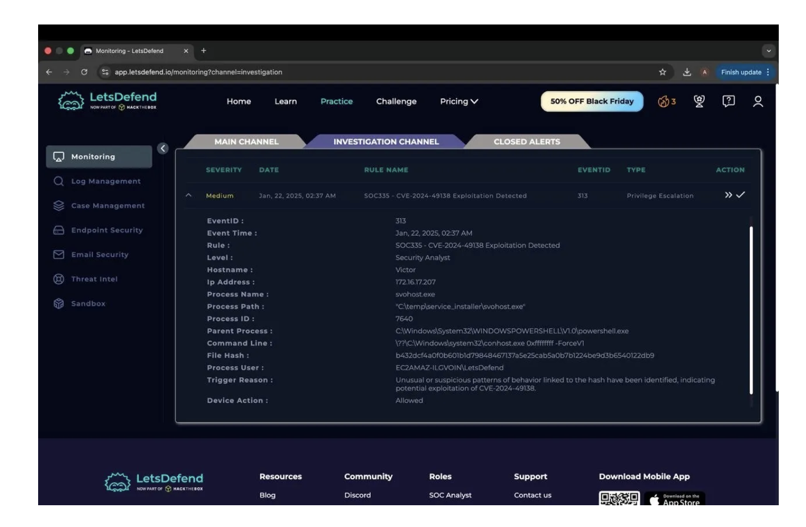
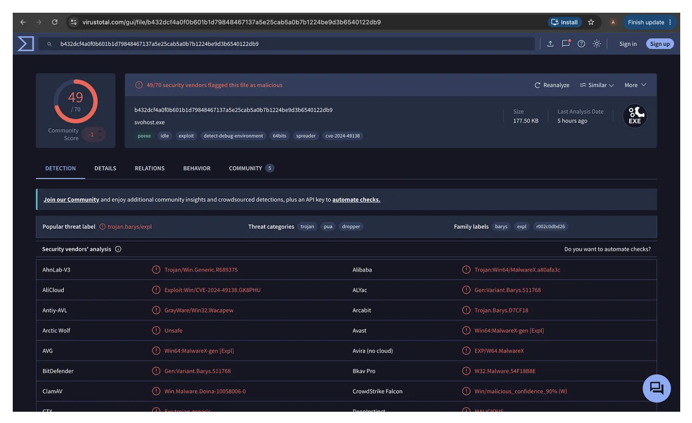
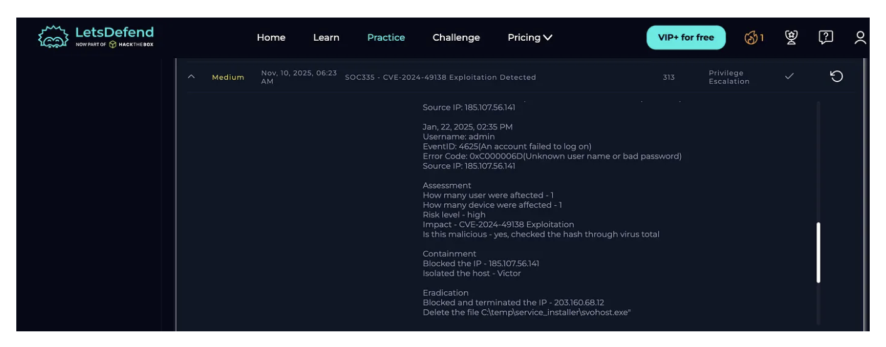

# CVE-2024-49138 Exploitation Investigation

> **Platform:** LetsDefend SOC Training Environment  
> **Alert:** SOC335 - CVE-2024-49138 Exploitation Detected  
> **Category:** Privilege Escalation | Malware Analysis | Incident Response  
> **Status:** Investigation Completed ✅

## Overview

In this investigation, I worked on an alert involving suspected exploitation of CVE-2024-49138 on a Windows endpoint.

The alert initially pointed to suspicious activity involving a process named `svohost.exe`. Rather than relying on the alert alone, I started by reviewing the process details, parent process, command line, file location, hash, and activity surrounding the affected host.

As I worked through the investigation, I found additional evidence that helped me determine whether the activity was genuinely malicious. This included checking the file hash against threat intelligence, reviewing authentication activity, and looking at what happened around the time of the alert.

The goal was not just to close the alert, but to understand what happened, determine the impact, and decide what actions would be needed to contain and remove the threat.

## Investigation Scope

The investigation focused on:

- Validating the CVE-2024-49138 exploitation alert
- Investigating the suspicious process and its parent process
- Checking the suspicious file hash against threat intelligence
- Reviewing authentication activity associated with the incident
- Determining whether the alert was a true or false positive
- Identifying the affected user and endpoint
- Documenting containment and eradication actions

 ## Alert Overview

The investigation started with the LetsDefend alert **SOC335 - CVE-2024-49138 Exploitation Detected**, which was classified as a privilege escalation alert.

The alert provided several pieces of information that immediately needed further investigation:

| Field | Details |
|---|---|
| Severity | Medium |
| Hostname | Victor |
| IP Address | 172.16.17.207 |
| Process | `svohost.exe` |
| Process Path | `C:\temp\service_installer\svohost.exe` |
| Process ID | 7640 |
| Parent Process | `powershell.exe` |
| Device Action | Allowed |

What caught my attention first was the process name `svohost.exe`. It looks very similar to the legitimate Windows process `svchost.exe`, but the name is different.

The file was also running from `C:\temp\service_installer\`, while its parent process was PowerShell. Taken together, these were enough reasons for me to continue investigating rather than treating the alert as a false positive.

### Initial Alert Evidence

The screenshot below shows the original alert and the information available when I started the investigation.

## Suspicious Process Analysis

The next step was to look more closely at the process that triggered the alert.

The process was named `svohost.exe` and was running from:

`C:\temp\service_installer\svohost.exe`

One of the first things I noticed was how closely the name resembled the legitimate Windows process `svchost.exe`. A small difference in a process name does not automatically make it malicious, but combined with the unusual file location and PowerShell parent process, it made the activity more suspicious.

The alert also provided the SHA-256 hash of the executable. I used this hash to check whether the file had already been identified by security vendors.

## Threat Intelligence Check

I searched the file hash on VirusTotal to get additional context about the executable.

VirusTotal showed that **49 out of 70 security vendors** detected the file as malicious. Several detections also associated the sample with exploitation activity related to CVE-2024-49138.

This gave me stronger evidence that I was not dealing with a normal Windows executable. However, I did not use the VirusTotal result by itself to make the final decision. I considered it together with the process name, file location, PowerShell parent process, and the other activity observed on the host.

### VirusTotal Evidence

## Authentication Activity

After confirming that the executable was suspicious, I continued looking at activity associated with the incident instead of stopping at the malware detection.

During the investigation, I found a failed Windows logon event involving the `admin` account.

The event showed:

| Field | Details |
|---|---|
| Event ID | 4625 |
| Account | `admin` |
| Result | Failed logon |
| Error Code | `0xC000006D` |
| Source IP | `185.107.56.141` |

Event ID `4625` represents a failed Windows logon attempt. In this case, the failed authentication activity gave me another event to correlate with the suspicious activity already identified on the endpoint.

I treated this as supporting evidence and continued reviewing the incident as a whole rather than assuming that a single failed login proved compromise.

## Incident Assessment

After reviewing the available evidence, I classified the alert as a **true positive**.

My decision was based on multiple findings rather than one indicator:

- A suspicious process named `svohost.exe` was executed from a temporary directory.
- PowerShell was identified as the parent process.
- The file hash was detected as malicious by 49/70 security vendors on VirusTotal.
- The sample was associated with CVE-2024-49138 exploitation.
- Additional authentication activity was identified during the investigation.
- The affected endpoint was `Victor` (`172.16.17.207`).

At this stage, I had enough evidence to treat the incident as malicious and move from investigation into containment and eradication.

## Containment and Eradication

Once I determined that the alert was a true positive, the priority shifted from investigation to limiting the impact and removing the malicious activity.

Based on the investigation, the response actions documented in the case were:

### Containment

- Block the identified malicious source IP `185.107.56.141`.
- Isolate the affected host `Victor` to prevent further malicious activity or communication.

### Eradication

- Block the additional malicious IP `203.160.68.12` identified during the investigation.
- Terminate the associated malicious activity.
- Remove the malicious executable from:

`C:\temp\service_installer\svohost.exe`

These actions were intended to stop further attacker activity, isolate the affected system, and remove the malicious file responsible for the alert.

### Response Evidence

## Key Findings

By the end of the investigation, I was able to connect several pieces of evidence instead of relying only on the original alert.

The main findings were:

- The affected endpoint was `Victor` with IP address `172.16.17.207`.
- A suspicious executable named `svohost.exe` was running from `C:\temp\service_installer\`.
- PowerShell was identified as the parent process.
- The executable's hash was flagged as malicious by 49 out of 70 security vendors on VirusTotal.
- Threat intelligence associated the sample with CVE-2024-49138 exploitation.
- A failed logon event involving the `admin` account and source IP `185.107.56.141` was identified during the investigation.
- The overall evidence supported classifying the alert as a true positive.

## MITRE ATT&CK Mapping

Based on the activity observed in this investigation, the following MITRE ATT&CK techniques are relevant:

| Technique | ID | Why It Applies |
|---|---|---|
| PowerShell | T1059.001 | PowerShell was identified as the parent process of the suspicious executable. |
| Exploitation for Privilege Escalation | T1068 | The alert involved suspected exploitation of CVE-2024-49138 for privilege escalation. |

I kept the mapping limited to techniques supported by the evidence available in the investigation rather than trying to map every possible attacker behavior.

## What I Took Away From This Investigation

One of the main things I took away from this investigation was the importance of not making a decision from one indicator alone.

The suspicious process name and file location gave me a reason to investigate further, but they were not enough by themselves. Checking the parent process, file hash, threat intelligence results, authentication activity, and the surrounding alert context gave me a much clearer picture of what was happening.

It also reinforced the difference between identifying malicious activity and responding to it. Once an alert is confirmed as a true positive, the investigation needs to lead into containment and eradication to reduce the impact of the incident.

## Skills Demonstrated

- Alert triage and validation
- Endpoint process analysis
- Windows Event Log analysis
- Threat intelligence enrichment
- VirusTotal hash analysis
- Incident investigation
- True positive / false positive decision making
- Containment and eradication planning
- MITRE ATT&CK mapping

## Related Write-up

I also documented this investigation in more detail on Medium:

[Read the full investigation walkthrough on Medium](https://medium.com/@adisasocanaylst/investigating-cve-2024-49138-exploitation-detection-on-letdefend-soc-analyst-walkthrough-3b80f9e7e8f6)

## Disclaimer

This investigation was completed in the **LetsDefend simulated SOC training environment** for educational and portfolio purposes. The systems, users, IP addresses, alerts, and incident activity shown here are part of the training scenario and do not represent a real production incident.
