# Contents
## General Introduction

This was made to clarify general aspects concerning Windows exploitation. It explains basic concepts applied to CVE-2022-37969. The final result is a working PoC. It does not clarify every aspect about the CVE, but provides re-usable pieces of code and explains mechanisms that can be found in many general exploits.

The target user would be a beginner reverse engineer, exploit developer that seeks a working proof of concept source code to test and understand basic Windows Internals. It provides a reference point to further learning.

*Requirements: Basic kernel debugging, basic Reverse Engineering, basic Windows internals, c/c++ programming skills*

## Context

A program is a piece of code that is running on a machine. Generally a program receives data (input) makes calculations using the inputs and generates data (output). Most programs are wirtten by humans, and thus have bugs. A bug is generated by some source code that was not written correctly (the programmer wanted to do somenthing with the input, the resulting code was different from the intended result). Most bugs are corrected before launching the product, but some remain. This happens because there are different types of bugs, some harder to spot than others.

Windows is a computer program, was written by humans, and thus it has bugs. Why is it important? Because Windows systems ca run programs that operate sensitive data like, bank accounts, health care databases, and other. Some bugs can be used to illegally gain access to restricted data (this a good usecase for an exploit)

There are multiple kind of bugs, some usefull some not. Generally bugs are generated by inputs to the program that in conjunction with the lines of code that were written wrong generate a malformed output or behaviour of the program. Finding that input is the job of the security specialist (or hacker). The next step is assesing the resulted malformed output/behaviour and answering the question "Can it be used in a usefull manner ?". This is where bugs are classified in different categories. For example a bug may generate behaviour that corrupts some data structures and causes the target computer to restart. It's usefullness is limited.
One bug may cause the input to be written in a memory zone that controls access permissions to restricted files. This kind of bug is more usefull.

So from the set of all possible bugs the hacker searches the subset that is most useful to it's purpose. Generally speaking the problem is "Can i give the target program a specially crafted input so that I do not break the system but I can elevate my level of access and profit?"

After this non-techincal introduction the scope the tutorial can be formulated: **Can we find a Windows program that accepts malformed input and as a result of wrong developer code can  illegally elevate our permissions from regular user to administrator?**

*Target program*: **Windows CLFS (Common Log File System Driver)**

*Expoit name*: **CVE-2022-37969**

*Type*: **Local Privilege Escalation**

*VULNERABLE ISO DOWNLOAD*: [Download Here](https://archive.org/details/windows-11-21-h-2-notpm)

## Privilege escalation Windows general theory

The Windows address space is roughly divided between user-space (running general programs) and kernel-space (running the operating system itself and hardware component software-->drivers). One regular user must not access the kernel space, but there are mechanisms by which regular-user-programs can access parts of the kernel code (system calls, driver procedures). Why do we need access? To interract with the OS in a secure and controlled manner, that is provided by the OS designers.

Some drivers use data inputs provided by the user to operate on kernel-space-data-structures. If the input generates a bug, then the kernel might be corrputed. One case is the *Common Log File System Driver*. By using some special input we can force the driver to alter kernel-data-structures that hold the privilege access level for the user and overwrite *regular user* with *administrator*

**What needs to be modified in order to elevate the privilege to admin?**

We begin with the end-goal in mind. Windows stores inside a kernel data structure named _EPROCESS information for each process running on the system. [Example of _Eprocess](https://www.vergiliusproject.com/kernels/x64/windows-11/22h2/_EPROCESS)

One important field is **struct _EX_FAST_REF Token**. This is another data structure that further points to data referencing the privilege level of that respective process. In the following picture System process has a system token and Explorer process has a regular user token.

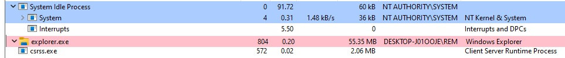

So to elevate the privilege of Explorer.exe we would need to **copy the value from System's _EPROCESS-->Token** to **Explorer's _EPROCESS-->Token**. We will acomplish something similar by copying System Token into our own program's Token and launching a Command Prompt from the elevated process (Children processes inherit the token of the father process).

To complete these actions we need mechanisms for:
1. Obtaining the address for _EPROCESS data structure in the Kernel
2. Reading the value of the Token field for System process
3. Obtaining the address of the _EPROCESS data structure for Explorer
4. Writing the value of System's token at Explorer's Token offset in its _EPROCESS strucutre

## Locating _EPROCESS data structure for a target process by PID

*Introduction: The nature of Windows over the years* : As with the discovery of new vulnerabilities, Windows needed patching to mitigate them. Also with the emergence of new technology, Widows needed updates to stay competitive. One crucial requirement was backwards-compatibility with previus versions. And sometimes security was achieved via obscurity. Data structures, function definitions were removed from manuals, but the functionality still remained. By reverse engineering, researchers were able to use those functionalities to various purposes.

For finding the kernel address of _EPROCESS we will use a undocumented function: [`NtQuerySystemInformation`](https://ntdoc.m417z.com/ntquerysysteminformation) (See link for parameters). By using the `SystemInformationClass` parameter we can specify what kind of information we want to retrieve. We will retrieve general process information by specifying `SystemExtendedHandleInformation` value (`#define SystemExtendedHandleInformation 0x40`).

A caveat of using `NtQuerySystemInformation` is that we do not know beforehand what is the length of the returned data, but `NtQuerySystemInformation` has a mechanism that helps. It it is called with a wrong sized array for the required data, it returns ERROR and the correct data size that should have been requested. This can be used to correctly  read Process Information in the following way:

1. Call `NtQuerySystemInformation` with a dummy `SystemInformationLength` parameter
2. Read the returned `ReturnLength` parametre value
3. Call `NtQuerySystemInformation` again with the correct `SystemInformationLength` value returned earlier

The returned data structure is of type [`PSYSTEM_HANDLE_INFORMATION_EX`](https://ntdoc.m417z.com/system_handle_information_ex). This is a undocumented data structure. (See link) that leads to a [`SYSTEM_HANDLE_TABLE_ENTRY_INFO_EX`](https://ntdoc.m417z.com/system_handle_table_entry_info_ex) data structure, that holds in the `Object` field the Kernel address of _Eprocess data structure for the corresponding process.

So the logic would be Iterate over all `PSYSTEM_HANDLE_INFORMATION_EX` elements, compare `SYSTEM_HANDLE_TABLE_ENTRY_INFO_EX` `UniqueProcessId` field with the desired process PID and select the corresponding `Object` field to find its _Eprocess address in the kernel.

A snipp of code:

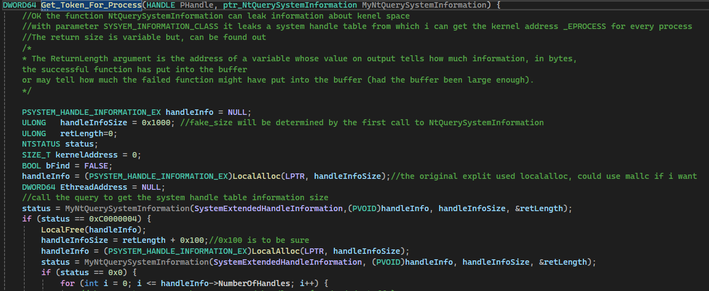
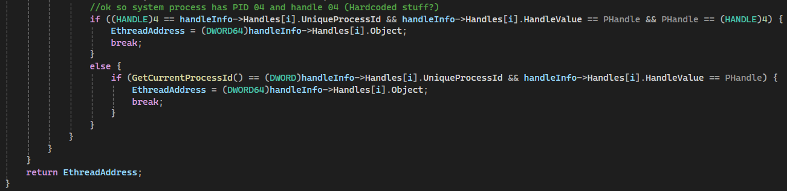

`NtQuerySystemInformation` is declared as a pointer to a function and its address is obtained dynamically at run time via `loadlibrary` and `getprocaddress`.

1. `typedef NTSTATUS(WINAPI* ptr_NtQuerySystemInformation)(int, PVOID, ULONG, PULONG);`
2. `ntdll=LoadLibrary(L"ntdll.dll");`
3. `MyNtQuerySystemInformation = (ptr_NtQuerySystemInformation)GetProcAddress(ntdll, "NtQuerySystemInformation");`

For reading and writing the Token, we will have to rely on vulnerabilities inside **clfsw32.sys** and NamedPipes

# Reading and writing data in the Kernel using pipes

This is somewhat a black box, detailed in other articles, but the minimum knowledge for this functionality will be explained in order to gain a basic understanding of the exploit process.
Pipes are inter-process communication mechanisms. Processes can pass information to eachother using pipes. Pipes are represented as Kernel data structures that have some fields that can be populated form userspace. An example would be Pipe Attributes.

 *(Later we will link this to the CLSF vulnerability to gain arbitrary read/write from user-space in kernel-space)*

## Data allocation in the kernel

For further reading please consult [fengshui-spraying-big-kids-pool](https://www.crowdstrike.com/en-us/blog/sheep-year-kernel-heap-fengshui-spraying-big-kids-pool/). A simplified explanation of the mechanisn would be:

The Kernel has 2 ways of allocating memory with respect to the size that we want to allocate: small-pool for objects <4KB+header and big-pool for objects >4KB+header .
Big-pool pages are important because **it can be enumerated from user-space**. This means that a regular user can find all start  kernel adddresses that contain a Big-Pool page.

How? Each Big-Pool page has a field named Tag (that can be used to get information about the type of data that is stored there). All Big-Pool pages in the system can be enumerated using `NtQuerySystemInformation` with `SystemBigPoolInformation` as value for `SystemInformationClass` parameter. Then from all the pages we ca filter by Tag and get the address of the Big-Pool pages that we are interested in. For example CLFS uses Big-Pool pages with 'Clfs' tag. We can get the address of all pages in the Kernel where CLFS objects are allocated.

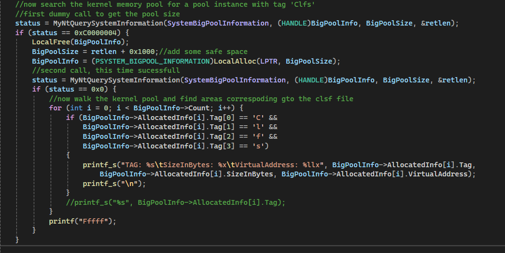

Returning to Pipes, we can operate in the same manner, allocate a pipe big enough to use Big-Pool mechanism, enumerate the big pool pages, search for pipe's specific Tag and filter those pages.

Thus we can leak in userspace the place where the kernel allocated our pipes. What about controlling data that goes in the Kernel and reading it?

For this we rely on Pipe Attributes. Much like the Big-Pool tag the Pipe Attribute is an array that can contain information that describes the pipe (filled by the user) Using the undocumented function [`NtFsControlFile`](https://ntdoc.m417z.com/ntfscontrolfile) we can arbitrary read, write to the pipe-attribute data structure. Being undocumented, only a proof of concept that sets a PipeAttribute vector and then Reads it is provided. The only modification that is allowed to the primitivers for read, write is controlling the content of the input/output buffer and their size.

## Writing and reading from pipe attribute in the kernel eg.:

Here we allocate a pipe big enough to use the big-pool pages (0x2000), set an input and output buffer to a controlled value.
Caution the first 2 bytes of the input value MUST be 0x5a 0x00 in order to work

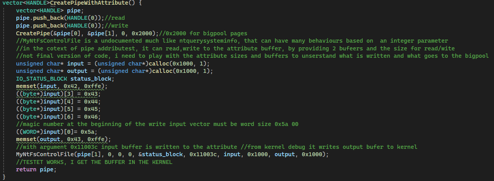

Here we read back what we have written in te kernel before, again only change the output buffer

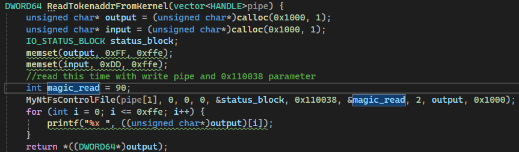

And the result:

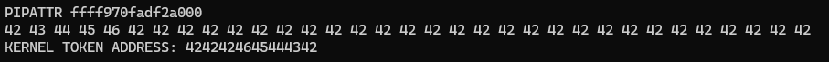

## How does a pipe pig-pool page look in the memory and why the previous operation is useful to us?

Here are the contents of the pipe big-pool page in the kernel:
By quering the big-pool pages we found the beginning of the pipe data structure in the kernel. At address pipe_begin+0x20 we find a pointer to our input buffer+0x2.

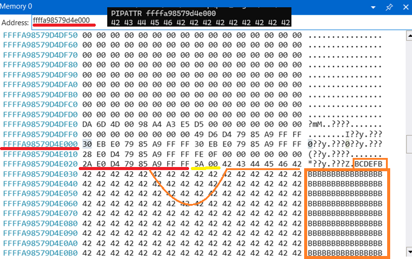

When we call the pipe attribute reading function, the os will do the following:

1. Identify pipe location in kernel
2. add 0x20, dereference the pointer and dump the content from the kernel space in our user buffer.

Why is it usefull? Imagine if we can replace the pointer at pipe_begin+0x20 with the location of System's process security token and call pipe attribute read. We would leak it's value in userspace. The replacement is acomplished via CLFS.SYS vulnerability.

# Memory spraying

Understanding this techinque is crucial for understanding the exploit.

Most exploits are not deterministic in nature but probabilistic. Even if the code that leverages the vulnerability is correct the exploit might not work. By putting the target program in a unstable state, the exploit developer must make sure that after executing the exploit, the system does not chash. Imagine a program that when exploited gives the ability to read from address that depends on a variable value inside a program.

Eg:

Let's say that `target=0x1000000+ var_1&0xff+ var_2&0xff00`.

The hacker cannot control target or var_1 or var_2.

But the exploit gives the ability to read from address target.

We coud read from anywhere between 0x1000000 and 0x100FFFF, which in some cases might be usefull or not.

Eg2:

Let's say that an exploit gives the ability to read a QWORD from an address matching a certain pattern and put the contents in it's security token value. Let's say we have perviously obtained the security token value for System.exe
How can we leverage the exploit to elevate privileges?

`read_addr=0x1000000+alfa&0xFFFF00`

We cannot control alfa parameter

**OFF TOPIC BUT VERY IMPORTANT**: *The kernel can access the userspace corresponding to the process that is running kernel code at that momment*. 

What address can we read from? well 0x1000000, 0x1000100(alfa=1),0x1000200(alfa=2),....,0x1FFFF00(alfa=ffff00).

To be sure that the exploit succeeds the programmer should do the following:

1. Allocate in userspace a piecce of memory the of 0x1000000 size (roughly): `memory=virtualalloc(dest=0x1000000,size=0x1000000,....)`
2. `for (i=0x1000000;i<0x2000000;i+=0x100) ((QWORD*)i)[0]=system_token_value;`
3. The code at 2. fills the memory at any possible alfa value with the system token value. So it is guaranteed that regardless of the value of alfa parameter, the sytem token will be present at the address.

This is in fact memory spraying. Memory manipulation following a specific pattern that matches all possible values of a probabilistic expression that is the result of an exploit.

A requirement for this to work in our case is that memory can be allocated at address 0x1000000. This is a limitation, that we must also work with in the case of the real exploit.

# Common Log File System

With some technical aspects cleared, now a basic understanding on CLFS is needed.[Microsoft Link](https://learn.microsoft.com/en-us/previous-versions/windows/desktop/clfs/common-log-file-system-portal). CLFS is used for application Logs, data base logs, transactions, etc.

Exploits generally require a certain memory layout in order to function. The form of the layout is dictated by variable values inside the program at the exact time of exploitation.

This tutorial will not explain in detail the vulnerable code, or the format of the Log File system. It will offer a basic understanding of the processes that generate the exploit.

Log files are a special kind of files that have a certain format and can be interacted with by CLSF driver and dll APIs.
Within this system there is also the concept of log containters. The log containers are also log files, but are linked in memory to a main log file, (the log file that they are added to).

This construction works as following:

1. Create or open a main log file
2. Create or open secondary log files
3. Use AddLogConstainer API to add the secondary log files as containers to the main log file

This operation forces the allocation of new memory space within the main log file, and will modify different objects inside the memory layout of the main log file. The modification of the memory layout, would conceptually look like this:

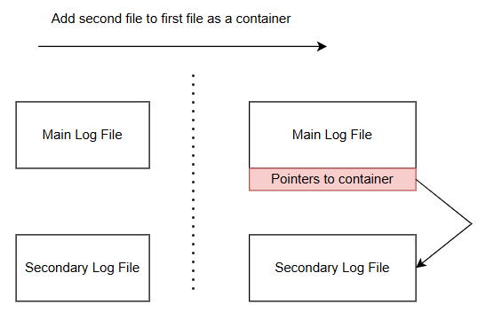

# High level overview of the Exploit mechanism

As with every important data structure/file before using it the CLFS driver makes sanity checks against the format of the log file:

1. Anti-tampering (integrity): The hash of the file is stored at a coonstant offset in the file. In order to open the file successfully the driver calculates the file hash and checks it against the stored value. If the values are not the same, it means that the file was tampered with after creation, and an error is thrown.
2. Range and file structure checks: Various header and lenghts are checked to make sure that the format of the file is respected.

The second point is the starting point of the vulnerability. The attacker is able to modify a previously created log file, and recalulate it's hash, and edit the hash field to make the driver pass the integrity test.
The modifications are related to file headers lenghts. A carefully crafted set of values determine a pass on a  range-length check that would otherwise fail and throw an error. The driver thus accepts the fake length as a valid one, and continues code execution as normal. The fake length is used to calculate an offset within the file where a hardcoded address will be written. This gives the attacker the ability to control the address where the previous write opperation will occur.

This vulnerability must be chained with pipe-kernel-read-write to complete the exploit.
Visual proof:

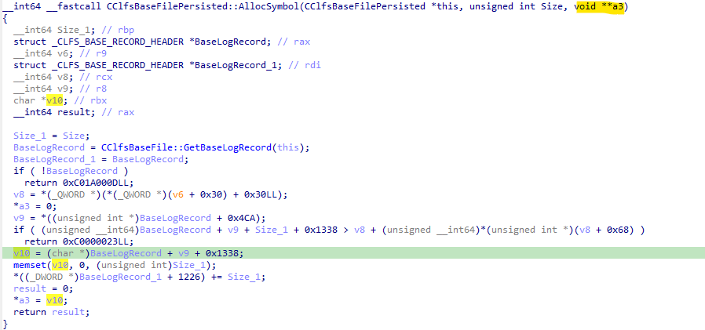

In the previous figure we see the funciton `AllocSymbol` within CLFS.sys that is responsible for the bogous range check. The vulnerable length check is the one that would return the 0xC0000023 error code.(`BaseLogRecord + v9 + Size_1 + 0x1338 > v8 + *(0x68)`) It's input to the condition is in part controlled by the attacker. It is possible to inject a value in the formula that cause the check to pass even though it would normally fail. By controlling v8 and v9 we can manipulate the truth value of the condition to be FALSE, prevent error returning and lead to the arbitrary calculation of the value of v10 variable, using the atttacker controled v9 value. 

V10 is further used for a memset with 0 as the value to be set. So the attacker gains the abililty to arbitrary set memory to 0. This is not all. Befor the final return *a3=v10. A3 is a parameter sent by address to the AllocSymbol function. The caller of AllocSymbol thus receives the value of V10 after returning from AllocSymbol.

The caller of AllocSymbol is FindSymbol.

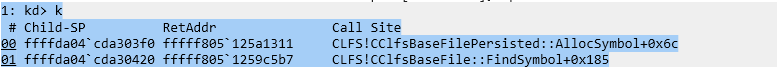

Inside FindSymbol V33 is the the parameter named a3 in AllocSymbol. So v33 gets the value of v10. Then The value at v33 address is set to a constant. (0xc1fdf006) and further prefixed with the value 0x30.

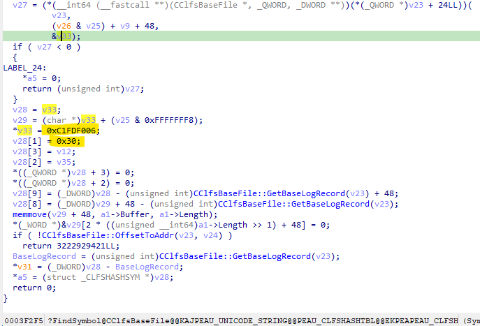

 So the attacker gains the ability to set a arbitrary memory location with a constant.

 Why would this be important? If we can overwrite the default value of a function pointer with a constant address accesible from both user space and kernel space, and have a guarantee that the respective pointer will be called we gain code execution control. Alhtough this is the general idea, there are techincal setbacks that will be explined further.

 ## CLSF pointer corruption, or which location to overwrite in order to hijack execution flow

 Earlier we talked about clfs containers. When a container is added to a file, in the parent file a structure gets populated. The structurea has a pointer named `CClfsContainer* pContainer;`. When the respective container is deallocated, in the parent file, clean-up operation take place and dereference `pContainer` and use values `[[pContainer]+0x18]` and `[[pContainer]+0x8]` as function pointers.

 So the ability to control `pContainer` and execute the container specific API's for adition and deletion guarantee control flow redirection.

 Where is `pContainer` located? 

 CLFS file structure is undocumented, but some individual attempts at reversting the file structure do exist.

 A bird's eye view of a log file structure:

 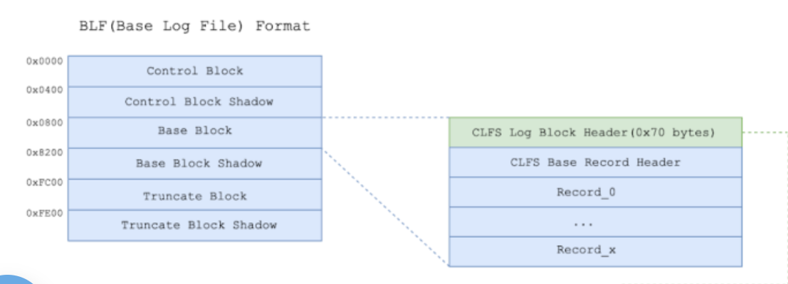

 And a detailed view on the base block:

 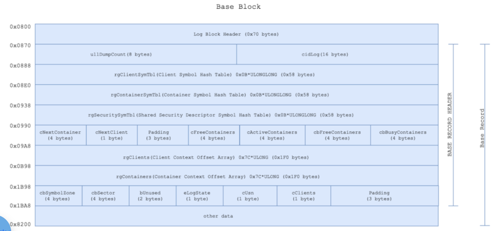

 Differences between the structure and memory view:

 CLFS files are allocated in big-pool pages with a tag value of `Clfs` . When a clfs's log address will be obtained in userspace (the same method used in obtaining the kernel space address of a pipe object), the kernel will return THE ADDRESS WHERE THE BASE BLOCK BEGINS. ( at offset 0x800 in the previous picture ). At `offset 0xb98` we see a datastructure named `regContainers`. This is an array of 32bit values. Each value is related to one container and represents the offset (counting from `0x870`) where a container's internal data structures are located in the base block file.

 The memory layout of a containter file is as follows:
1. `CLFS_CONTAINER_CONTEXT structure`

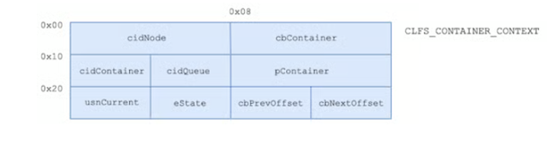

At `offset 0x18` into `CLFS_CONTAINER_CONTEXT structure` it is our target  `pContainer`.

Apparently the offset to `pContainer` is constant, that is the first element of `regContainers` array. And it's value is `0x1468`.

# Proof that pContainer is dereferenced and used as a function pointer:

Dereferencing and accessing `pContainer` as a function pointer is the crux of the exploit. This happens inside `Remove container` function in CLFS.SYS driver. So the exploit will be triggered when the container is removed.

Proof:

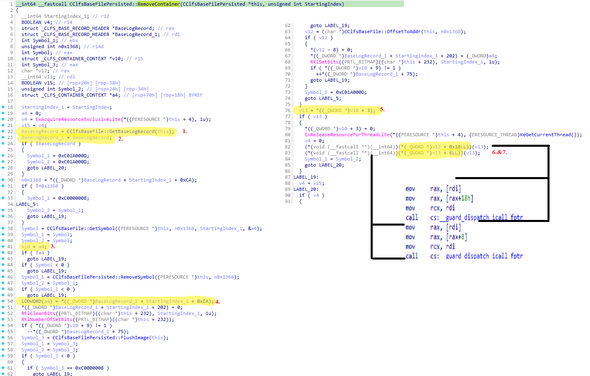

Lets review the steps of removing a container to show that indeed the pointer `pContainer` is accessed as a pointer to a function

1. At line 22 there is a call to `GetBaseLogRecord` API which returns the kernel address of the base block + 0x70 (it moves the file pointer pass the header)
2. At line 23 a copy the result (`BaseRecord_1`) is initialized
3. At line 41 another copy of a variable `a4` is initialized as `v10`
4. At line 50 : There is an interesting vector indexation construction: `LODWORD(a4) = *(  (_DWORD*)BaseLogRecord_1 + StartingIndex_1 + 0xCA);` If there is a single container added to the file, then ` StartingIndex_1 ` is zero. The value returned by `GetBaseLogRecord` is casted to a DWORD(32bit) vector and indexed by 0xCA elements. Note that `(_DWORD*)BaseLogRecord_1 + 0 + 0xCA` does not simply add 0xCA value to `BaseLogRecord_1`.  Because of the cast this is equivalent to `BaseLogRecord_1[0xCA]`. This is reflected in the dissassembled code corresponding to this, `   mov     eax, [rdi+r12*4+328h]` where rdi is the base, r12 is StartingIndex_1 (note that is multiplied by 4 which is the length of a 32bit sized element (DWORD)) and added with 0x328 which is 0xCA*0x4.

The value of a4 is at the end `BaseBlock+0x70+0+328=(BaseBlock+0x398)` which would take us to the first value of RgConrainers (0x398+0x800=0xB98).

5. At line 76, v13 is obtain from v10 (copy of a4) via cast to QWORD vector (element size 8) and indexation with 3 positions. Note at line 16 of the decompilation that a4 is of type _CLFS_CONTAINER_CONTEXT. So v10 is the third field from the structure that corresponds to `pContainer`.
6. At lines `82 & 83` pContainer is derefenced, added with 0x18, and 0x8, interpreted as a pointer to a function and executed. (call cs:__guard_dispatch_icall_fptr is in fact a call to a `jmp eax` instruction)

This proves that by rewriting tha `pConainter` value we can alter the control flow of the driver and point it to attacker controlled addresses.

# Kernel Sparying With objects

Earlier it was explained that sometiones you would need to fill a piece of memory with a predetermined pattern of values in order to guarantee the sucessfull execution of an exploit. This is because the hacker can controll only a subset of the variables that make up the state of the program at the time of the exploitation. 
In the simple example of memory spraying eralier we used only values writtten in a vector to satify a certain condition. 

In the real case the, conditions are more complicated. We need to arrange Log Files in kernel memory in a certain order with a known offset between them.

First of all, let's create many Log files in a loop and study how does the OS allocate memory for them.
The experiment will use the following pattern:
1. Identify CLFS files present on system by default
2. Allocate a new CLFS file
3. Identify the kernel address of the Base Block of the new file
4. Repeat for ~50 files
5. Study the addresses where files were allocated

The following piece of code acomplishes that:

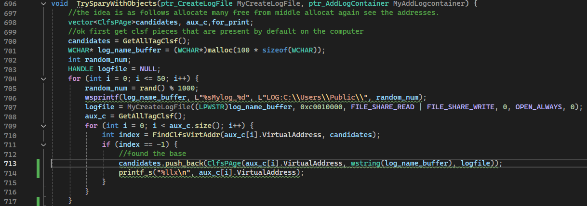

And the result:

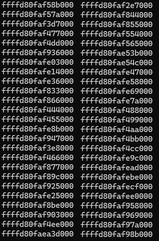

Let's order the addresses:

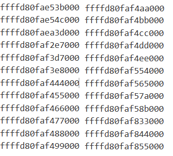

By inspecting offset between the addreses, a pseudo pattern regarding the allocations: There are continuous allocations that have a constant offset between them. For example form `ffffd80faf444000` to `ffffd80faf4ee000` the offset between two consecutive allocations is `0x11000`.

This assumption is crucial for the functioning of the exploit. It will be relied on.

Another assumption: Let's take some pages that are `0x11000` apart. For example: `ffffd80faf444000`,`ffffd80faf455000`,`ffffd80faf466000`,`ffffd80faf477000`,`ffffd80faf488000`,`ffffd80faf499000`. All the pages correspond to opened CLFS files. If we would close one file the page will be deallocated and the memory at the respective address will be free.
This would look like this in memory (let's say we close the file corresopding to the page at `ffffd80faf466000`):
`ffffd80faf444000`,`ffffd80faf455000`,`xxxxxxxxxxxxxxxx`,`ffffd80faf477000`,`ffffd80faf488000`,`ffffd80faf499000`

*IF we open the file again the OS will with a high degree of certainty allocate a page at the same address (ffffd80faf466000) to fill the hole and make the memory continuous*. --> This is also crucial for the execution of the exploit.

# Schematic of the exploit so far

Now we introduce a schematic of the strategy that we will employ to make sure that we overwrite `*pConainter` pointer with an address ouf our control, in userspace.

# Exploit schematic

1. Allocate a bunch of clfs files resulting in a memory layout like this:

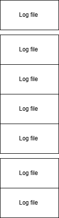

2. Identify a sequence (ideally maximal) of files stat are 0x11000 apart from eachother.

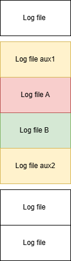

In the previous picture `start(aux1)+0x11000=start(A),start(A)+0x11000=start(B),start(B)+0x11000=start(aux2)`

3. We will use `Logfile A` to overwrite `Logfile B's *pcontainer pointer`, and trigger the exploit *by Closing* `Logfile B` using a special delete after close code.

4. Add a log container to Logfile B, in order to allocate and update the fields that signal that B has a correct container file. We can add aux2 as a container to B.

5. Close LogfileA so we can edit it on disk. It is important to choose A and B to be in the middle of a maximal seqence of 0x11000 spaced files, in order to create a hole in memory that the OS will prioritise filling. If it does not, the exploit will fail.

6. Recompute A's hash edit it's hash field to maintain integrity and open A again and hope that the Kernel places it at the same address or the exploit will fail.

7. Call AddLogContainer on A with a normal Log file to trigger the overwriting of B's *pContainer pointer

8. Delete B file so that RemoveConainter is called and the execution is transferred to B's *pContainer that is now corrupted and points to user allocated code.

The following picture depicts the steps mentioned earlier.

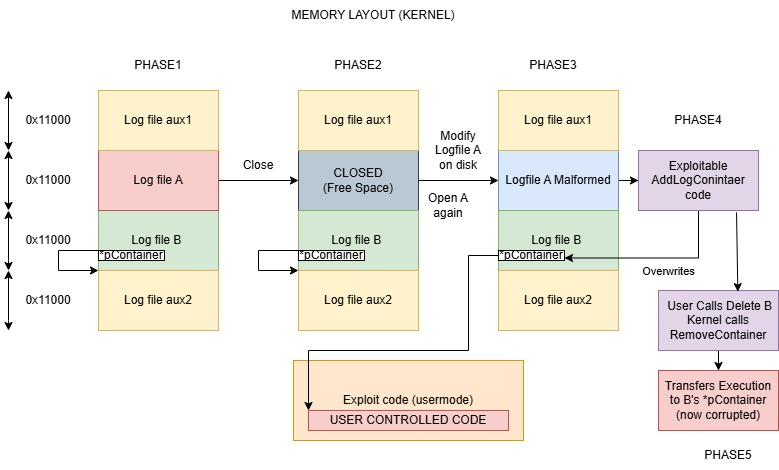

# CODE - Obtaining a correct memory layout

We first begin by allocating 50 CLFS files. After each allocation, we query all CLFS pages in Kernel memory and make a list with all the addresses that were allocated for each file. Next, we identify 2 files that are 0x11000 apart of eachother (A and B on the scheme). (and store it in first, second variables)

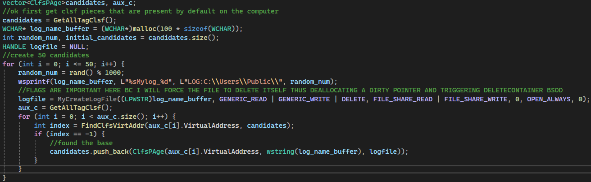

After identifying the address search for two files 0x11000 apart A->first , B->second

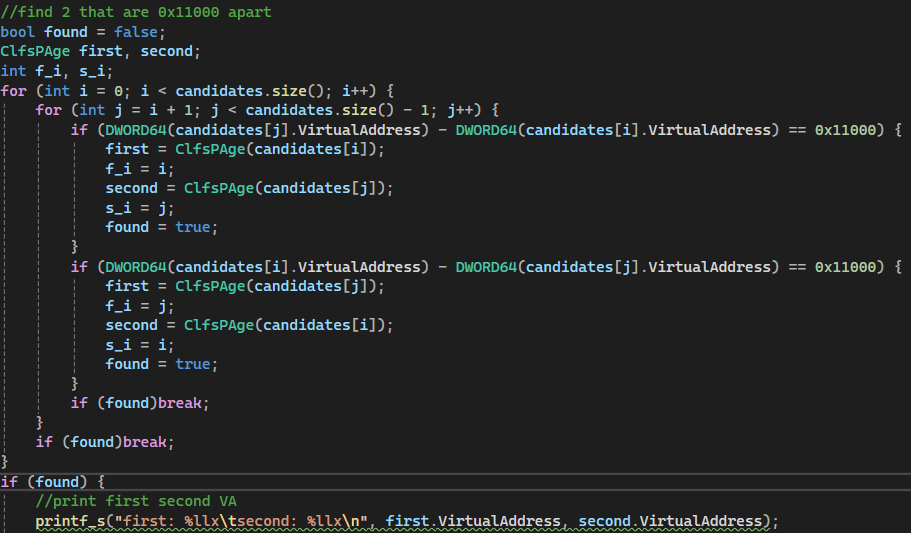

Next close A (first) and edit it on disk (malform it's headers) and open it again.

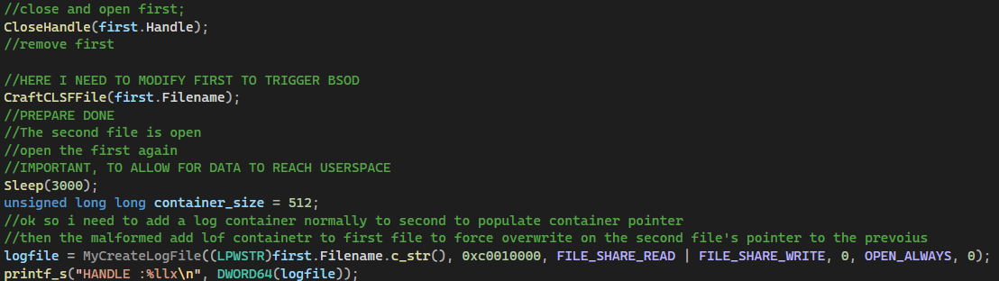

# Editing A's headers and re-computing it's hash

This step needs further explanation because the we need to compute some exact values that, when triggering the exploitable code in AllocSymbol will lead to overwriting B's *pConainter pointer.

Form the earlier analysis on AllocSymbol and FindSymbol function we know that we must modify A file in asuch a way that it overwrites the logical value of the IF condition to FALSE and injects a value to `v9` variable that will lead to a write in the B's `*pContainer` location pointer.

First what value should v9 be set to?

AllocSymbol calculates `v10` (target address of the write) as :
`v10=BaseLogRecord + v9 + 0x1338`. This is calulated in context of A address space. So `BaseLogRecord` is : A's Kernel Page Address + 0x70 . `v9` is controlled by the attacker and `0x1338` is constant.

Where is B's *pContainer relative to it's Kernel Page Address?

This was detailed earlier so, from B's Kernel Page address we need to add 0x398 to get to B's regContainter vector ad index by first element to get the offset to first CONTEINER_CONTEXT structure. As stated earlier for the first container the index was determined to be 0x1468 (counting from B BaseBlock +0x70 )

So the location of B's *pContainer is `B's Kernel_Address + 0x70 + 0x1468 + 0x18 (third element in CONTEINER_CONTEXT structure)`

`B's Kernel_Address=A's Kernel Address+0x11000` (because we constructed the memory in this way)

`A's BaseRecordAddress=A's Kernel Address+0x70`

`V10=A's Kernel Address+0x70+v9+0x1338`

v10 needs to overwrite B's *pContainer

V10 needs to be: v10=`B's Kernel_Address + 0x70 + 0x1468 + 0x18 (third element in CONTEINER_CONTEXT structure)`

Substituing B's Kernel_Address: `v10=A's Kernel Address+0x110000+x70 + 0x1468 + 0x18`

Reducing v10: `A's Kernel Address+0x70+v9+0x1338=A's Kernel Address+0x11000+x70 + 0x1468 + 0x18`

Solving for `v9 = 0x11000+0x70+0x1468+0x18-0x1338-0x70=0x11148`

Now what fields in A need to be overwritten? --> There are 2 categories of fields:

1. Fields to force `IF` condifiton in `AllocSymbol` to evaluate to `FALSE`
2. Field corresponding to v9 to compute the exact distance to B's *pContainer

Fields in 1. category will not be detailed. V9 corresponds to the field at offset 0x1b98 on disk inside A file. There will not be any more details related to why this fields trigger the exploit, it is up to the reader to read about this, if interested.

Here are the value that need to be modified:

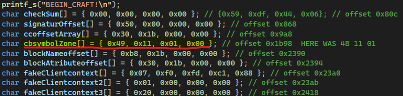

Note that (little endian), the value used is 0x11149 instead of 0x11148. This is because we need to controll the higher order octets in *pContainer. The least significant octet will be of the form X0 (10 or 20 or 30...). We can make a memory spray at each of the value to account for this condition.

Note that v10 will be also used to memset with 00 a region of memory of len 0xa0

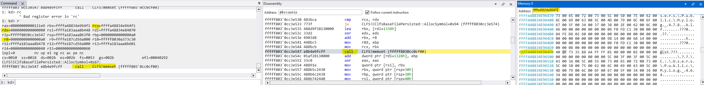

Then at the same address the overwite with constant

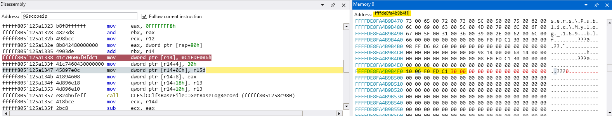

Note the constant value which is of form `0x30c1fdf006X0` 

This occurs when we add a log container to A file, but we did not cover the hash re-calculation process after the modification of A's fields.

The view of the log file on disk is somewhat different from the view in memory. We are modifying only contents on the `base block` which is `0x7a00` in length and begins on disk at file offset `0x800`. The hash algorithm used to hash the base block is CRC32. The field that holds the value of the hash is also stored inside the base block at offset `0x80c`.

Procedure to recalculate the hash:

1. Zero out the old CRC32 value at `0x80c`
2. Edit the fields according to the hardcoded values and offsets
3. Calculate CRC32 for the base block starting at `0x800` with lenght `0x7a00`.
4. Replace the zeroed out value with the new CRC32 value

# The full code thas is responsible for triggering the exploit:

To get the code execution routed to userspace we need to:

1. Get the memory layout of A and B CLFS File (already explained)
2. Close A, edit it on disk with malformed headers and open it again (explained)
3. Add a Log Container to B (named second in code) to initialize container structures. The container needs to be a regular normal log file (one of the 50 allocated earlier)
4. Prepare the user memory that will represent the altered execution path (WILL BE EXPLANED NEXT)
5. Add a  log conainer to A (named first in code) with a normal regular log file as a conainter. Adding a container to the malformad version of a will trigger an overwrite on B's (second) `*pConainter` value with a constant value of form `0x30c1fdf006X0`.
6. Set B (second) to be automatically deleted after close using [NtSetInformationFile](https://ntdoc.m417z.com/ntsetinformationfile). It is crucial to use this API, because simply closing it's handle will not trigget the `RemoveContainer` API.

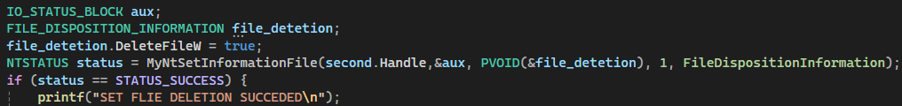

7. Close B and trigger redirection.

# User memory spray and layout

There are some conditions imposed on the user memory that is the target for redirecting the execution flow using `*pContainer`. We can't just randomly start executing instructions from userspace with the program in kernel mode.

The purpose of this section is to leak the value of the SystemToken in Userspace, without causing a System Crash (BSOD).

How can you read from from an address in kernel and store the result in userspace? A quick reminder about the Pipe section on the tutorial:

Here we:

1. Allocated a pipe (kernel object) with a size big enough to be allocated inside a BigPool
2. Write some information in the pipe attribute section (the alphabet string BCDEFBBBB)
3. Get the address of the pipe object in userspace using Tag field of the BigPool pages
4. Study the pipe structure in KErnel using Windbg.
5. Read data back from the kernel in userspace using NtFsControlFile PipeReadAttribute

The idea linking the Pipe object and our goal of obtaining system token value is to use `NtFsControlFile` PipeReadAttribute to read from the address of the system toke instead of the beginning of the buffer that holds the infromation we passed to the kernel using PipeWrite Attribute.

This means that we must modify the value of the pointer at address `PIPE_BEGIN+=0x20` to hold the address at which the system token is located.

The addess is known, obtained in the earlier stages of the tutorial, when we located and parsed EPROCESS structure.

Here we need to find a mechanism that allows us to write in the pipe structure at a fixed location.

For this we use the code redirection obtained via exploiting CLFS AddLogConainer function. One might think that it is enough to write a shellcode that does the raw replacement but (although it was not tested) it might certainly not work. This is because the driver runs in Kernel context and executes code form a user process area.

To circumvent this limitation we must find Kernel Rop's that accomplish a write at an arbitrary value. That is find some pieces of kernel code that are at the end of a function and finish with a `ret` instruction, and proivide their addresses as targets for redirection. In this way the code is still executed by the Kernel.

This is the main idea but limitations arise from the way in which the CLFS driver calls code inside *pConainer:

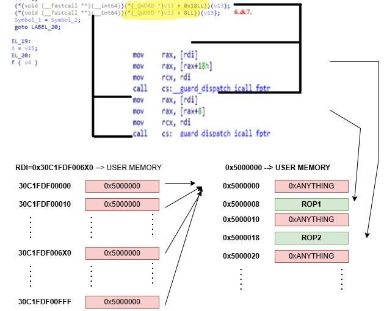

To craft a usable memory pattern we must study the way RemoveContiner function accesses *pContainer code.

In the previous picture we highlight the portions of code that dereference *pContainer and use it as a function pointer.

RDI is the constant that was written inside *pcontainer by exploiting AllocSymbol. As you see the constant is not entirely fixed in value, it varies in the first byte (the form is 6X0, X being anythig).

`mov rax, [rdi]` dereferences the constant value. In order to not cause an invelid read (and BSOD) we must make sure that `rdi` holds a pointer to a valid address. To do this we must spray the user memory from `0x30C1FDF00000` to at least `0x30C1FDF006FF`. This is done by allocating a chunk of memory with `VirtualAlloc`. Of course if the system cannot allocate memory for any reason, the exploit fails.

`LPVOID dirtySpray = VirtualAlloc((LPVOID)0x000030c1fdf006d0, 0x1000000, 0x3000, 0x4);`

Then for any possible value of X we store at `0x30C1FDF000X0` to `0x30C1FDF00FX0` another value that corresponds to valid user memory choosing an arbitrary value let's say `0x5000000`. In this way we make sure that rax will be equal to `0x5000000` for any rdi of form  `0x30C1FDF006X0`

After this step we see two more dereferencing operations: `mov rax, [rax+0x18]` and `mov rax ,[rax+0x8]`

To ensure that memory is still consistent at these addresses we must store at `0x5000008` and `0x5000018` pointers to kernel functions (ROP1 and ROP2, will be calculated in the future.)

This is the algortihm for generating the spray pattern.

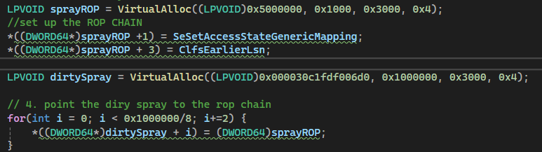

 Note: The pattern will evolve when we introduce the ROP's because they also have parameters that will be taken into account but this is the minimum until now to prevent invalid memory addressing.

 This is how sprayed memory first stage looks in the debugger (observe where value `0x5000000` is placed-->X0 aligned):

 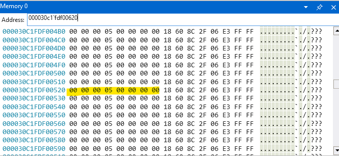

 This is what memory at `0x5000000` looks like (the ROP's that will be detailed)

 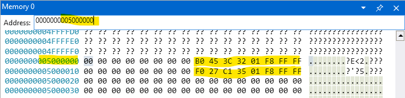

 And the process of code redirecting in the kernel debugger:

 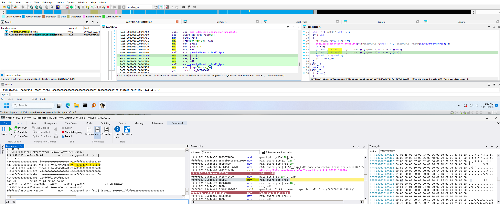

 Note the value of `RDI` regiter and the instruction pointer in the debugger. `RDI` derefeneced once is `0x5000000` and stored in `RAX`. `[RAX+0x18]` is the second ROP, and further down `[RAX+0x8]` will be the address of the first ROP.

 # Kernel ROP's what are they, why usefull

 At this stage, we have the following pieces of exploit that we shall link together:

 1. The address of the System token
 2. Redirection of code using CLFS exploit
 3. A pipe with attribute object

The scope at this point is to link code redirection with a piece of code that will overwrite the Pipe's pointer to attribute buffer with the address of system's token and use Pipe read attribute to get back the information in userspace.

As we stated the code that is rerouted must also be in the kernel. Moreover we have only 2 functions to use. The tutorial will not cover how these 2 specific function were found but presumably there is a list of ROP candidates that are often used.

We will study 2 functions:

1. `SeSetAccessStateGenericMapping` in `ntoskrnl.exe` Called second (`[rax+0x8]`)
2. `ClfsEarlierLsn` in `CLFS.SYS` Called First (`[rax+0x18]`)

Analysis of `ClfsEarlierLSn`:

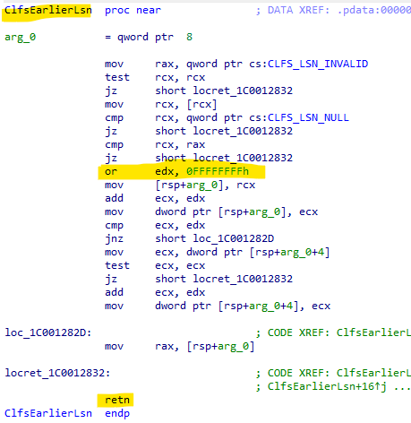

The sole role of this function when called with incorrect parameters is to set `EDX` to `0xFFFFFFFF` and return. Why this is needed will be clear when analysing the second ROP.

Analysis of `SeSetAccessStateGenericMapping`:

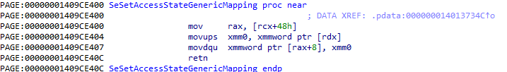

This needs to be discussed line by line in detail.

Inputs: When entering this function:

1. RAX value does not matter because it is overwritten at the first line of the function
2. RCX is the value of RDI, which is the `0x30C1FDF006X0` constant
3. [RCX+0x48] is of form `0x30C1FDF00YX8` always `0x8` aligned and will not conflict with `0x30C1FDF006X0` which is `0` aligned and constains `0x5000000`

Function code execution:

1. `mov     rax, [rcx+48h]` will dereference from `0x30C1FDF00YX8` and move the value in `RAX`
2. `movups  xmm0, xmmword ptr [rdx]` will move 16 bytes from `RDX` to `XMM0` register. Remember here from `ClfsEarlierLSn` RDX is `0xFFFFFFFF`
3. `movdqu  xmmword ptr [rax+8], xmm0` will move to `[RAX+0x8]` the value of `XMMO`

Essentialy this read form an address and store within the Kernel. It can be interpreted as such:

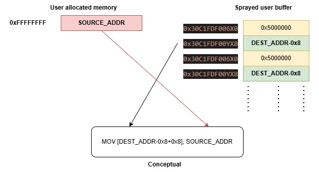

So in order to overwrite pipe's attribute buffer pointer with a pointer to system token we must allocate 16 octets at 0xFFFFFFFF store the address of the system token there. Then we must spray the memory at `0x30C1FDF00YX8` repeatedly with the value of the destination address -0x8. That is the value of the offset to the pipe attribute buffer-0x8. That is PIPE_KERNEL_PAGE_ADDRESS+0x20-0x8.

Here is how this is achieved in the actual code:

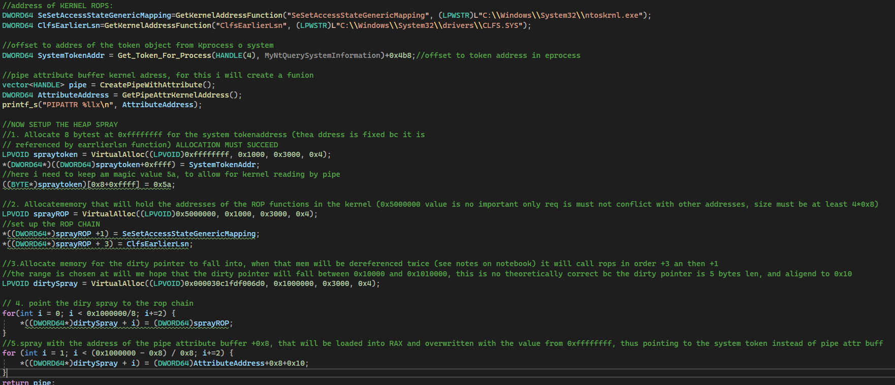

Another aspect that was not explained: How do you get Kernel addresses pf the ROP's in the user space?

It is a trick. Firstly you can get the base address of any kernel module by using  `NtQuerySystemInformation` with the following parametes:  `NtQuerySystemInformation(SystemModuleInformation, (HANDLE)ModuleInfo, ModuleInfoSize, &retlen)`

Then you filter by `ModuleInfo->Modules[i].Name` value to match the required library. This gets the base address in the kernel.

Then we exploit the fact that the offset between the base address and the export address is constant regardless of the address space where is the executable loaded.

We load the module in userspace (you cand do that) using `LoadLibrary` and get the address of the export using `Getprocaddress`. Compute the delta between Export and user base and add it to the Kernel base (found using `NtQuerySystemInformation`). Thus we obtain in userspace the address of the export that is loaded in KernelSpace.

# Reading the value of the system token

Once the Pointer to the attribute has been corrupted and set to point to the location of the system token, a call to `MyNtFsControlFile` with the right parameters should read from the address and leak the system token value in the userspace.

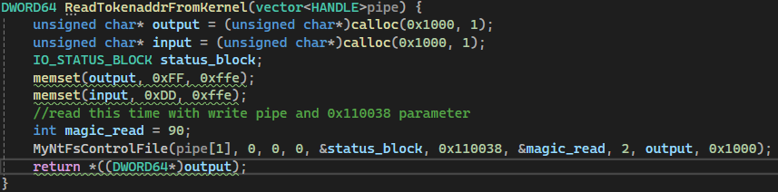

# What next?

Having the correct value for the System token, to complete the exploit we must write it instead of our own process. That is overwrite the token of the process that executes the exploit with the value of the system token.

The steps needed to make this change do not include any new techniques or methodologies, but rely on the re-use of previous code. The algorithm for overwriting our own token value imply a write operation in the kernel at a certain address. This is achieved by the ROP functions `SeSetAccessStateGenericMapping` and `ClfsEarlierLSn`. This implies that **WE NEED TO TRIGGER THE CLFS EXPLOIT A SECOND TIME**. This is correct, we must do the conainer allocation and memory spraying a second time and hope that the OS does not crash.

Steps to overwrite our own token value:

1. Identify where in the Kernel our own token is stored. (similar to the first time where we identified address for the system token)
2. Do the system memory spraying and object sparying with CLFS files again
3. Inside the user sprayed memory set the buffer contents in such way so the DESTINATION_ADDRESS is the address of our own system token and the source address (at address 0xFFFFFFFF) is the value of the system token obtained from the first run of the exploit.
4. Trigger the CLFS exploit a second time.
5. Spawn a cmd.exe and check the privileges.

As we do not need a read from kernel the second time, we have no use of pipe this time.

As the steps do not require additional knowledge, the tutorial cand end here with a final proof of a cmd.exe with **nt authority\system**

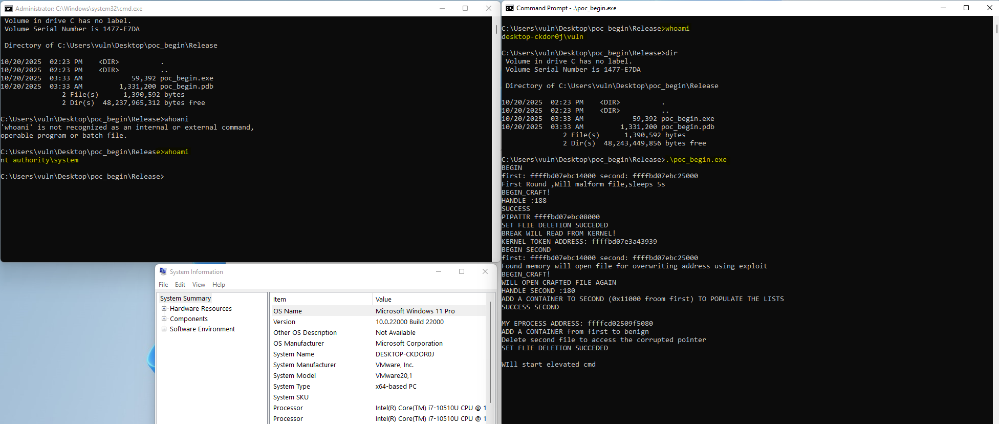

# Synopsis

This tutorial's main focus was not the internals of the CVE itself, but rather a user friendly description of the process of creating a Windows privilege escalation example. Many exploits share the same methods and building blocks like memory spraying or working with certain Windows data structures. And most of the time there is a big gap between having theoretical Windows internal knowledge and effectively writing an algorithm that leverages a vulnerability. 
