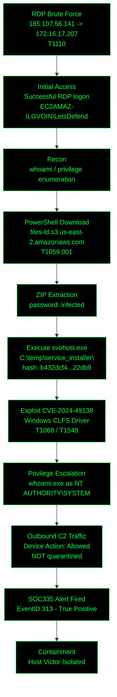

<div align="center">


<br/>


</div>

<br/>

## `> whoami`

```bash
root@soc:~# cat case_file.txt

  Platform      : LetsDefend
  Case          : SOC335 - CVE-2024-49138 Exploitation Detected
  EventID       : 313
  Alert Time    : 2025-01-22T02:37:00+03:00
  Alert Type    : Privilege Escalation
  Difficulty    : Medium
  Role          : Security Analyst

  Hostname      : Victor
  IP Address    : 172.16.17.207
  Process User  : EC2AMAZ-ILGVOIN\LetsDefend
  Process Name  : svohost.exe   (masquerading svchost.exe)
  Process Path  : C:\temp\service_installer\svohost.exe
  Parent Proc   : C:\Windows\System32\WINDOWSPOWERSHELL\V1.0\powershell.exe
  File Hash     : b432dcf4a0f0b601b1d79848467137a5e25cab5a0b7b1224be9d3b6540122db9
  Device Action : Allowed

  MITRE ATT&CK  : T1059.001  PowerShell
                  T1055      Process Injection
                  T1068      Exploitation for Privilege Escalation
                  T1548      Abuse Elevation Control Mechanism
                  T1110      Brute Force
```

---

## `> ./playbook.sh --pivot-methodology`

Metodología de 5 fases, cada una resuelta en **WHO / WHAT / WHEN / WHY** antes de pivotar a la siguiente.

```
┌─[ STEP 1: ALERT TRIAGE ]─────────────────────────────────────────────────────┐
│                                                                              │
│  WHO   : SIEM queue / SOC335 rule (EventID 313)                              │
│  WHAT  : svohost.exe spawned by powershell.exe outside System32              │
│  WHEN  : 2025-01-22 02:37:00 +03:00                                          │
│  WHY   : separates real EoP attempt from benign svc install                  │
│                                                                              │
│  $ filter process_name="svohost.exe" AND path!="*\System32\*"                │
│                                                                              │
│  PIVOT : hash + host isolated -> enrich with threat intel                    │
└──────────────────────────────────────────────────────────────────────────────┘

┌─[ STEP 2: THREAT INTEL ENRICHMENT ]──────────────────────────────────────────┐
│                                                                              │
│  WHO   : VirusTotal, CISA KEV, SentinelOne CVE DB                            │
│  WHAT  : hash flagged malicious; behavior maps to CVE-2024-49138 (CLFS EoP)  │
│  WHEN  : patched Dec-2024 Patch Tuesday; exploited pre-patch as 0-day, KEV-  │
│          listed                                                              │
│  WHY   : turns an unknown binary into a named, weaponized CVE with known TTPs│
│                                                                              │
│  $ vt hash b432dcf4a0f0b601b1d79848467137a5e25cab5a0b7b1224be9d3b6540122db9  │
│                                                                              │
│  PIVOT : malware + CVE confirmed -> validate on endpoint process tree        │
└──────────────────────────────────────────────────────────────────────────────┘

┌─[ STEP 3: ENDPOINT PROCESS TREE ]────────────────────────────────────────────┐
│                                                                              │
│  WHO   : Endpoint Security / EDR telemetry on host Victor                    │
│  WHAT  : child proc whoami.exe executes as NT AUTHORITY\SYSTEM               │
│  WHEN  : immediately after svohost.exe execution, same alert window          │
│  WHY   : proves exploitation SUCCEEDED, not merely attempted                 │
│                                                                              │
│  $ proctree --host Victor --pid 7640                                         │
│                                                                              │
│  PIVOT : escalation confirmed -> pivot to network logs for entry vector      │
└──────────────────────────────────────────────────────────────────────────────┘

┌─[ STEP 4: NETWORK & LOG PIVOT ]──────────────────────────────────────────────┐
│                                                                              │
│  WHO   : Log Management: RDP auth logs + firewall/netflow                    │
│  WHAT  : RDP brute force from 185.107.56.141; outbound traffic to C2         │
│  WHEN  : brute force precedes 02:37 alert; C2 traffic follows escalation     │
│  WHY   : completes the chain from initial access to impact; feeds IOC list   │
│                                                                              │
│  $ filter dst_ip=172.16.17.207 AND event_type=logon_failed,logon_success     │
│                                                                              │
│  PIVOT : full attack chain reconstructed -> containment & closure            │
└──────────────────────────────────────────────────────────────────────────────┘

┌─[ STEP 5: CONTAINMENT & CLOSURE ]────────────────────────────────────────────┐
│                                                                              │
│  WHO   : Incident responder / case owner                                     │
│  WHAT  : Device Action=Allowed -> malware NOT quarantined; host isolated     │
│  WHEN  : at alert time, within response SLA                                  │
│  WHY   : halts lateral movement/C2; documents evidence for TP closure        │
│                                                                              │
│  $ isolate-host Victor --reason "CVE-2024-49138 confirmed exploitation"      │
│                                                                              │
│  PIVOT : case closed as True Positive -> remediation (patch CLFS, harden RDP)│
└──────────────────────────────────────────────────────────────────────────────┘
```

---

## `> ./run_investigation.sh`

<details>
<summary><b>[ Step 1 ] Alert Triage — SIEM / SOC335</b></summary>

```bash
$ cat alert_313.log

[i] EventID 313 | Rule: SOC335 - CVE-2024-49138 Exploitation Detected
[i] Parent -> powershell.exe (v1.0)
[i] Child  -> svohost.exe  "C:\temp\service_installer\svohost.exe"
[!] Legit svchost.exe NEVER runs outside C:\Windows\System32\
[+] ANSWER: filename masquerading detected (svohost vs svchost) -> escalate to full case
```
🔗 [LetsDefend SOC335 case data]

</details>

<details>
<summary><b>[ Step 2 ] Threat Intel Enrichment — VirusTotal + CVE research</b></summary>

```bash
$ vt hash b432dcf4a0f0b601b1d79848467137a5e25cab5a0b7b1224be9d3b6540122db9

[+] ANSWER: Multiple AV engines flag file as MALICIOUS
[i] CVE-2024-49138 -> Windows Common Log File System (CLFS) Driver
[i] Type: Heap-based buffer overflow -> Elevation of Privilege
[i] CVSS: 7.8 (HIGH) | Local attack vector | No user interaction beyond exec
[i] Patched: December 2024 Patch Tuesday
[!] Exploited IN THE WILD as a 0-day BEFORE the patch shipped
[!] Listed on CISA Known Exploited Vulnerabilities (KEV) catalog
```
🔗 [SentinelOne — CVE-2024-49138 Vulnerability Database](https://www.sentinelone.com/vulnerability-database/cve-2024-49138/)
🔗 [The Hacker News — Microsoft Patches 72 Flaws Incl. CLFS 0-day](https://thehackernews.com/2024/12/microsoft-fixes-72-flaws-including.html)
🔗 [Cybersecurity News — CLFS Zero-Day Exploited](https://cybersecuritynews.com/clfs-zero-day-cve-2024-49138/)

</details>

<details>
<summary><b>[ Step 3 ] Endpoint Process Tree — host Victor</b></summary>

```bash
$ proctree --host Victor --pid 7640

powershell.exe (v1.0)
 └── svohost.exe        C:\temp\service_installer\svohost.exe
      └── conhost.exe   0xffffffff -ForceV1
      └── whoami.exe    RunAs: NT AUTHORITY\SYSTEM        <-- [!] ESCALATION CONFIRMED

[+] ANSWER: privilege escalation SUCCEEDED (not just attempted)
[i] whoami.exe executing as SYSTEM proves CVE-2024-49138 exploit landed
```
🔗 [LetsDefend SOC335 Walkthrough — Mohamed Sahal](https://0xmsahal.medium.com/soc335-cve-2024-49138-exploitation-detected-letsdefend-walkthrough-7ca94edc538b)

</details>

<details>
<summary><b>[ Step 4 ] Network & Log Pivot — initial access + C2</b></summary>

```bash
$ filter dst_ip=172.16.17.207 AND event_type=logon_failed,logon_success

[i] Multiple failed RDP logons from 185.107.56.141  (brute force pattern)
[+] ANSWER: successful RDP logon from 185.107.56.141 -> initial access vector = T1110
[i] Post-escalation: PowerShell downloads ZIP from
    files-ld.s3.us-east-2.amazonaws.com  (password-protected: "infected")
[!] Outbound traffic observed to attacker-controlled infrastructure post-exploit -> C2
```
🔗 [Incident Response Walkthrough — Gustavo Padilha Cassol](https://medium.com/@gugucassol/incident-response-walkthrough-cve-2024-49138-exploitation-detected-letsdefend-soc335-639991349231)
🔗 [Letsdefend SOC335 Writeup — dev.to](https://dev.to/hitanshugedam/letsdefend-soc335-cve-2024-49138-exploitation-detected-3773)

</details>

<details>
<summary><b>[ Step 5 ] Containment & Closure — playbook answers</b></summary>

```bash
$ cat case_playbook_answers.txt

  Threat indicator identified?   -> Unknown Traffic / suspicious PS download
  Malware detected?              -> Yes  (hash confirmed malicious via VT)
  Malware source verified?       -> Yes
  Is malware quarantined?        -> No   (Device Action = "Allowed" in raw log)
  C2 communication observed?     -> Yes  (outbound to attacker infra)

$ isolate-host Victor --reason "CVE-2024-49138 confirmed exploitation"
[+] ANSWER: host Victor isolated from network
[+] Case classification: TRUE POSITIVE
```

</details>

---

## `> graph --attack-chain`



---

## `> cat sources.log`

<details>
<summary><b>Ver fuentes completas</b></summary>

- [SentinelOne — CVE-2024-49138 Vulnerability Database](https://www.sentinelone.com/vulnerability-database/cve-2024-49138/)
- [The Hacker News — Microsoft Fixes 72 Flaws, Including Patch for Actively Exploited CLFS Vulnerability](https://thehackernews.com/2024/12/microsoft-fixes-72-flaws-including.html)
- [Cybersecurity News — Windows Common Log File System Zero-day Vulnerability (CVE-2024-49138) Exploited](https://cybersecuritynews.com/clfs-zero-day-cve-2024-49138/)
- [LetsDefend SOC335 Walkthrough — Mohamed Sahal (Medium)](https://0xmsahal.medium.com/soc335-cve-2024-49138-exploitation-detected-letsdefend-walkthrough-7ca94edc538b)
- [Incident Response Walkthrough: CVE-2024-49138 — Gustavo Padilha Cassol (Medium)](https://medium.com/@gugucassol/incident-response-walkthrough-cve-2024-49138-exploitation-detected-letsdefend-soc335-639991349231)
- [Letsdefend SOC335 Writeup — dev.to (hitanshugedam)](https://dev.to/hitanshugedam/letsdefend-soc335-cve-2024-49138-exploitation-detected-3773)
- [LetsDefend SOC335 — Tomasz Kozlowski (Medium)](https://medium.com/@blockchainski2.0/lets-defend-soc335-cve-2024-49138-exploitation-detected-f9d467c62841)

</details>

<div align="center">


</div>
