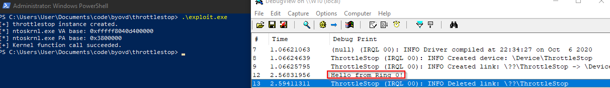

# CVE-2025-7771 

Exploit to invoke arbitrary kernel-mode functions from usermode by abusing ThrottleStop driver.

---

# Demonstration

---

# References

https://github.com/jonomango/superfetch

https://securelist.com/av-killer-exploiting-throttlestop-sys/117026/
