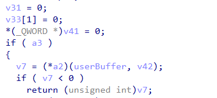

# CVE-2024-21338 Exploit

## 项目简介

这是一个针对 CVE-2024-21338 的 POC，该漏洞是 Windows AppLocker 驱动（appid.sys）中的一个提权漏洞，曾作为 0day 被 Lazarus 组织利用，用于 Windows 本地权限提升。

## 漏洞背景

CVE-2024-21338 是一个在 2024 年 2 月 13 日微软 Patch Tuesday 中被披露的提权漏洞，该漏洞被 Lazarus 黑客组织利用，用于获取内核访问权限，以部署 FudModule rootkit。

该漏洞存在于 appid.sys 驱动的`0x22A018`控制码中，攻击者可以通过发送特制的 IOCTL 请求来触发漏洞，从而实现任意回调调用，最终获得内核读写权限。

## 漏洞原理
### 漏洞位置

该漏洞位于 appid.sys 驱动的`AppHashComputeImageHashInternal`函数中，`AipDeviceIoControlDispatch`在处理`0x22A018`请求时没有正确检查`PreviousMode`，导致用户模式的进程可以触发内核模式的回调函数。

### 利用过程

1. **获取 Local Service 权限**：该漏洞需要 Local Service 权限才能访问`\\Device\\AppID`设备，因此工具会先找到并 impersonate Local Service 进程。

2. **构造 IOCTL 请求**：工具会构造特制的 IOCTL 请求，包含一个可控的函数指针和参数。

3. **触发漏洞**：通过发送 IOCTL 请求，触发漏洞，调用内核中的 gadget 函数，修改当前线程的`PreviousMode`字段，将其从用户模式改为内核模式。

4. **获得内核读写权限**：修改`PreviousMode`后，用户模式的进程就可以使用`NtReadVirtualMemory`和`NtWriteVirtualMemory`来读写任意内核内存。

## 项目结构

|文件名称|功能描述|
|---|---|
|main.cpp|主函数，负责漏洞利用的流程控制|
|CVE-2024-21338.h|漏洞利用相关的结构体和函数声明|
|CVE-2024-21338.cpp|漏洞利用的前置条件实现函数|
|export_func.h|导出函数的声明|
|gadget_search.cpp|内核 gadget 搜索的实现|
|Native.h|原生 Native API 的定义|
|PE.h|处理 PE 文件相关的工具函数|
## 使用方法

### 编译

使用 Visual Studio 2026 编译该项目，需要 Windows SDK 和 C++ 编译器支持。

### 运行
1. 在未打补丁的 Windows 系统上（如 Windows 10 1709）启用 Application Identity 服务。
2. 以管理员权限运行编译后的可执行文件。

3. 工具会自动找到 Local Service 进程，并 impersonate 该进程。

4. 工具会加载 appid.sys 驱动，并构造 IOCTL 请求触发漏洞。

5. 漏洞触发成功后，工具会提示输入要修改的内核地址和值，实现内核内存修改。

## 免责声明

该项目仅用于教育和研究目的，不得用于非法用途。

## 参考资料

1. [Windows AppLocker Driver Elevation of Privilege (CVE-2024-21338)](https://nero22k.github.io/posts/windows-applocker-driver-elevation-of-privilege-cve-2024-21338/)

2. [Lazarus and the FudModule Rootkit: Beyond BYOVD with an Admin-to-Kernel Zero-Day](https://www.gendigital.com/blog/insights/research/lazarus-and-the-fudmodule-rootkit-beyond-byovd-with-an-admin-to-kernel-zero-day)

3. [Microsoft Security Advisory CVE-2024-21338](https://msrc.microsoft.com/update-guide/vulnerability/CVE-2024-21338)
