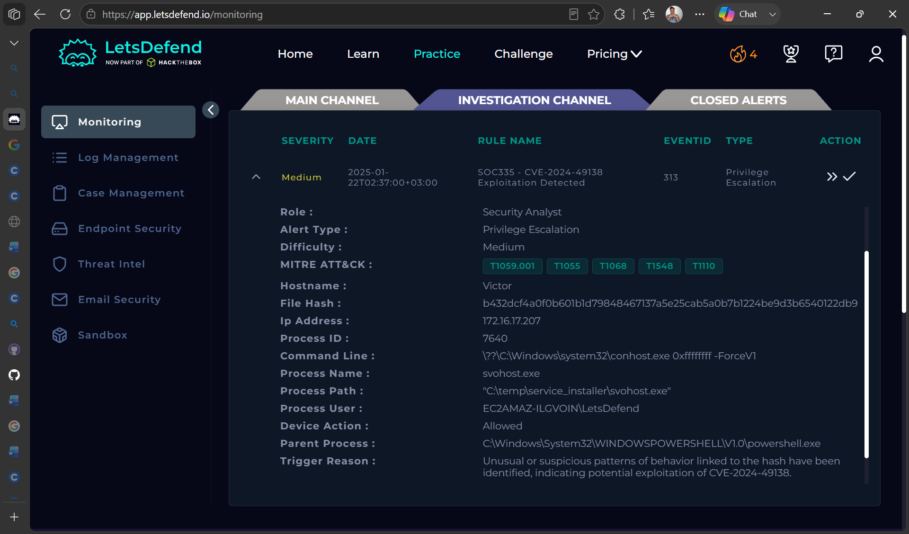
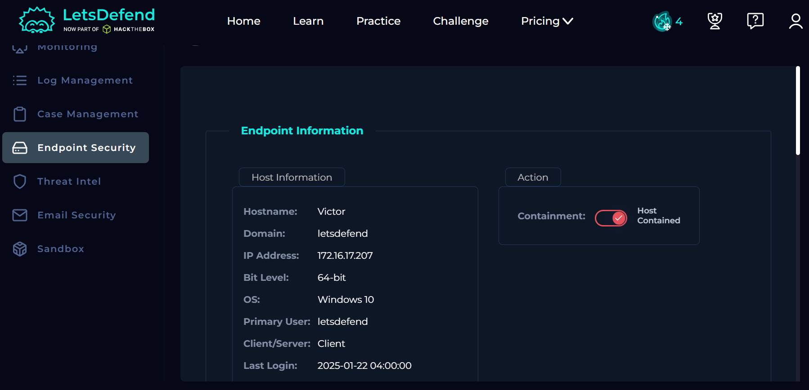
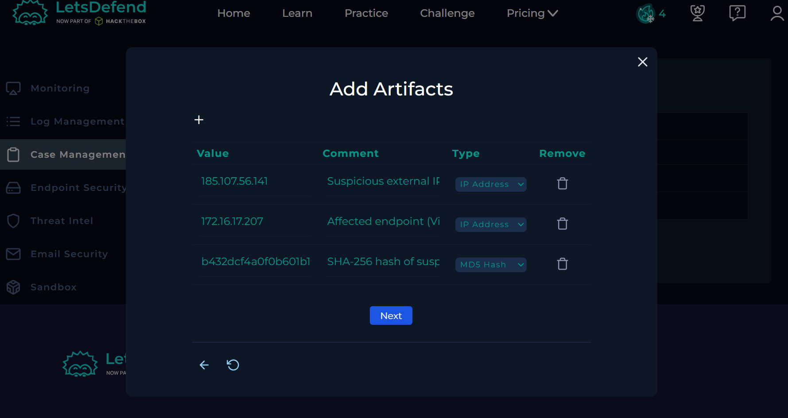
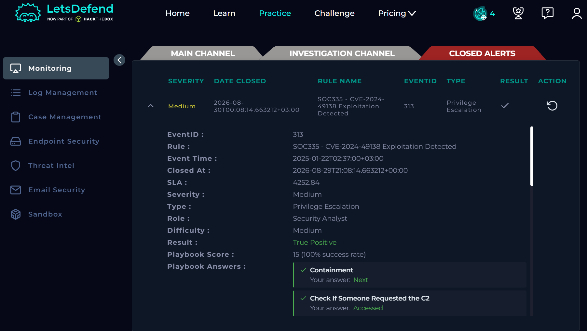
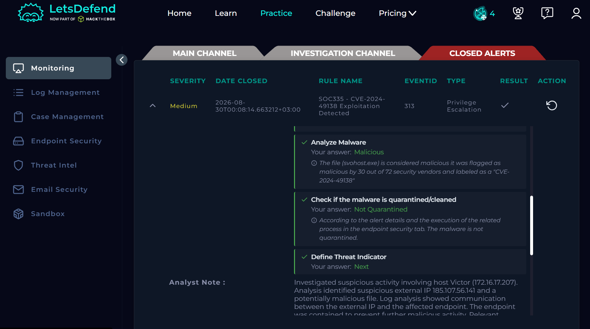
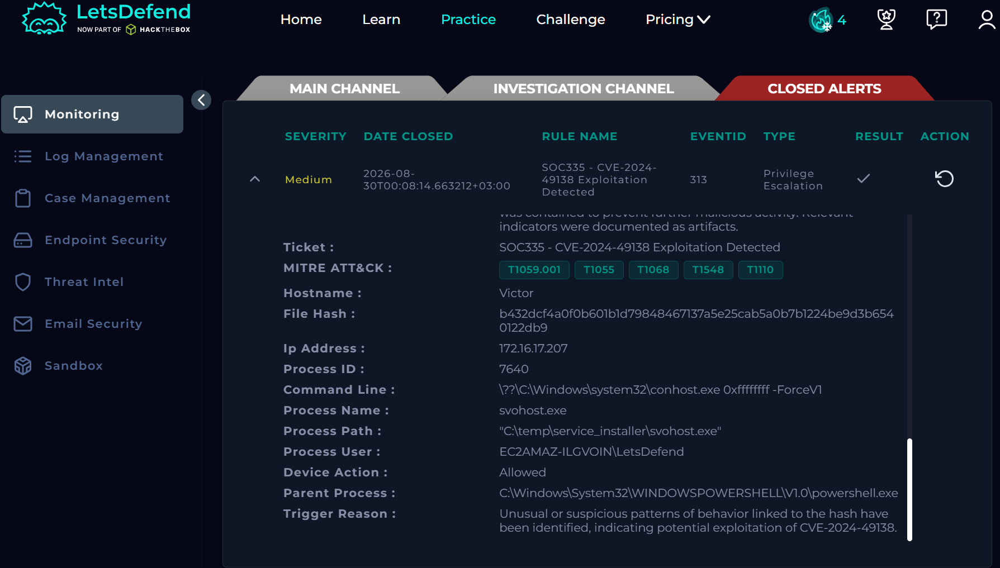

# SOC335 – CVE-2024-49138 Exploitation Investigation

## Overview
This project documents a SOC investigation of a CVE-2024-49138 exploitation alert using the LetsDefend platform. The investigation involved analyzing network logs, researching indicators of compromise, determining whether suspicious communication occurred, and containing the affected endpoint.

## Alert Details
- **Alert:** SOC335 – CVE-2024-49138 Exploitation Detected
- **Severity:** Medium
- **Event ID:** 313
- **Category:** Privilege Escalation
- **Affected Host:** Victor
- **Internal IP:** 172.16.17.207
- **Suspicious External IP:** 185.107.56.141

### Alert Screenshot

## Investigation

### 1. Log Analysis
Firewall logs were reviewed to investigate communication involving the affected endpoint. Traffic was identified between the suspicious external IP address and the internal host.

### 2. Threat Intelligence
The external IP address was investigated using VirusTotal and additional threat intelligence information to determine whether it was associated with suspicious activity.

### 3. Endpoint Investigation
The affected endpoint was identified as **Victor (172.16.17.207)**, a Windows 10 client.

### 4. Containment
Based on the investigation findings, the affected endpoint was contained through the Endpoint Detection and Response (EDR) platform to prevent further potentially malicious activity.

## Indicators of Compromise (IOCs)
| Type | Value |
|------|-------|
| External IP | 185.107.56.141 |
| Internal IP | 172.16.17.207 |
| Hostname | Victor |

## Conclusion
The alert was determined to be a **True Positive**. Suspicious network activity associated with the exploitation alert was identified, and the affected endpoint was contained as part of the incident response process.

### Closed Alert Results

## Skills Demonstrated
- SOC alert triage
- Log analysis
- Threat intelligence research
- Indicator of Compromise (IOC) analysis
- Endpoint investigation
- Incident containment
- EDR investigation
- Incident documentation

## Tools Used
- LetsDefend
- VirusTotal

---
*This project was completed in a simulated SOC environment for educational and portfolio purposes.*
