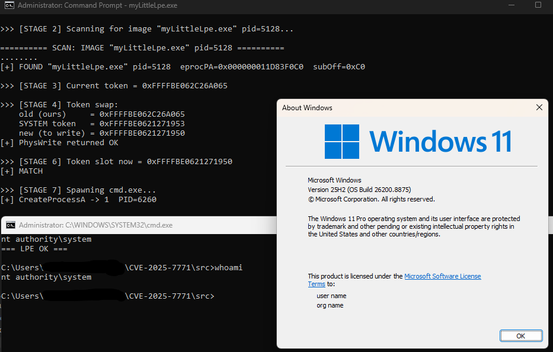

# CVE-2025-7771 — ThrottleStop.sys Arbitrary Physical Memory R/W

Full proof-of-concept for the TechPowerUp `ThrottleStop.sys` driver (CVE-2025-7771).
A signed, still-loadable kernel driver exposes unvalidated physical memory read and
write through two IOCTLs. This repo turns that primitive into a working
administrator-to-SYSTEM local privilege escalation and documents a device-naming quirk
that breaks most path- and filename-based detections.

A PoC for the same IOCTLs already existed (see Credits). This is an independent, full
exploit chain rather than a primitive demonstration.

## Affected driver

| Field | Value |
|---|---|
| SHA256 | `16F83F056177C4EC24C7E99D01CA9D9D6713BD0497EEEDB777A3FFEFA99C97F0` |
| SHA1 | `82ED942A52CDCF120A8919730E00BA37619661A3` |
| MD5 | `6BC8E3505D9F51368DDF323ACB6ABC49` |
| Version | 3.0.0.0 ("Low-Level Driver", 2004-2020) |
| Signer | TechPowerUp LLC, DigiCert EV Code Signing |
| Cert thumbprint | `524EDA9C819321C66E22C7BABEB23DAEAFFB2182` |
| Cert validity | 2019-08-10 to 2022-06-15 |

The certificate expired in 2022, but the signature carries a trusted countersignature
timestamp, so Windows still loads it. Revocation only helps if its date precedes the
signing time, which is rarely the case for old drivers like this.

The version resource has no `CompanyName`, `OriginalFilename` or `InternalName`, so the
file cannot be attributed to a vendor from its own metadata.

## The bug

Two IOCTLs read and write physical memory with no bounds or address validation:

| IOCTL | Operation |
|---|---|
| `0x80006498` | Physical read |
| `0x8000649C` | Physical write |

Both are `METHOD_BUFFERED`, so there is no user-pointer dereference; the defect is the
missing validation of the caller-supplied physical address, not an unchecked pointer.

Worth flagging: the write handler `0x8000649C` is declared `FILE_READ_ACCESS`. A handle
opened read-only can still issue physical writes, so the declared access mask does not
match what the handler actually does.

## Impact

Opening the device needs administrator rights, so this is not a privilege boundary
crossing on its own. What it gives an attacker who is already admin is arbitrary kernel
read/write from user mode, which defeats the protections that are supposed to hold above
admin: HVCI code integrity, PPL, and EDR/AV self-protection. Classic bring-your-own-
vulnerable-driver.

As a concrete demonstration, the PoC uses the R/W primitive to steal the SYSTEM token
and spawn a SYSTEM shell.

CVSS 4.0: `AV:L/AC:H/AT:N/PR:H/UI:N/VC:H/VI:H/VA:H/SC:H/SI:H/SA:H` (8.7, High).

## How the exploit works

Everything runs from user mode against the driver's physical R/W IOCTLs. There is no
page-table walking and no CR3 involved; both processes are located by scanning physical
memory directly:

1. **Locate SYSTEM.** Scan physical memory for an EPROCESS whose `ImageFileName` is
   `System` and `UniqueProcessId` is 4. The scan is bounded to the populated RAM ranges
   read from the firmware's `HARDWARE\RESOURCEMAP\...\Physical Memory` registry key,
   not a guessed window, so MMIO holes are never touched and nothing above installed RAM
   is missed.
2. **Read the SYSTEM token.** Read the `Token` field (`EPROC_TOKEN`) from the located
   EPROCESS.
3. **Locate our process.** Scan physical memory the same way for the PoC's own EPROCESS,
   matching the image name as an 8-byte pattern and confirming with its PID.
4. **Swap the token.** Write the SYSTEM token value into our own `Token` slot. The token
   is an `_EX_FAST_REF`, so the low reference-count bits are masked by default (`--mask`
   selects the behaviour).
5. **Prove it.** Spawn `cmd.exe`; `whoami` returns `NT AUTHORITY\SYSTEM`.

Offsets (`EPROC_TOKEN`, `EPROC_PID`, `EPROC_IMG_NAME`, etc.) are for a specific build and
must be confirmed against `dt nt!_EPROCESS` on the target Windows version.

The executable name matters. Step 3 locates our own process by matching its
`ImageFileName` in physical memory, and that field is capped at 15 characters with the
scan matching the first 8. Keep the compiled name short and distinctive; if you rename
the binary, stay within that limit or the self-scan will not find the process.

## Device name is attacker-controlled

The driver does not use a fixed device name. It derives the device object name from the
**service name** it is registered under; the filename on disk is irrelevant. Registering
the binary under service `TRIXX` produces `\\.\TRIXX` no matter what the file is called on
disk.

So any detection keyed on `\Device\ThrottleStop` or `ThrottleStop.sys` is trivially
bypassed. Detection has to be based on the file hash or the signing certificate:

```
SHA256:     16F83F056177C4EC24C7E99D01CA9D9D6713BD0497EEEDB777A3FFEFA99C97F0
Thumbprint: 524EDA9C819321C66E22C7BABEB23DAEAFFB2182
Subject:    CN=TechPowerUp LLC, O=TechPowerUp LLC, L=Spokane, S=Washington, C=US
```

The `DEVICE_NAMES` list in the source is just a probe for known product installs. Pass a
device name as an argument to target a service you registered yourself.

## Related TechPowerUp drivers

| CVE | Driver |
|---|---|
| CVE-2019-7245 | GPU-Z.sys |
| CVE-2025-5324 | GPU-Z.sys |
| CVE-2025-7771 | ThrottleStop.sys (this repo) |

## The driver is not included

The binary is not shipped here. Verify any copy against the SHA256 above. The sample is
catalogued in [LOLDrivers](https://github.com/magicsword-io/LOLDrivers/issues/291).

## Build

```
cl /nologo /EHsc /W4 /O2 src\ThrottleStop.cpp /Fe:myLittleLpe.exe /link advapi32.lib
```

## Usage

Lab use only. Run inside an isolated VM with a snapshot to roll back to.

```
sc.exe create <name> type= kernel binPath= C:\path\to\ThrottleStop.sys
sc.exe start <name>

myLittleLpe.exe

sc.exe stop <name>
sc.exe delete <name>
```

The binary takes no arguments. It prints the physical memory map, scans for the SYSTEM
and local EPROCESS, swaps the token, and spawns `cmd.exe` running as
`NT AUTHORITY\SYSTEM`.

## Demo



## Other PoCs and prior work

Other public work on the same driver, for comparison:

- [Demoo1337/ThrottleStop](https://github.com/Demoo1337/ThrottleStop) — earlier PoC for the same IOCTLs
- [xM0kht4r/CVE-2025-7771](https://github.com/xM0kht4r/CVE-2025-7771) — physical R/W plus VA-to-PA via Superfetch
- [AmrHuss/throttlestop-exploit-rw](https://github.com/AmrHuss/throttlestop-exploit-rw) — physical R/W with Superfetch address translation
- [v31l0x1/ThrottleStopPPL](https://github.com/v31l0x1/ThrottleStopPPL) — PPL protection bypass
- [Yuri08loveElaina/CVE-2025-7771](https://github.com/Yuri08loveElaina/CVE-2025-7771) — another implementation

## Credits

- [LOLDrivers](https://www.loldrivers.io/) — vulnerable driver cataloguing

## Disclaimer

Published for defensive research and detection engineering. The vulnerability is already
public as CVE-2025-7771. Everything here was tested on systems owned by the author. Do
not run this against systems you do not own or are not authorised to test.
