# RoguePlanet PoC Validation Report for Microsoft Defender

## Purpose and scope of the report

This report concerns the validation of the publicly described RoguePlanet PoC related to Microsoft Defender. The described technique was presented in the media on 10 June 2026 as a Local Privilege Escalation (LPE), in which a local user can obtain NT AUTHORITY\SYSTEM privileges. Public descriptions indicated that the mechanism uses functions used by Microsoft Defender when handling or scanning a file.

The purpose of the test was to determine whether the exploit could be prepared and executed in a controlled laboratory environment, and to observe how Microsoft Defender protection mechanisms behave on an up-to-date Windows 11 system. The report covers the test environment, update status, Microsoft Defender configuration, preparation of the compilation environment, compilation result, Defender response, and risk-reduction recommendations.

The test was research-oriented and was performed locally on a dedicated test workstation. The results should be interpreted as an assessment of the behavior of a specific artifact and a specific environment configuration, not as full confirmation of resistance to all possible variants of this technique.

Sources referenced in the analyzed material:

- Article:

  https://thehackernews.com/2026/06/microsoft-defender-rogueplanet-zero-day.html

- Public PoC repository:

  https://github.com/MSNightmare/RoguePlanet/tree/main

- MSYS2 installer source:

  https://github.com/msys2/msys2-installer/releases/tag/nightly-x86_64

- Visual Studio source:

  https://visualstudio.microsoft.com/insiders/?rwnlp=pl

## Test environment

The PoC was performed on a client workstation operating outside an Active Directory domain, in the WORKGROUP workgroup. The operating system installed on the workstation was Microsoft Windows 11 Home, version 25H2, 64-bit architecture.

| **Parameter**       | **Value**                            |
|---------------------|--------------------------------------|
| System name         | Microsoft Windows 11 Home            |
| Edition             | Home                                 |
| System version      | 25H2                                 |
| OS version          | 10.0.26200                           |
| Build number        | 26200                                |
| Architecture        | x64 / 64-bit                         |
| Installation type   | Client / Workstation                 |
| Host name           | LAPTOP-80LPIEH2                      |
| Device manufacturer | Lenovo                               |
| Device model        | Lenovo Legion Slim 5 16IRH8          |
| Processor           | 12th Gen Intel(R) Core(TM) i5-12450H |
| RAM                 | 32 GB                                |

On the day the PoC was performed, the system had the June 2026 security updates installed, as well as earlier updates from May and April 2026. This means that the test was carried out on an up-to-date Windows 11 25H2 system, build 26200, after installation of the latest available security patches as of the test date.

| **HotFixID** | **Update type** | **Installation date** |
|--------------|-----------------|-----------------------|
| KB5094135    | Security Update | 10.06.2026            |
| KB5094126    | Security Update | 10.06.2026            |
| KB5087051    | Update          | 14.05.2026            |
| KB5092762    | Security Update | 13.05.2026            |
| KB5054156    | Update          | 28.04.2026            |

## Microsoft Defender configuration

Microsoft Defender Antivirus was active on the workstation used for the test and was running in normal mode. The protection service was running and enabled, and antivirus protection, antispyware protection, behavior monitoring, and real-time protection were active.

| **Parameter**               | **Value**     |
|-----------------------------|---------------|
| AMProductVersion            | 4.18.26050.15 |
| AMServiceVersion            | 4.18.26050.15 |
| AMEngineVersion             | 1.1.26050.11  |
| AMRunningMode               | Normal        |
| AMServiceEnabled            | True          |
| AntivirusEnabled            | True          |
| AntispywareEnabled          | True          |
| RealTimeProtectionEnabled   | True          |
| BehaviorMonitorEnabled      | True          |
| OnAccessProtectionEnabled   | True          |
| IoavProtectionEnabled       | True          |
| NISEnabled                  | True          |
| NISEngineVersion            | 1.1.26050.11  |
| IsTamperProtected           | True          |
| DefenderSignaturesOutOfDate | False         |
| RebootRequired              | False         |
| IsVirtualMachine            | False         |

On the day of the test, Microsoft Defender signatures were up to date. Antivirus, antispyware, and NIS signatures had been updated on 10.06.2026 at 13:27:32.

| **Signature type**          | **Version** | **Last update date** |
|-----------------------------|-------------|----------------------|
| AntivirusSignatureVersion   | 1.453.27.0  | 10.06.2026 13:27:32  |
| AntispywareSignatureVersion | 1.453.27.0  | 10.06.2026 13:27:32  |
| NISSignatureVersion         | 1.453.27.0  | 10.06.2026 13:27:32  |

The last quick scan was performed on 08.06.2026 between 15:00:36 and 15:01:58, using signatures version 1.451.323.0. A full scan had not been performed previously or its history was not available, as indicated by the FullScanAge value of 4294967295 and the absence of full scan start and end times.

## Preparation of the compilation environment

The first attempt to compile the code from the GitHub repository ended with an error caused by the missing winternl.h header. The message indicated that the system did not have the complete set of Windows SDK headers required by the analyzed code.

<p align="center">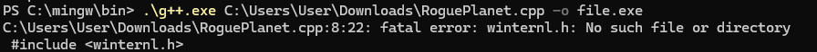</p>

<p align="center"><em>Figure 1. Missing winternl.h header error during the first compilation attempt.</em></p>

The code also referenced other headers related to Windows API and NT API, including windows.h, Psapi.h, ntstatus.h, virtdisk.h, shlwapi.h, taskschd.h, and bcrypt.h. For this reason, it was necessary to prepare a more complete compilation environment and install the appropriate SDK components.

<p align="center">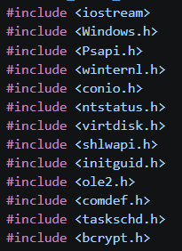</p>

<p align="center"><em>Figure 2. Fragment of the list of headers required by the analyzed code.</em></p>


### Attempt to use MSYS2/MinGW-w64

Initially, MSYS2/MinGW-w64 was used to prepare the compilation environment. This environment provides GNU tools for Windows, including the gcc and g++ compilers. Packages in MSYS2 are managed using pacman, which serves a similar role to apt on Linux systems or winget on Windows.

<p align="center">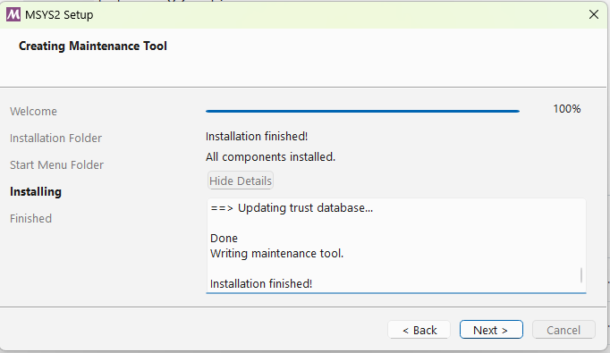</p>

<p align="center"><em>Figure 3. Completion of the MSYS2 installation.</em></p>

Using pacman, the MinGW-w64 GCC/G++ toolchain was installed, i.e. a set of tools that enables compilation of C/C++ code for Windows. The package includes, among other components, the gcc compiler, the g++ C++ compiler, the linker, and the headers and libraries required to build applications running in the Windows environment. The purpose of this attempt was to check whether the code could be compiled using the open toolchain available in MSYS2, without using Visual Studio.

<p align="center">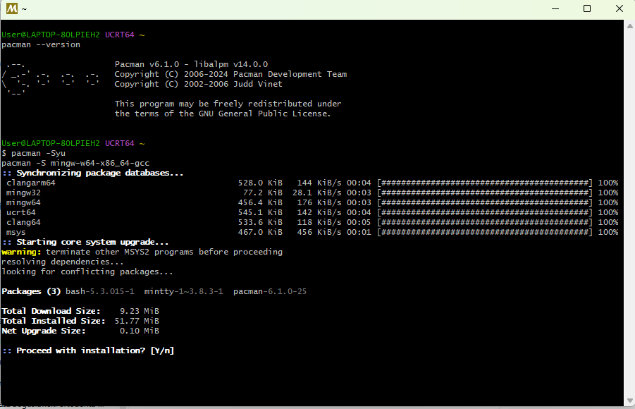</p>

<p align="center"><em>Figure 4. Installation of MSYS2/MinGW-w64 packages using pacman.</em></p>

After installation, an attempt was made to compile the code using g++. The command directly specified the path to the source file and the path to the resulting executable file.

```cmd
C:\msys64\mingw64\bin\g++.exe C:\Users\User\Downloads\RoguePlanet.cpp -o C:\Users\User\Desktop\roguePlanet.exe
```


### Unicode mode issue

The first significant indication of a Unicode mode issue was the compiler messages concerning incompatible character types. The logs contained errors stating that values of type const wchar_t\* or wchar_t\* could not be converted to LPCSTR or LPSTR. This meant that the code was passing wide-character strings to Windows API functions, while the compiler was selecting function variants intended for classic ANSI strings.

In Windows API, many functions exist in two variants: ANSI, marked with the A suffix, and Unicode, marked with the W suffix. For example, CreateFile can be mapped as CreateFileA or CreateFileW, and RegOpenKeyEx as RegOpenKeyExA or RegOpenKeyExW. The A variant expects parameters of type char\* or LPCSTR, while the W variant expects parameters of type wchar_t\* or LPCWSTR.

In the analyzed case, the code used literals in the form L"..." and buffers of type wchar_t. At the same time, the error messages indicated that the compiler selected functions such as GetModuleHandleA, RegOpenKeyExA, RegQueryValueExA, GetWindowsDirectoryA, CreateFileA, and wsprintfA. This was a direct indication that the code had been written with Unicode mode in mind, but the compilation command did not define UNICODE and \_UNICODE.

Unicode mode was therefore forced by adding the UNICODE and \_UNICODE definitions. After this change, Windows API functions without an explicit suffix should be mapped to W-suffixed variants, such as CreateFileW, RegOpenKeyExW, GetModuleHandleW, and GetWindowsDirectoryW. The fact that some of the errors disappeared after this change confirmed the correctness of the diagnosis.

```cmd
C:\msys64\mingw64\bin\g++.exe C:\Users\User\Downloads\RoguePlanet.cpp -o C:\Users\User\Desktop\roguePlanet.exe -DUNICODE -D_UNICODE
```

After the Unicode-related issues were removed, however, errors remained that indicated a deeper incompatibility between the code and MinGW. They concerned, among other things, duplicate definitions of the FILE_BASIC_INFORMATION and FILE_RENAME_INFORMATION structures, which were defined both in the source code and in the MinGW headers. In addition, the FILE_RENAME_INFORMATION version available in MinGW differed from the one expected by the code, including the absence of the Flags field.

Additional errors also resulted from the more restrictive approach of the g++ compiler to types, especially with enum flags and function pointers. This concerned, among others, the VIRTUAL_DISK_ACCESS_MASK and ATTACH_VIRTUAL_DISK_FLAG types, as well as passing function pointers as void\*. As a result, MinGW was deemed unsuitable for compiling this code without significant source-code modifications.

## 5. Migration to MSVC and Windows SDK

Due to compatibility issues with MinGW, an MSVC and Windows SDK environment was prepared. The “Desktop development with C++” workload was selected in the Visual Studio installer because the analyzed code was a native Windows application written in C/C++ and used Windows API and Windows SDK components directly. It was not a .NET, Python, Node.js, or web application project, so components related to those technologies were not installed.

<p align="center">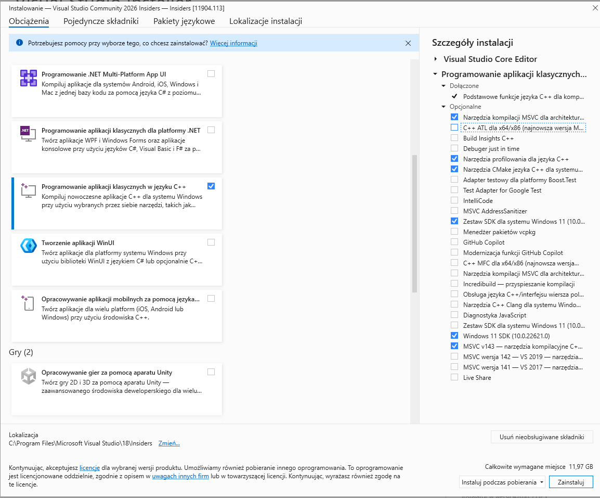</p>

<p align="center"><em>Figure 5. Selected Visual Studio workload and components for desktop C++ applications.</em></p>

The most important component was MSVC v143, the Microsoft C/C++ compiler intended for building C/C++ applications for Windows. It was selected because the earlier attempt to compile with MinGW/G++ caused compatibility errors related to headers, types, and NT API structures. The code used Windows-specific mechanisms, so the most compatible environment was Microsoft’s compiler together with the libraries provided by the Windows SDK.

Windows 11 SDK was also installed. This component contains the headers and libraries required to use Windows system functions, including windows.h, winternl.h, winreg.h, processthreadsapi.h, virtdisk.h, and .lib import libraries used during linking. In addition, C++ CMake tools were kept as an auxiliary component, useful when analyzing more complex projects.

After installation, x64 Native Tools Command Prompt for VS Insiders was used — a CLI with the correct paths set for the cl.exe compiler, Windows SDK, and linker libraries.

<p align="center">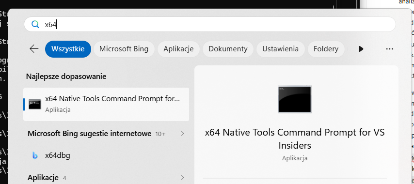</p>

<p align="center"><em>Figure 6. Launching x64 Native Tools Command Prompt for VS Insiders.</em></p>

## 6. Compilation using MSVC

After switching to MSVC, the code progressed significantly further in the build process. The first command still returned errors related to mapping Windows API functions to ANSI variants, so it was necessary to add the UNICODE and \_UNICODE definitions also during MSVC compilation.

```cmd
cl /EHsc RoguePlanet.cpp -o rogue.exe
```

<p align="center">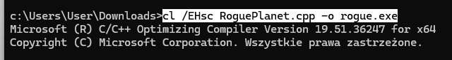</p>

<p align="center"><em>Figure 7. Compilation attempt using MSVC without full Unicode and linking configuration.</em></p>

After adding the Unicode switches, the code was processed further, and header and type compatibility errors were replaced by LNK2019 linker errors. This meant that the compiler was already able to create an object file, while the linker had not yet received all import libraries required by the Windows API functions used.

```cmd
cl /EHsc /DUNICODE /D_UNICODE RoguePlanet.cpp /Fe:rogue.exe
```

<p align="center">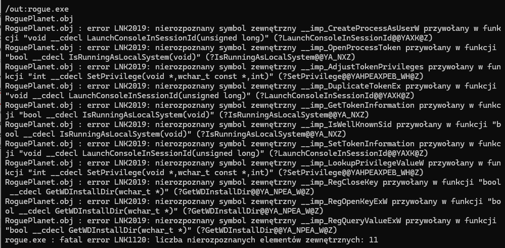</p>

<p align="center"><em>Figure 8. LNK2019 linker errors for Windows API functions.</em></p>

The linker errors involved functions such as CreateProcessAsUserW, OpenProcessToken, AdjustTokenPrivileges, DuplicateTokenEx, GetTokenInformation, LookupPrivilegeValueW, RegOpenKeyExW, and RegQueryValueExW. These functions are related to security tokens, privileges, starting processes in a specific user context, and reading the system registry. The header only declares that the function exists, but the linker must receive the correct import library indicating where the implementations of those functions are located.

To resolve the linker errors, the advapi32.lib library was added. This is a Windows import library that provides, among other things, functions related to security tokens, privileges, user accounts, and the system registry. After adding it to the linking stage, the linker was able to resolve the previously unresolved external symbols and create the executable file.

```cmd
cl /EHsc /DUNICODE /D_UNICODE RoguePlanet.cpp /Fe:rogue.exe /link advapi32.lib
```

<p align="center">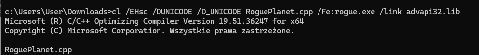</p>

<p align="center"><em>Figure 9. Result of the corrected compilation command.</em></p>

<p align="center">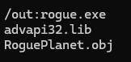</p>

<p align="center"><em>Figure 10. Result of the successful command.</em></p>

<p align="center">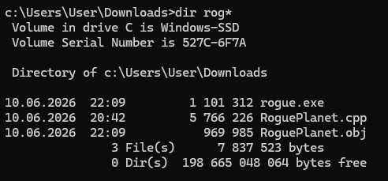</p>

<p align="center"><em>Figure 11. Created rogue.exe file in the working directory ~\Downloads\\</em></p>

## Microsoft Defender response and execution result

During validation, the created executable file was immediately detected by Microsoft Defender as Trojan:Win64/RoguePlanet.DA!MTB with the severity level “Severe”. The system proposed standard protection actions, such as moving the file to quarantine or deleting it.

<p align="center">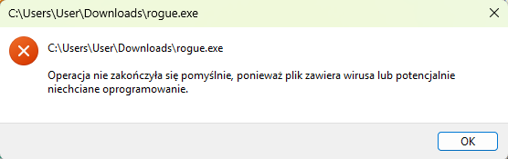</p>

<p align="center"><em>Figure 12. Windows message informing that the file was blocked as a virus or potentially unwanted software.</em></p>

<p align="center">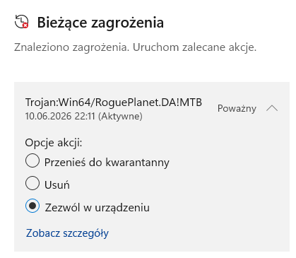</p>

<p align="center"><em>Figure 13. Microsoft Defender detection: Trojan:Win64/RoguePlanet.DA!MTB.</em></p>

This means that Defender’s detection mechanisms identified the prepared artifact as malicious or potentially dangerous before it could be successfully executed. From an endpoint protection perspective, this is a positive result, because the block occurred at the executable-file stage rather than only after observing the effects of the program’s execution.

After real-time protection was temporarily disabled, the file could be executed. The test observation indicates that after the second execution it was possible to obtain a console running with SYSTEM privileges. This result confirms that active Defender protection was important in blocking the tested artifact.

<p align="center">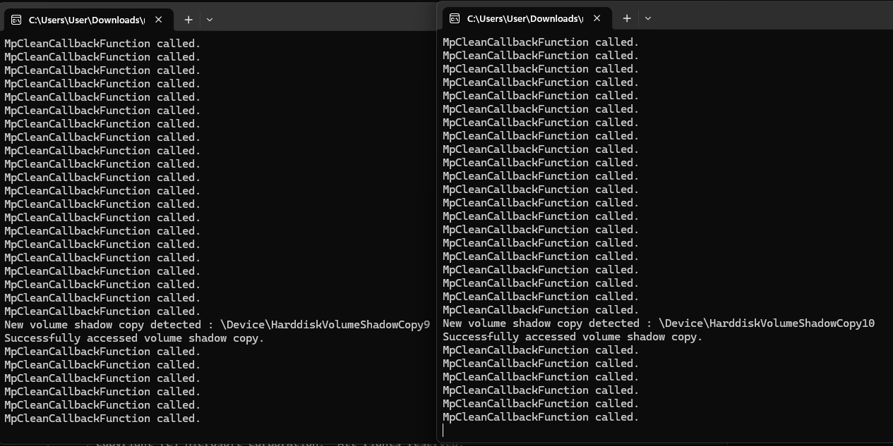</p>

<p align="center"><em>Figure 14. Program execution in the test environment after real-time protection was disabled.</em></p>

<p align="center">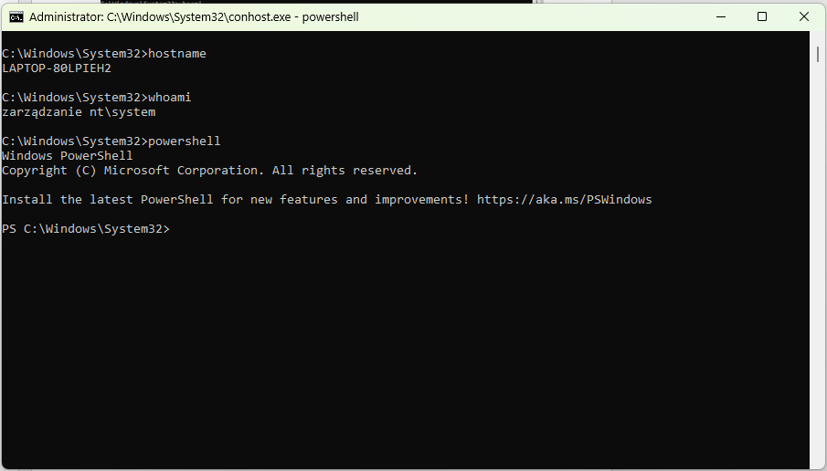</p>

<p align="center"><em>Figure 15. Console running in the system context in the test environment.</em></p>

## Risk assessment

The detection of one specific file by Microsoft Defender does not mean that the vulnerability risk has been fully eliminated. Defender detected a known or similar PoC artifact, while a modified version of the code, a different compilation, a changed file structure, or another loader could behave differently with regard to signature-based or heuristic detection. The test result should be treated as confirmation of the effectiveness of the current protection layer against the tested artifact, not as proof that every possible variation of the technique will be blocked.

At the same time, the test result indicates that with active real-time protection and up-to-date signatures, Defender successfully blocked the created artifact. The risk of practical exploitation increases significantly when a user is able to disable real-time protection, add an exclusion, allow a detected threat, or locally modify the protection configuration.

In practice, this means that effective mitigation should not rely solely on the presence of Defender itself, but also on centrally enforcing its configuration and blocking local changes made by users.

## 9. Recommendations

Centrally enforcing Microsoft Defender configuration through security policies is critical. Local users should not be able to disable real-time protection, add exclusions, allow detected threats, or modify protection settings. In such a model, the user should not be able to bypass detection independently by selecting an option such as “Allow on device” or by temporarily disabling protection.

- Centrally enforce real-time protection, cloud-delivered protection, and automatic sample submission;

- Block users from managing exclusions and actions for detections;

- Monitor Defender events related to detections, quarantine, attempts to allow threats, and protection configuration changes;

- Treat the Trojan:Win64/RoguePlanet.DA!MTB detection as a security event requiring analysis;

- Consider additional mechanisms limiting the execution of unauthorized executable files, such as application allow-listing, WDAC, or AppLocker, according to the capabilities of the environment.

## Final conclusions

The test confirmed that preparing the artifact required an environment compatible with Microsoft’s native toolchain. The compilation attempt using MinGW/G++ revealed compatibility issues with NT API headers and structures, while switching to MSVC and Windows SDK allowed the process to reach the linking stage and ultimately create the executable file after adding the correct import library.

Microsoft Defender running in normal mode, with up-to-date signatures and real-time protection enabled, detected the created file as Trojan:Win64/RoguePlanet.DA!MTB and blocked its execution. This is a positive test result from the endpoint protection perspective.

At the same time, disabling real-time protection allowed the artifact to be executed and led to obtaining a console with SYSTEM privileges. The practical conclusion is clear: Defender configuration should be centrally enforced, and users should not be able to locally weaken protection, add exclusions, or allow detected threats.