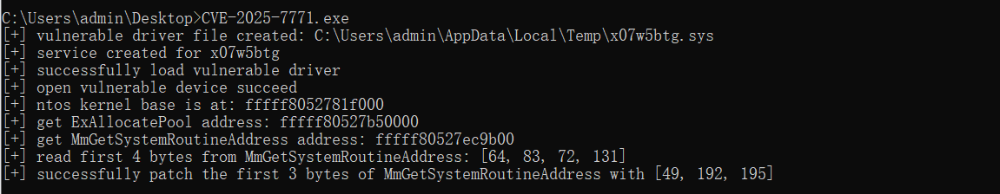

# A exploit app written in Rust for CVE-2025-7771
At a glance of the source code
- data.rs, store the vulnerable driver binary as a static array
- exploit.rs, implement a arbitrary read/write primitives based on that vulnerable drvier
- filemap.rs, a simple wrapper for win32 file mapping ops
- nt.rs, some nt features implement in Rust
- services.rs, a simple wrapper for win32 service management(create/delete, start/stop/pause/continue)
- spf.rs, implement virtual address to physical address translation based on superfetch

# Compile And Run
compile it will get an executable file, run it in the command line promot and it will produce some outputs like this:

