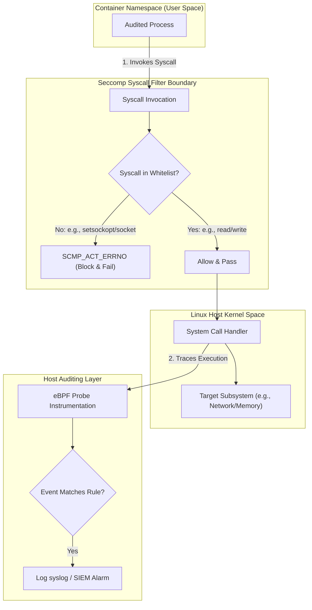
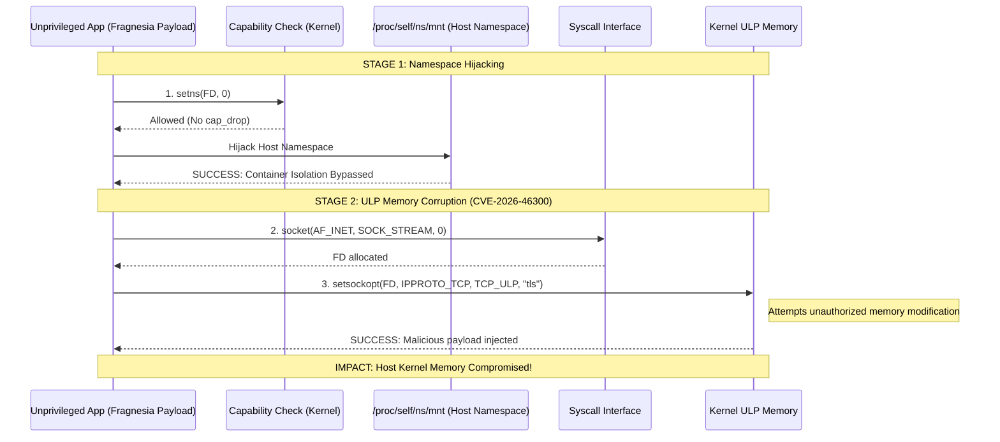
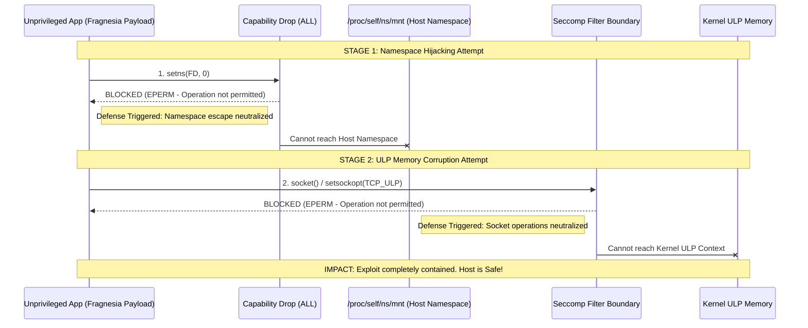

# Charantej Architecture: Hardened Container Staging & Syscall Telemetry Lab

An enterprise-grade, defense-in-depth container containment and runtime security telemetry framework. Designed from the perspective of a Cisco Lead Cybersecurity Architect, the Charantej Architecture isolates staging runtimes, restricts system call surfaces, and instruments real-time kernel telemetry using host-level auditing to secure modern Linux container deployments.

---

## High-Level Design (HLD)

The Charantej Architecture enforces isolation, least-privilege containment, and out-of-band monitoring to ensure security boundaries remain resilient against host kernel compromise vectors.

```mermaid
flowchart TD
    subgraph HostOS ["Host OS (Secured Linux Node)"]
        subgraph Docker ["Docker Container Runtime"]
            App["Audited App Namespace"]
        end
        
        subgraph Auditor ["Host Auditor (Falco Engine)"]
            eBPF["eBPF Probes"]
        end
        
        Kernel["Host Linux Kernel"]
    end
    
    SIEM["SIEM / Log Repository"]

    App -->|System Calls| Kernel
    Kernel -->|Trace Events| eBPF
    eBPF --> Auditor
    Auditor -->|Telemetry Logs| SIEM
    
    style HostOS fill:#1e1e1e,stroke:#333,stroke-width:2px
    style Docker fill:#2a2a2a,stroke:#007bff,stroke-width:2px
    style Auditor fill:#2a2a2a,stroke:#dc3545,stroke-width:2px
    style Kernel fill:#333,stroke:#ffc107,stroke-width:2px
    style SIEM fill:#1e1e1e,stroke:#28a745,stroke-width:2px,stroke-dasharray: 5 5
```



### Trust Boundaries
1. **Container Runtime Sandbox:** The container namespace runs strictly as a non-privileged user, stripping all default Linux capabilities (`CAP_SYS_ADMIN`, `CAP_NET_ADMIN`, `CAP_NET_RAW`, etc.) to block raw system-level network manipulations.
2. **Syscall Whitelisting:** A custom Secure Computing Mode (seccomp) profile acts as a gatekeeper between containerized processes and the host kernel, preventing access to dangerous socket or namespace alteration system calls.
3. **Out-of-Band Instrumentation:** Event auditing runs out-of-band at the host level via eBPF tracing probes. This ensures that even if a container runtime is compromised, telemetry logging cannot be tampered with or disabled from within the container context.

---

## Low-Level Design (LLD)

The Low-Level Design defines the operational syscall validation logic, filter paths, and monitoring endpoints within the kernel boundary.



The Charantej Architecture is composed of three interconnected configuration layers to enforce security boundaries.

### 1. Hardened Container Staging (Container Runtime)
The orchestration configuration implements the following security controls directly via runtime flags:
- **`--cap-drop=ALL`**: Drops every default Linux kernel capability, preventing the container from gaining low-level administrative privileges.
- **`--security-opt no-new-privileges:true`**: Prevents child processes from gaining more privileges than their parent process via `setuid` or `setgid` binaries.
- **`--security-opt seccomp=seccomp-profile.json`**: Implements whitelisted system call filtering.

### 2. Syscall Whitelist Gatekeeper (`seccomp-profile.json`)
By default, Docker's seccomp filter allows a broad list of system calls. The Charantej Architecture restricts this to the absolute minimum required for basic process execution:
- **Default Action (`SCMP_ACT_ERRNO`)**: Blocks all system calls unless explicitly whitelisted in the profile.
- **Allowed Syscalls**: Permits only fundamental operating primitives (such as `read`, `write`, `exit`, `exit_group`, `futex`, `nanosleep`, `mmap`, `munmap`, `mprotect`, and `close`).
- **Blocked Vectors**: Explicitly blocks `socket` manipulations, `setsockopt` network changes, namespace joins (`setns`), and capability sets (`capset`), neutralizing unauthorized local privilege escalation (LPE) attempts.

### 3. eBPF Telemetry Tracing (Conceptual)
Host-level tracing rules conceptually monitor process and syscall boundaries:
- **`Det_Anomalous_Networking`**: Audits socket options and flags an immediate `CRITICAL ALERT` if any containerized process attempts to modify upper-layer protocols or ULP properties (`TCP_ULP` optname).
- **`Container_Privilege_Escalation_Attempt`**: Alerts on unauthorized attempts to join namespaces (`setns`) or modify capability sets (`capset`).

 

---

## Live Exploit Demonstration (CVE-2026-46300 "Fragnesia")

This repository includes a live exploit simulation for CVE-2026-46300 to practically demonstrate the effectiveness of the Charantej Architecture. 
The exploit attempts two vectors:
1. **Namespace Escape**: Attempting to hijack the host mount namespace using `setns()`.
2. **Kernel ULP Corruption**: Attempting unauthorized ULP memory manipulation via `setsockopt(TCP_ULP)`.

### Running the Exploit Test
A helper script is provided to automatically build the exploit and run it against an unmitigated container (representing a vulnerable system) and the Charantej-secured container.

1. Ensure Docker is running.
2. Execute the test script:
   ```bash
   bash run_exploit.sh
   ```

### Expected Results
#### 1. Unmitigated Environment (Exploit Stage)
The exploit will successfully execute both `setns()` and `setsockopt()`, reporting a "VULNERABLE" status.



#### 2. Charantej Secured Environment (Mitigation Stage)
The exploit is intercepted. `setns()` is blocked by capability drops (EPERM), and `socket()` / `setsockopt()` are explicitly neutralized by the Seccomp syscall filter boundary (or cap drops depending on execution profile), reporting a "BLOCKED" status. This confirms that even if the Fragnesia payload gets executed, the Charantej architecture securely isolates the host from the exploit.


