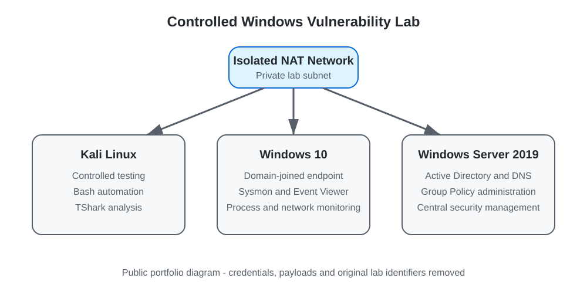

# PrintNightmare Detection and Mitigation Lab

A sanitised academic case study demonstrating how a Windows domain lab was designed, monitored and hardened while investigating **CVE-2021-34527 (PrintNightmare)** in a controlled virtual environment.

> **Safety note:** This repository focuses on systems administration, defensive monitoring, evidence analysis and mitigation testing. It intentionally excludes operational exploit code, payloads, credentials, raw packet captures, virtual-machine images and the original university submission.

## Project overview

The project followed three academic phases: vulnerability proposal, detection-and-mitigation design, and implementation with a live demonstration. The final lab reproduced the vulnerability in an isolated network, correlated host and network telemetry, tested multiple controls, and documented both successful and unsuccessful mitigations.

### Environment

- **Windows Server 2019** domain controller
- **Windows 10** domain-joined test endpoint
- **Kali Linux** analysis and controlled testing workstation
- **Active Directory Domain Services**, DNS, organisational units, users and security groups
- Isolated **VirtualBox NAT network**

### Monitoring and analysis

- Windows Event Viewer: PrintService, Security and System logs
- Sysmon event collection
- Process Monitor and Print Management
- Wireshark and TShark packet analysis
- Splunk-based centralised monitoring in the broader project design
- Nmap-based service enumeration in the isolated lab

### Administration and mitigation

- Group Policy configuration and forced policy refresh
- Windows Firewall controls for RPC and SMB exposure
- PowerShell access-control changes to sensitive Print Spooler directories
- Print Spooler and inbound remote-printing restrictions
- Bash automation concepts for repeatable lab execution and cleanup

## Architecture



The isolated topology separated the testing workstation from the domain controller and domain-joined endpoint while allowing the team to observe authentication, SMB/RPC communication, service activity and endpoint changes.

## Detection findings

The investigation correlated several evidence sources rather than relying on a single security product:

| Source | Evidence reviewed | Defensive value |
|---|---|---|
| PrintService log | Event ID 316 and printer-driver activity | Identified suspicious driver installation and associated files |
| Sysmon | Event IDs 7, 11 and 13 | Tracked image loads, file creation and Registry modifications |
| Security log | Event IDs 4624, 4720, 4722, 4724, 4732 and 4738 | Revealed logons and account or group changes associated with privilege and persistence activity |
| System log | Event ID 7031 | Flagged unexpected Print Spooler termination |
| Wireshark/TShark | TCP endpoints, conversations, NTLM, SMB2 and transferred objects | Connected host events with network communication and file-transfer evidence |
| Process Monitor | Process, file and Registry activity | Supported reconstruction of the activity sequence |

See [Detection Analysis](docs/detection-analysis.md) and the [Defensive TShark Checklist](queries/tshark-defensive-checklist.md).

## Mitigation results

| Control tested | Result | Operational consideration |
|---|---|---|
| Disable inbound remote printing | Prevented the remote attack path | Remote print-server functionality was affected |
| Deny writes to the driver directory | Blocked unauthorised file placement | Could prevent legitimate print-queue or driver changes |
| Block RPC/SMB ports at the firewall | Prevented remote communication required by the test | Could interrupt services that depend on those ports |
| Disable the Print Spooler by Group Policy | Removed the vulnerable service path | Disabled local and remote printing |
| Restrict Point and Print / require signed drivers | Did not stop the tested path in this lab | Demonstrated that one control should not be trusted in isolation |

The main conclusion was that layered controls must be selected according to business requirements. A technically effective control can still be unsuitable if it disrupts a required service.

See [Mitigation Results](docs/mitigation-results.md).

## My documented contribution focus

This was completed as a two-person university project. My documented contribution focused on:

- manually validating and documenting the controlled testing workflow;
- developing Bash automation to make the demonstration repeatable;
- preparing detailed step-by-step technical documentation and screenshots;
- explaining the exploitation and detection phases during the demonstration; and
- analysing host and network evidence using Windows monitoring tools and Wireshark/TShark.

## Skills demonstrated

- Windows Server and Active Directory administration
- Windows endpoint configuration and troubleshooting
- DNS, TCP/IP, SMB and RPC fundamentals
- Group Policy and Windows Firewall management
- Security logging, event correlation and incident analysis
- Wireshark/TShark packet analysis
- Sysmon and Process Monitor
- PowerShell and Bash automation concepts
- Vulnerability assessment and control validation
- Technical documentation and presentation

## Repository contents

```text
.
├── README.md
├── NOTICE.md
├── assets/
│   └── lab-architecture.svg
├── data/
│   ├── detection-indicators.csv
│   └── mitigation-results.csv
├── docs/
│   ├── architecture-and-administration.md
│   ├── detection-analysis.md
│   ├── mitigation-results.md
│   ├── project-lifecycle.md
│   └── lessons-learned.md
├── queries/
│   ├── tshark-defensive-checklist.md
│   └── windows-event-checklist.md
└── scripts/
    ├── README.md
    └── cleanup_lab_artifacts.sh
```

## Portfolio scope

The repository is a concise case study rather than a copy of the assessment. Raw PCAP data, demonstration recordings, hardcoded laboratory credentials, payload-generation commands, third-party exploit code, copyrighted reference books, original reports and VM images are deliberately excluded.
