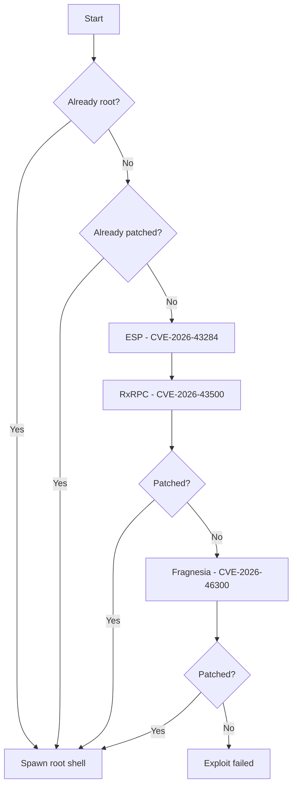

# CVE-KERNEL · Linux Kernel LPE Chain

<p align="center">
  
  
  
  
</p>

<p align="center">
  <strong>Multi-CVE Local Privilege Escalation chain for Linux kernel vulnerabilities</strong><br>
  <code>uid=1000 → root</code> via xfrm-ESP, RxRPC, or Fragnesia page-cache write
</p>

---

## Overview

**CVE-KERNEL** is a Python-based Local Privilege Escalation (LPE) tool that chains multiple Linux kernel CVEs to escalate from an unprivileged user to root. The exploit targets page-cache corruption primitives through kernel networking subsystems.

> **Modified By [MadExploits](https://github.com/MadExploits)** — UI overhaul, colored terminal output, and improved exploit flow presentation.

| CVE | Vector | Target |
|-----|--------|--------|
| **CVE-2026-43284** | xfrm-ESP | `/usr/bin/su` binary corruption |
| **CVE-2026-43500** | RxRPC + splice | `/etc/passwd` page-cache write |
| **CVE-2026-46300** | Fragnesia (ESP-in-TCP) | Page-cache write via `skb_try_coalesce` |

---

## Features

- **Multi-vector exploit chain** — Automatically tries ESP → RxRPC → Fragnesia
- **Patch detection** — Checks if `/usr/bin/su` or `/etc/passwd` is already compromised
- **Interactive root shell** — Spawns PTY shell via `su -` on successful exploitation
- **Kernel module validation** — Verifies `esp4`, `esp6`, `rxrpc` and `CONFIG_ESPINTCP`
- **User namespace support** — Acquires `CAP_NET_RAW` via unprivileged namespaces
- **Styled terminal UI** — Color-coded output with ASCII banner

---

## Preview

```
╔══════════════════════════════════════════════════════════╗
║                                                          ║
║ Linux Kernel LPE Chains                                  ║
║ CVE-2026-43284 | CVE-2026-43500 | CVE-2026-46300         ║
║                                                          ║
║   Modified By MadExploits                                ║
║                                                          ║
╚══════════════════════════════════════════════════════════╝

[*] Current user: uid=1000

  ── Exploit Chain ──

[ESP] Attempting to corrupt /usr/bin/su...
[+]     Namespace created successfully
[*]     (Full SU corruption requires XFRM SA setup - C only)

[RxRPC] Attempting to corrupt /etc/passwd...
[*]     Current root entry: b'root:x:0:0:root:/root:/bin/b'

  ── Fragnesia (CVE-2026-46300) ──

[Fragnesia] Attempting CVE-2026-46300 exploit...
[+]     ESP-in-TCP support detected
[+]     User namespace created (CAP_NET_RAW acquired)
```

---

## Requirements

| Requirement | Description |
|-------------|-------------|
| **OS** | Linux (x86_64) |
| **Python** | 3.8 or higher |
| **Privileges** | Unprivileged user (uid ≠ 0) |
| **Kernel modules** | `esp4`, `esp6`, `rxrpc` (loadable) |
| **Kernel config** | `CONFIG_ESPINTCP=y` or `=m` |
| **User namespaces** | Enabled (`/proc/sys/kernel/unprivileged_userns_clone`) |

### Load required kernel modules

```bash
sudo modprobe esp4
sudo modprobe esp6
sudo modprobe rxrpc
```

### Verify modules are loaded

```bash
lsmod | grep -E 'esp4|esp6|rxrpc'
```

---

## Installation

```bash
git clone https://github.com/MadExploits/CVE-2026-46300.git
cd CVE-KERNEL
```

No external Python dependencies — uses only the standard library.

---

## Usage

```bash
python3 main.py
```

### Exit codes

| Code | Meaning |
|------|---------|
| `0` | Exploit succeeded or already root |
| `1` | Exploit failed (patched system or missing modules) |

---

## Exploit Flow



### Attack vectors

#### 1. ESP — CVE-2026-43284
Corrupts `/usr/bin/su` via XFRM Security Association and user namespace isolation. Requires XFRM netlink socket setup (full implementation in C).

#### 2. RxRPC — CVE-2026-43500
Writes to `/etc/passwd` page cache through RxRPC key manipulation and `splice()`/`vmsplice()` syscalls.

#### 3. Fragnesia — CVE-2026-46300
Triggers `skb_try_coalesce` bug via ESP-in-TCP fragmented packets to achieve page-cache write primitive.

---

## Python vs C Implementation

This repository ships the **Python proof-of-concept**. Full exploitation requires low-level syscalls available only in the C version:

| Capability | Python | C |
|------------|:------:|:-:|
| User namespace setup | ✅ | ✅ |
| Patch detection | ✅ | ✅ |
| RAW socket trigger | ✅ | ✅ |
| XFRM netlink sockets | ❌ | ✅ |
| splice / vmsplice | ❌ | ✅ |
| AF_ALG crypto ops | ❌ | ✅ |
| RxRPC protocol handling | ❌ | ✅ |


---

## Troubleshooting

| Issue | Solution |
|-------|----------|
| `ESP modules not loaded` | Run `sudo modprobe esp4 esp6` |
| `ESP-in-TCP not enabled` | Kernel lacks `CONFIG_ESPINTCP` — use different kernel |
| `unshare failed` | Enable user namespaces or run on supported distro |
| `RAW sockets require CAP_NET_RAW` | Ensure user namespaces are enabled |
| Exploit failed | System may be patched — check kernel version |

```bash
# Quick diagnostic
lsmod | grep -E 'esp4|esp6|rxrpc'
grep ESPINTCP /boot/config-$(uname -r)
cat /proc/sys/kernel/unprivileged_userns_clone
```

---

## Project Structure

```
CVE-KERNEL/
├── main.py          # Main exploit script (Python PoC)
└── README.md        # Documentation
```

---

## Disclaimer

> **FOR EDUCATIONAL AND AUTHORIZED SECURITY TESTING ONLY**

This tool is provided strictly for **educational purposes**, **security research**, and **authorized penetration testing** on systems you own or have explicit written permission to test.

- Unauthorized access to computer systems is **illegal**
- The authors and contributors are **not responsible** for any misuse or damage
- Always comply with applicable laws and regulations in your jurisdiction
- Use only in isolated lab environments or with proper authorization

---

## Credits

| | |
|---|---|
| **Modified By** | **MadExploits** |
| **CVE References** | CVE-2026-43284 · CVE-2026-43500 · CVE-2026-46300 |

---

## License

This project is released for educational and research purposes. Use at your own risk.

<p align="center">
  <sub>Modified By MadExploits · Linux Kernel LPE Research</sub>
</p>
