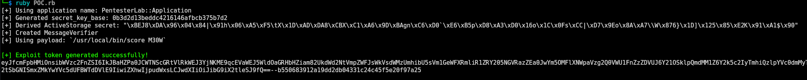

# Rails ActiveSupport Exploit (cve-2019-5420) POC (consider this to chain CVE-2019-5418!)
Pairs lovely with CVE-2019-5418!


## POC Screenshot




## 🚨 Warning

This repository contains a **proof-of-concept (PoC) exploit** demonstrating **remote code execution (RCE)** in Ruby on Rails applications via `ActiveSupport::MessageVerifier` abuse. **Use responsibly!**

## 📌 Overview

This script exploits **ActiveSupport deserialization vulnerabilities** by leveraging a **crafted ERB object** wrapped in `DeprecatedInstanceVariableProxy`. When the signed payload is deserialized by a vulnerable Rails application, **arbitrary Ruby code execution** occurs.

## ⚠️ Disclaimer

This project is for **educational and research purposes only**. Unauthorized use against systems you do not own **is illegal** and may result in severe legal consequences.

## 🛠️ How It Works

### 1️⃣ Generate a Secret Key

- The script derives a `` from a known Rails application name using MD5 hashing.

### 2️⃣ Create an ActiveStorage Secret

- Uses `ActiveSupport::KeyGenerator` to generate a signing key.

### 3️⃣ Create a Malicious ERB Object

- Constructs an **uninitialized **``** object** with attacker-controlled code.

### 4️⃣ Wrap in `DeprecatedInstanceVariableProxy`

- Hides the malicious object within an **innocuous-looking wrapper**.

### 5️⃣ Sign and Generate an Exploit Token

- Uses `ActiveSupport::MessageVerifier` to **sign** the payload, making it appear legitimate.

### 6️⃣ Achieve Remote Code Execution (RCE)

- When deserialized, Rails **executes** the attacker's payload, allowing arbitrary command execution.

## 🚀 Usage

```bash
ruby POC.rb
```

The script will generate a **signed exploit token**, which can be used against a vulnerable Rails application.

## 🛡️ Mitigations

- **Rotate and secure **`` to prevent attackers from generating signed payloads.
- **Upgrade Rails** to the latest version (Rails 7+ has stricter serialization mechanisms).
- **Use JSON serialization** instead of Marshal serialization to avoid arbitrary object loading.
- **Audit application deserialization** to ensure untrusted user input is not being deserialized.

## 📜 Legal Disclaimer

This project is intended for educational purposes **only**. The author is **not responsible** for any misuse or damages caused by this code.

## 📚 References

- [Rails Security Guide](https://guides.rubyonrails.org/security.html)
- [CWE-502: Deserialization of Untrusted Data](https://cwe.mitre.org/data/definitions/502.html)

---

⚠️ **Use at your own risk!**

