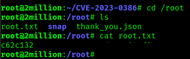

# Hack The Box - TwoMillion Writeup

## Overview

This repository contains my walkthrough for the **Hack The Box - TwoMillion** machine. The goal of this writeup is to document my methodology, explain the enumeration process, and demonstrate the exploitation chain that led to both **User** and **Root** access.

> **Disclaimer:** This writeup is intended for educational purposes only. All actions were performed in a legal lab environment provided by Hack The Box.

## Machine Information

| Platform | Difficulty | Operating System |
|----------|------------|------------------|
| Hack The Box | Easy | Linux |

## Skills Covered

- Enumeration
- Web Application Testing
- JavaScript Analysis
- API Enumeration
- IDOR Vulnerability
- Command Injection
- Credential Discovery
- Local Privilege Escalation
- CVE Exploitation

---

# Enumeration
### I started with some enumeration on the target machine to see what ports and services it has.

### After knowing that there is an HTTP service and trying to redirect to another host, but there is no IP for this hostname, so I edited the `/etc/host`

### Trying to open the link, then we get this page, and trying to go to the page of interest to see what it has.

### I found this webpage, and I clicked Join HTB.

### Then we checked which files start when we open this page and found an interesting JS file.

### Here is the content of the file, but it's obfuscated, so we want to deobfuscate the content to understand the code.

### Here is the code, and it seems like we have URLs to investigate.

### Here I tried to know how to generate an invite key and took this encoded data to decode it.

### Decode it using Local CyberChef, and we got a path to generate a key.

### Here we edit the URL path, and we got an invitation code, but it seems encoded.

### I tried base64, and it worked!! I have the invitation key.

### Register using the invite code and filling in details.

### We got this page and started searching for something valuable.

### We found a VPN file generator, so that is very good if we get any details about privileged accounts.

### Following the link from the previous page and trying to get any endpoints, we found very interesting paths to follow for admins.

### Here I started to try to get admin authentication for my account.

### Finally, we got the ID, and I think we got admin privileges, so now we want to check auth status.

### Yes, as we expected, we have admin access, so now the next step is to try to generate a VPN for me as admin.

### Here we start filling the requested item from the reply.

### Here we got a VPN file, but why not try some command Injection?!!

### As we expected, it worked!!!

### After looking at an interesting file like `.env`, we got the password for admin.

### And finally, we are inside the machine.

### Reading user flag

### Here all trying to get the Root flag

### Here we got an Email that reveals a very important vulnerability.

### After identifying the kernel version, I searched for publicly known vulnerabilities affecting it and found **CVE-2023-0386**. This is a **Local Privilege Escalation (LPE)** vulnerability in the Linux kernel's **OverlayFS** implementation. It allows a local attacker to gain **root privileges** by abusing a flaw in how OverlayFS handles files with Linux capabilities. Since the target machine was running a vulnerable kernel, this vulnerability provided a suitable path to escalate privileges from the current user to **root**.

### I searched for how to exploit the vulnerability, and I found this PoC and tried to make it.

### I downloaded the repo in my VM and used scp to copy it to the TwoMillion machine, read the README file, and deployed the exploit.

### Here we got the Root Access and read the Root flag.

### Finished!!

# Thank you <3

Abdullah Rawashdeh
