### About Machine

###### TwoMillion is an Easy difficulty Linux box that was released to celebrate reaching 2 million users on HackTheBox. The box features an old version of the HackTheBox platform that includes the old hackable invite code. After hacking the invite code an account can be created on the platform. The account can be used to enumerate various API endpoints, one of which can be used to elevate the user to an Administrator. With administrative access the user can perform a command injection in the admin VPN generation endpoint thus gaining a system shell. An .env file is found to contain database credentials and owed to password re-use the attackers can login as user admin on the box. The system kernel is found to be outdated and CVE-2023-0386 can be used to gain a root shell

---

#### Scan Results

|port| service | details |
|-|-|-|
|22/tcp |  ssh | syn-ack ttl 63 OpenSSH 8.9p1 Ubuntu 3ubuntu0.1 (Ubuntu Linux; protocol 2.0) |
|80/tcp| http | syn-ack ttl 63 nginx 2million.htb |

#### host setup

I added **2million.htb** to my `/etc/hots` file 

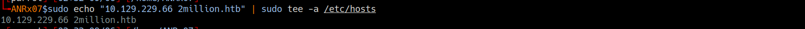

---
### Path Discovery

I performed a path discovery across `2million.htb` using **gobuster**

During enumeration, I discovered the `/invite` endpoint

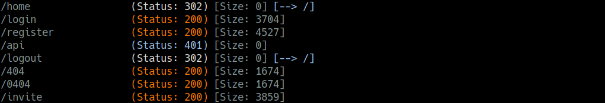<br>

After navigating the `/invite` page<br>

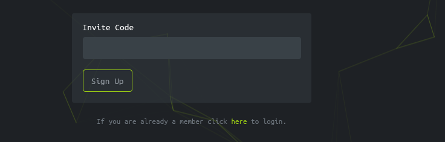<br>

While inspecting the page, I noticed it loaded a **Javascript file** named `inviteapi.min.js` contained obfscated code :

```js
eval(function(p,a,c,k,e,d){e=function(c){return c.toString(36)};if(!''.replace(/^/,String)){while(c--){d[c.toString(a)]=k[c]||c.toString(a)}k=[function(e){return d[e]}];e=function(){return'\\w+'};c=1};while(c--){if(k[c]){p=p.replace(new RegExp('\\b'+e(c)+'\\b','g'),k[c])}}return p}('1 i(4){h 8={"4":4};$.9({a:"7",5:"6",g:8,b:\'/d/e/n\',c:1(0){3.2(0)},f:1(0){3.2(0)}})}1 j(){$.9({a:"7",5:"6",b:\'/d/e/k/l/m\',c:1(0){3.2(0)},f:1(0){3.2(0)}})}',24,24,'response|function|log|console|code|dataType|json|POST|formData|ajax|type|url|success|api/v1|invite|error|data|var|verifyInviteCode|makeInviteCode|how|to|generate|verify'.split('|'),0,{}))
```

---
### Deobfuscation

I deobfuscated the code using [`de4js`](https://thanhle.io.vn/de4js/), which produced the following readable JavaScript:

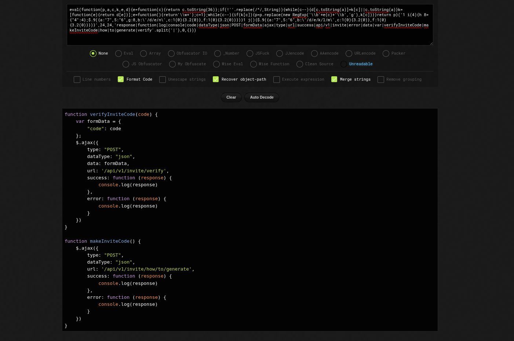<br>

```js
function verifyInviteCode(code) {
    var formData = {
        "code": code
    };
    $.ajax({
        type: "POST",
        dataType: "json",
        data: formData,
        url: '/api/v1/invite/verify',
        success: function (response) {
            console.log(response)
        },
        error: function (response) {
            console.log(response)
        }
    })
}

function makeInviteCode() {
    $.ajax({
        type: "POST",
        dataType: "json",
        url: '/api/v1/invite/how/to/generate',
        success: function (response) {
            console.log(response)
        },
        error: function (response) {
            console.log(response)
        }
    })
}
```

`makeInviteCode()` : generates a new invite code<br>
`verefyInviteCode(code)` : checks if a code is valid<br>

and to understood more, I intercepted the verification request :

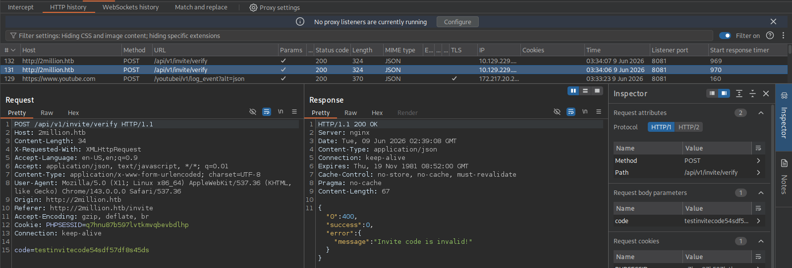<br>

the `API` uses `JSON` responses<br>

---

### Generating invite code and ROT13 decryption


I went to the browser console and executed `makeInviteCode()`

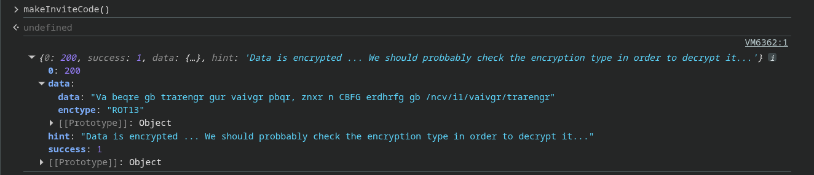<br>

I noticed that data were encrypted in `ROT13` cipher

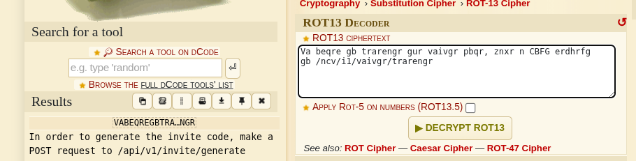<br>

Atfer decryption, I found the endpoint `/api/v1/invite/generate`, I then generated the invite code 

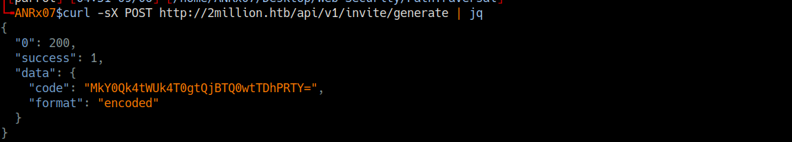<br>

**Base64 Deryption**
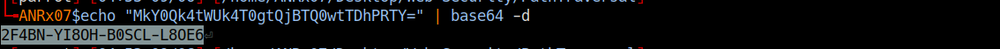<br>

**Key**<br>
The key `2F4BN-YI8OH-B0SCL-L8OE6` was inserted and accpeted successfuly
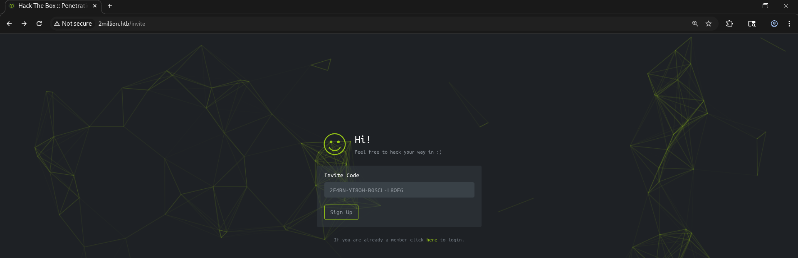<br>

**Regisitration**<br>
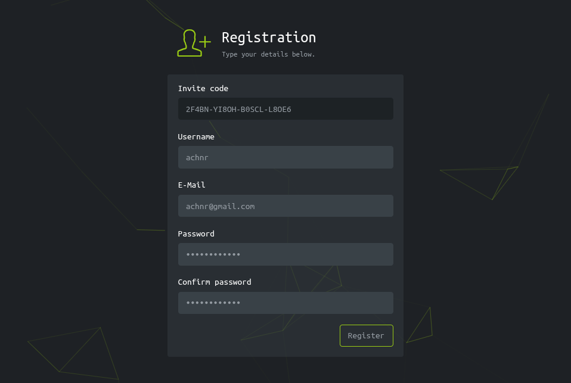<br>

**Home Page**<br>
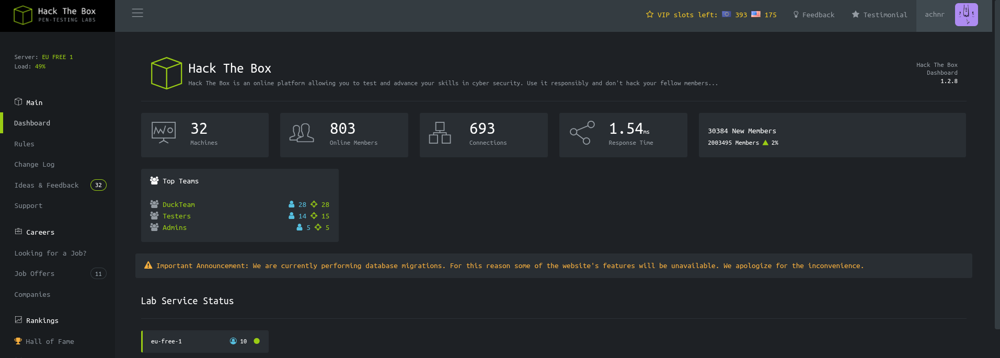<br>

**Access Page**<br>
No many pages on this site work properly, the access page is where things get interesting<br>
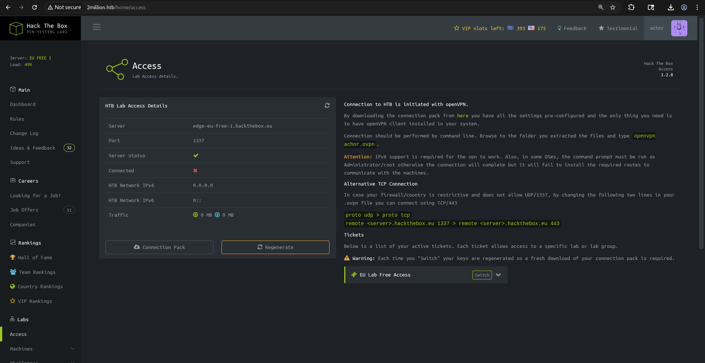<br>

**API Endpoints Enumeration**<br>
I uplaod vpn file by clicking on `connection pack` button, and intecrepted the `GET request`<br>

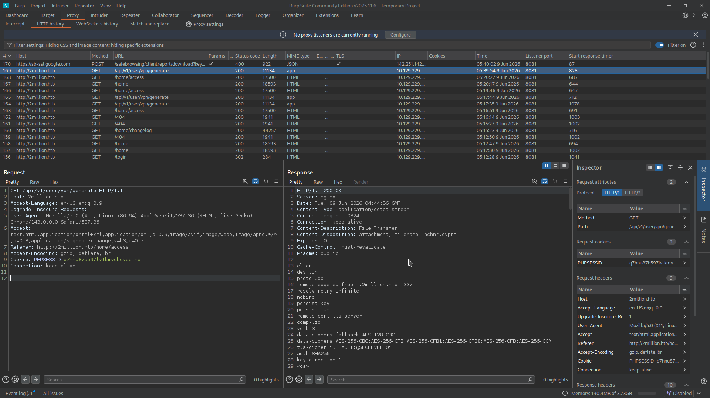<br>

I then executed a **curl request** with verbose and silent options to enumerate availaible `API endpoints`<br><br>
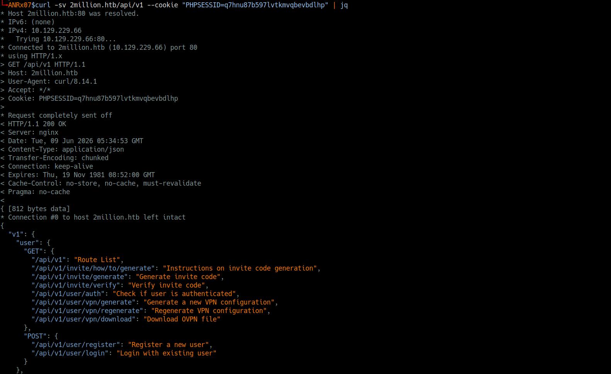<br>
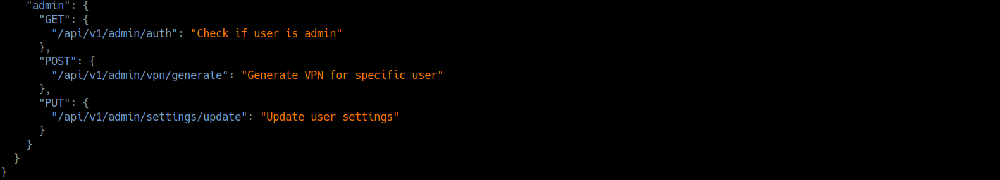<br>
The server responded with`JSON` list of`API` endpoints <br> 

The admin had 3 API endpoints with GET, POST and PUT methods

When I attempted to **generate admin key** with the admin ednpoint `/api/v1/admin/vpn/generate`, the key was not generated due to I was not the admin, and the first asmin endpoint `/api/v1/admin/auth` confirmed this

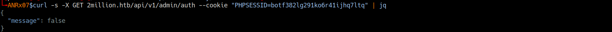<br>
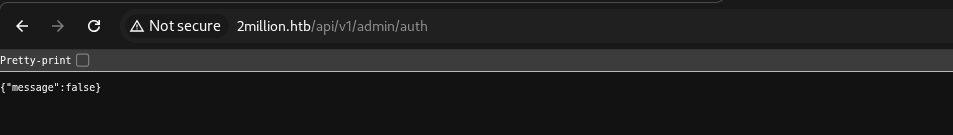<br><br>

---
## Web Application Vertical Privilege Escalation: escalate current standard user to administrator
<br>

After discovering the correct `PUT request` format with `Content-Type: application/json` and the `required parameters`, I successfully escalated my user to an administrator

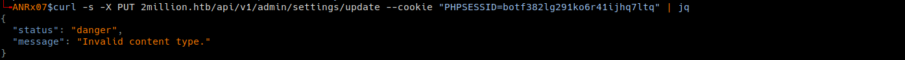<br>
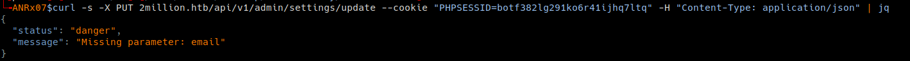<br>
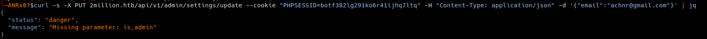<br>
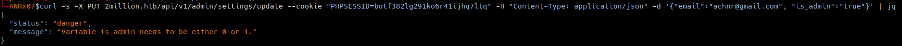<br>
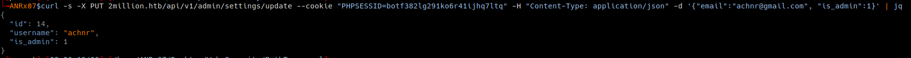<br>
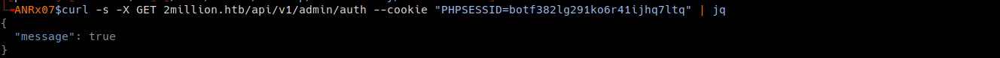<br>
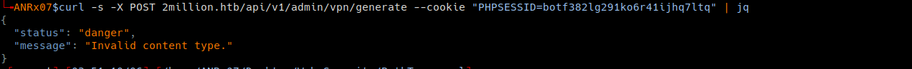<br>
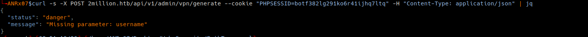<br>
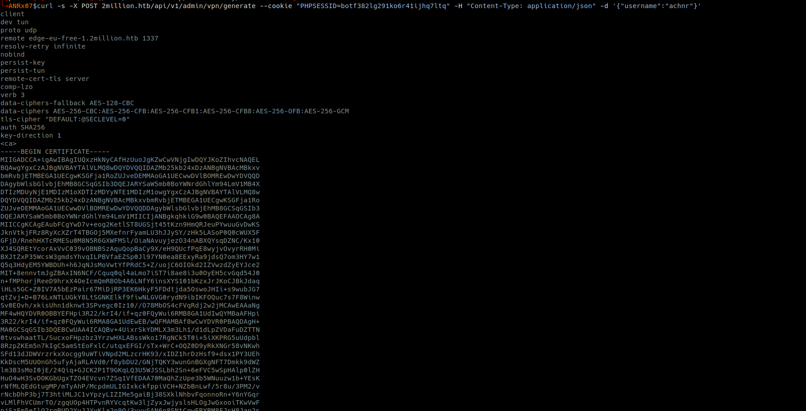<br>

---
## OS Command Injection

**I injected `;whoami;` into the username field, my suspicion fell on the `exec()` or `system()` php functions , which are common in admin-only features and often lack proper sanitization**

For example, the vulnerable code probably looked something like this:

```php
$username = $json->username;

exec("/usr/bin/cat /var/www/html/VPN/user/$username.ovpn");
```

This endpoint `POST /api/v1/admin/vpn/generate` was vulnerable, and **OS Command Injection** was performed successfully
 
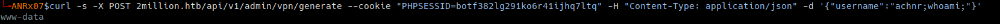<br>
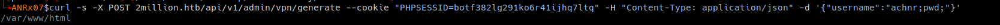<br>
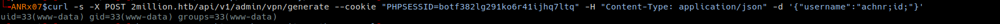<br>


## Initial Access : Reverse Shell via OS Comand Injection (base64 bypass)

#### Encode payload to bypass restrictions
Since the application had restrictions that prevented special characters, I encoded in base64 the reverse shell payload command to bypass this restriction

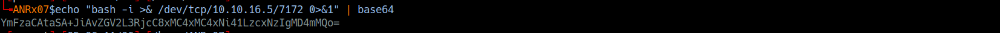<br>

#### Inject the encoded payload
I injected the payload into the `username parameter`, piping it to `base64 -d` | `bash` for decoding and execution:

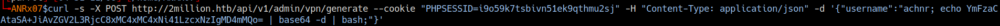<br>

#### Netcat Listener
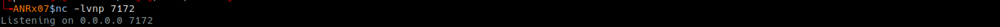<br>

#### Gained Initial Access
The payload executed successfully, returning a reverse shell as the `www-data user`

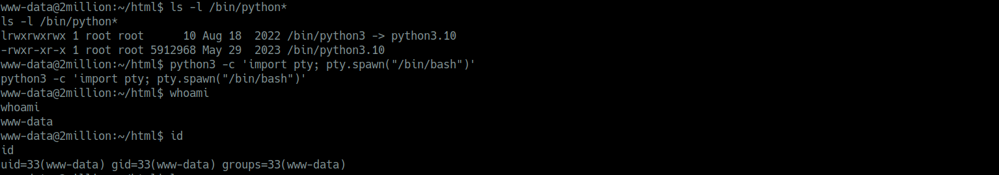<br>


## Lateral Movement

I attempted **lateral movement** from **www-data user** to the **admin user** using various techniques

While inspecting the `/var/www/html` directory I discovered a `.env` file containing **database credentials**:

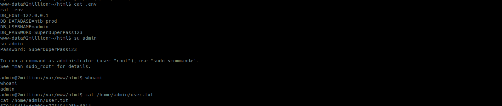<br>

The discovered password was successfully **reused** to authenticate via `SSH` and `MySQL`

**SSH**<br>
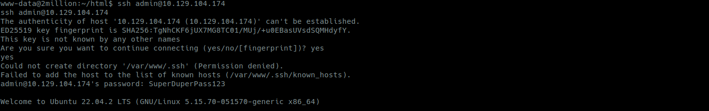

**MySQL**<br>
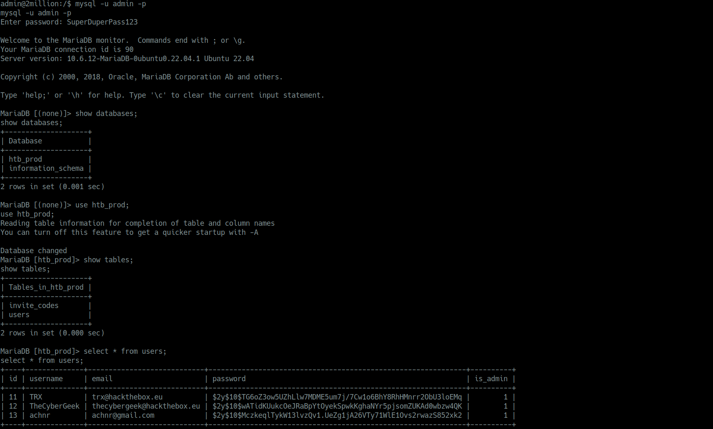

<br>

## OS Privilege Escalation 

After gaining initial access as the admin user, I performed system enumeration to identify potential privilege escalation vectors

I tried all the most privilege escalation tricks like SUID binaries, capabilities, sudo rights, cron jobs,  nothing worked. so I checked **environment variables** for PATH hijacking or sensitive variable, and I found a `MAIL variable` pointing to `/var/mail/admin`

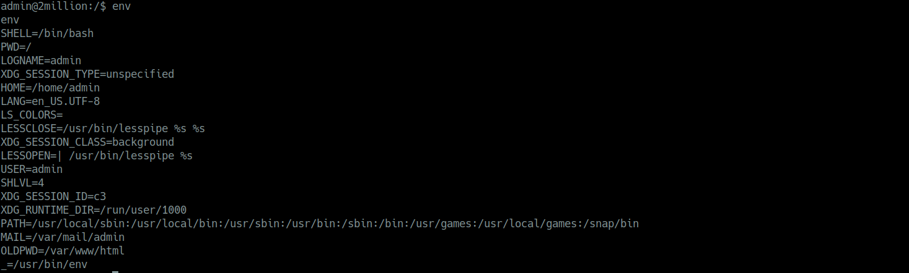<br>

I went check mail content and noticed that the admin had been warned to patch the kernel against an `OverlayFS/FUSE vulnerability`

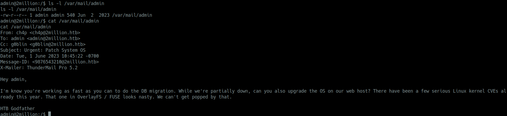<br>

kernel version
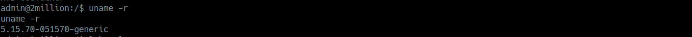<br>

os version
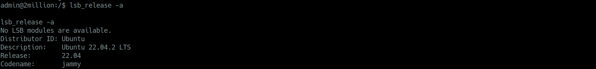<br>

The kernel was never updated, confirming that the administrator had ignored or forgot the security warning

Kernel enumeration revealed version `5.15.70-051570-generic`, which is vulnerable to `CVE-2023-0386` **OverlayFS/FUSE local privilege escalation**

with the vulnerability confirmed, I proceeded to obtain a public POC exploit

I cloned the POC, transferred it to the target machine

I then executed it an successfully gained root access
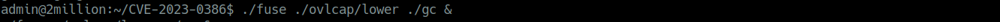<br>
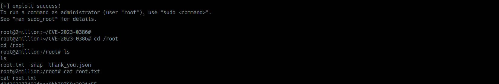<br>

<br>

## Attack Chain

| Phase | Technique | Target | Result |
|-------|-----------|--------|--------|
| **1. Recon** | Port Scan | 22 (SSH), 80 (HTTP) | Service discovery |
| | Path Discovery | `/invite` | Invite page found |
| | JS Deobfuscation | `inviteapi.min.js` | API endpoints exposed |
| **2. Initial Access** | Invite Generation | `POST /api/v1/invite/generate` | Valid invite code |
| | Registration | `POST /api/v1/user/register` | Standard user created |
| **3. Web Privesc** | API Enumeration | `GET /api/v1` | Admin endpoints discovered |
| | Vertical Escalation | `PUT /api/v1/admin/settings/update` | `is_admin: 0 -> 1` |
| **4. System Access** | Command Injection | `POST /api/v1/admin/vpn/generate` | `username=test;id;` |
| | Reverse Shell | Base64 encoded payload | `www-data` shell |
| **5. Lateral Movement** | File Discovery | `/var/www/html/.env` | `admin:SuperDuperPass123` |
| | SSH Reuse | `ssh admin@2million.htb` | `admin` user access |
| **6. Root Escalation** | Kernel Enumeration | `uname -r` -> `5.15.70` | CVE-2023-0386 identified |
| | Email Warning | `/var/mail/admin` | OverlayFS/FUSE confirmed |
| | Exploit Execution | `./fuse && ./exp` | Root shell |


---
<br>


#### Resources

[CVE-2023-0386](https://securitylabs.datadoghq.com/articles/overlayfs-cve-2023-0386/) - 
[CVE-2023-0386](https://red.infiltr8.io/redteam/privilege-escalation/linux/kernel-exploits/overlayfs-exploits/cve-2023-0386-overlayfs) -
[OS Command Injection](https://github.com/achnouri/WebSec-OS-CommandInjection)

---

<br>

**Disclaimer:** This machine was rooted under an authorized penetration testing environment