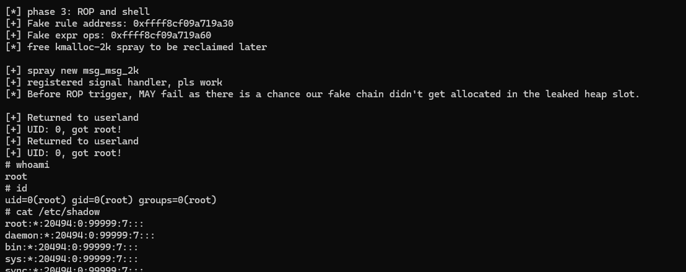
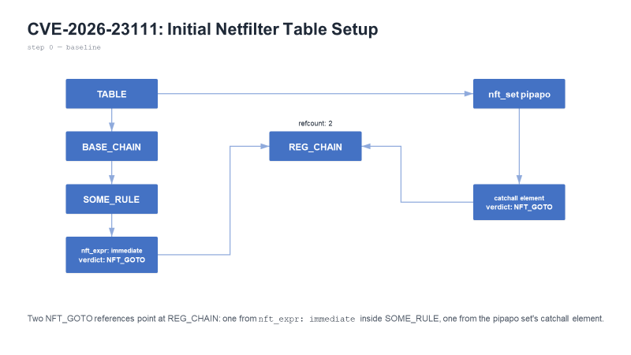
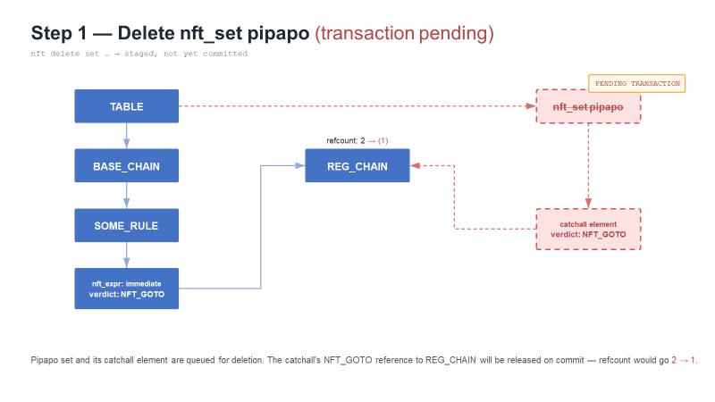
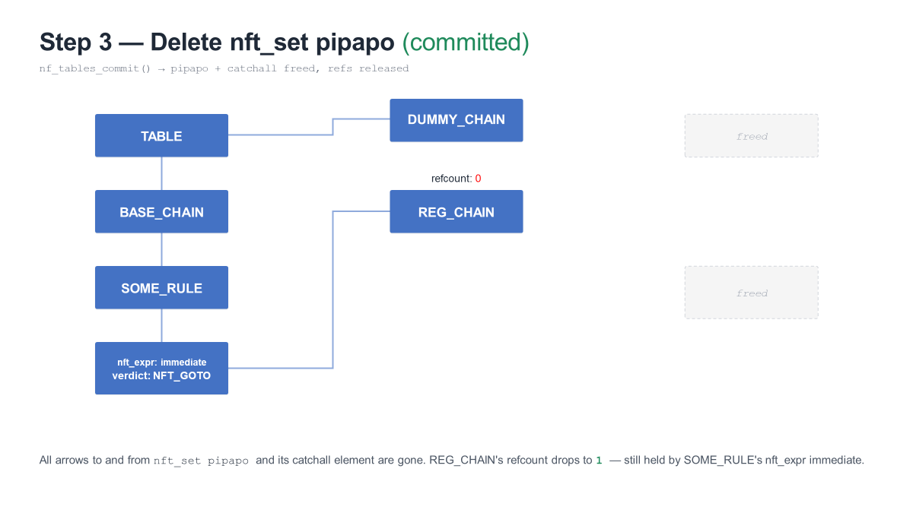
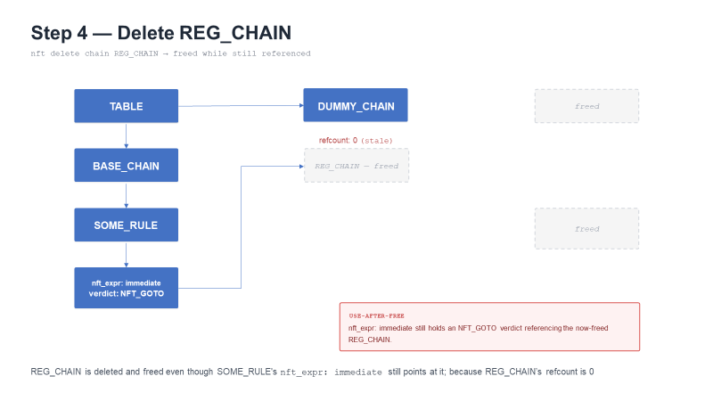

# General Information

No publicly available PoC. However, there are two independent reproductions by [Exodus Intel](https://blog.exodusintel.com/2026/06/08/off-by-exploiting-a-use-after-free-in-the-linux-kernel/) and [FuzzingLabs](https://fuzzinglabs.com/repro-cve-2026-23111/)

Kernel Version: 6.12.19
- Cloned Linux Kernel `git` tree
- then `git checkout 1444ff890b4653add12f734ffeffc173d42862dd^`

You will need the following libraries to compile the PoC:  
- libnftnl
- libmnl

To install:  
```
sudo apt update
sudo apt install libnftnl-dev libmnl
```

As the PoC uses ROP to obtain LPE, you will need to use the same kernel version for it to work.

To compile the PoC:  
```
gcc exp.c -o exp -lnftnl -lmnl -w -no-pie
```

# Debugging Notes

```
sudo modprobe nf_tables
cat /sys/module/nf_tables/sections/.text
add-symbol-file /path/to/nf_tables.ko <addr>
```

- load `nf_tables`
- dump loaded address
- load kernel module + addr in `gdb`

# Exploitation Details

The blog posts sufficiently describe the pre-requisites for this PoC to work. The PoC should be ran in a shared user namespace, which can be done using `unshare -Urmn`. For some reason, `unshare -Urmin` (which is described to be used in the blog posts) did not work for me.

Successful exploitation should give us LPE, allowing us to read `/etc/shadow`. Executing `id` should NOT show `65534 (nogroup)`:  


The exploitation can be split into 3 phases:  
1. UAF + obtain kernel leak
2. Using kernel leak primitive to leak heap address
3. Control RIP to execute ROP chain and obtain LPE


## Phase 1: Obtaining Kernel Memory Leak

The idea is to first setup tables in this way:  


The above is based on the blog post by `Exodus Intel`.

After this setup, 4 batches of transactions will be made to trigger the UAF:  
1. deletion of the `pipapo` set + error out to abort the transaction
2. a successful transaction to toggle generation cursor; done by creating a dummy chain
3. **actual deletion** of the `pipapo` set
4. deletion of the regular chain

### Batch 1: deletion + abort

Nothing much to be said about deletion. To abort the deletion process, simply set an invalid map and try to delete it.

This will cause an error, which will force the transaction to be aborted.

When the transaction is pending deletion:  


The `refcount` of `REG_CHAIN` is reduced to 1. After the transaction is aborted, the `refcount` is NEVER restored back to `2` -- **this is where the vulnerability** lies.

### Batch 2: benign transaction

Simply create a DUMMY_CHAIN


### Batch 3: actual deletion

In this batch, we perform the actual deletion of the `pipapo` set -- causing the `refcount` of `REG_CHAIN` to be reduced to 0:  


Since `refcount` is now 0, `REG_CHAIN` can now be deleted -- even though `SOME_RULE` has a `NFT_GOTO` referencing `REG_CHAIN`!

### Batch 4: delete REG_CHAIN (UAF)

Since `refcount` is 0, the API allows us to legitimately delete the chain with complaining, resulting in the following:  


But `SOME_RULE` still holds a reference (via the `NFT_GOTO` expr) to `REG_CHAIN` -- triggering the UAF


---------------------------

For simplicity, the above 4 steps (Batches 1 to 4) shall be called the **trigger**, as this is what causes the UAF.

To figure out how this can be useful, we need to know the structure of the UAF object (an `struct nft_chain`):  

```
struct nft_chain {
	struct nft_rule_blob		__rcu *blob_gen_0;
	struct nft_rule_blob		__rcu *blob_gen_1;
	struct list_head		rules;
	struct list_head		list;
	struct rhlist_head		rhlhead;
	struct nft_table		*table;
	u64				handle;
	u32				use;
	u8				flags:5,
					bound:1,
					genmask:2;
	char				*name; <--- WE CAN LEAK THIS!!
	u16				udlen;
	u8				*udata;

	/* Only used during control plane commit phase: */
	struct nft_rule_blob		*blob_next;
	struct nft_chain_validate_state vstate;
};
```

To trigger a kernel memory leak, we **can read the name of the chain that is referenced by the rule**.

`nft_chain->name` is a pointer to a name. This `name` is allocated by `kmalloc-cg`, and the size is dependent on the length of the name.

Following [this blogpost](https://kaligulaarmblessed.github.io/post/nftables-adventures-2/), we will use `struct seq_operations` as the spray object -- which is allocated in `kmalloc-cg-32`. 

This means we will have to: 
- force `nft_chain->name` to be allocated in `kmalloc-cg-32` by giving a name >= 17 length
- trigger UAF
- spray `struct seq_operations` to reclaim memory originally occupied by `nft_chain->name`
- read `nft_chain->name`, leaking the address of `single_start` function

With the address of `single_start`, we can get the kernel base address; defeating KASLR.

## Phase 2: Leaking Kernel Heap Memory

Before going into this phase, we need to clear the tables; otherwise it might end up buggy (for some reason...)

In this phase, we will leak kernel heap memory. Specifically, we are looking to leak `kmalloc-cg-2k` -- this is so we have sufficient space to perform ROP later.

There are a few parts in this phase:  
1. Spraying `kmalloc-cg-2k` with `msg_msg` structures
2. Leaking the following:  
    a. `struct xa_node`  
    b. `struct xa_node` (leaf node), from (a)  
    c. `struct msg_queue` from (b)
    d. `kmalloc-cg-2k` heap from (c)

Spraying `kmalloc-cg-2k` with `msg_msg` must be done before leaking. This is because the subsequent leaks is dependent on `msg_msg` existing in the IPC queue first.

Recommended to read the blog post by FuzzingLabs, which has more information about how each of the structures link to each other, and finally, to the heap.

### A: Leaking `struct xa_node`

The first `struct xa_node` is leaked by reading `&init_ipc_ns+0x118`. `init_ipc_ns` is a global variable of type `ipc_namespace`.

### B: Leaking leaf node `struct xa_node`

The leaf node from the initial `struct xa_node` is the one that contains the pointer to the actual `struct msg_queue`, so we need to leak that.

The leaf node for `struct xa_node` can be read by leaking `struct xa_node->slots[0]`.

`struct xa_node->slots[0]` is at offset `0x28`


### C: Leaking `struct msg_queue`

From (B), we obtained the leaf node. At `struct xa_node->slots[0]`, it contains a pointer to a `struct msg_queue` -- so this is what we want to leak.

`struct xa_node->slots[0]` is at offset `0x28`

`struct msg_queue` gives us a pointer to `struct list_head q_messages` points to the first message in the `msg_msg` IPC queue! This will leak allow us to leak the `kmalloc-cg-2k` heap address.

### D: Leaking `kmalloc-cg-2k`

Simply read `msg_queue->q_messages`, giving us the heap address. This is at offset `0xc0`.

-------------

To perform the **actual leak**, we need to use a different approach from Phase 1. Notice that in Phase 1, we didn't actually specify _any_ address (because we don't even know what the address would be!)

In order to leak the above (A,B,C and D), we will need a primitive to specify the addresses.

The approach taken by FuzzingLabs is to force allocation of `nft_table->name` into the freed `nft_chain` slot. 

`struct nft_chain` is allocated by `kmalloc-cg-128`. By specifying a name of length > 96, we can force allocations to be in `kmalloc-cg-128` as well. Then, we can control what is being leaked from `nft_chain->name` by placing an arbitrary address at offset 88.
- NOTE: in case this isn't clear, we are controlling `nft_chain->name` by changing the address it points to. In Phase 1, we are forcing allocations into the freed kernel heap.

To leak kernel memory, we simply read the rule referencing the deleted `nft_chain`. For each leak, we will need to reset the tables as well.

At the end of this phase, we should have obtained the address of an object that gets allocated in the `kmalloc-cg-2k` heap space.

## Phase 3: Redirecting Execution, LPE

The logic for redirecting execution and controlling RIP is explained [here](https://kaligulaarmblessed.github.io/post/nftables-adventures-2/) (under the Controlling RIP section).

The main idea for redirecting control flow and achieving LPE is:  
1. Trigger UAF and place `table->name` at old location of `nft_chain`. This time, control `rules->next` (offset `16` or `0x10`) to point to the heap location where we will place our fake rule
2. Create a fake rule with our ROP chain in it, then use `msg_msg` to cause heap allocations
3. Create a new rule, which will set off a chain of functions that will trigger the ROP chain

### Rationale for Modifying `rules->next`

The idea here is that we modify `rules->next` to point to somewhere we control. This is the kernel heap address which we previously leaked. `rules->next` specifically because when a new rule is created in Step 3, the `expr->ops->validate` function pointer will be executed for each rule.

Since we have modified `rules->next` to point to the fake rule, we need to implement the custom logic.

### Step 2: Creating Fake Rule

The fake rule **must minimally define `ops` and `validate`**.
`ops` is at offset 0x30 from `nft_rule`, and `validate` is at offset `0x18` from `ops`.

Thus, the starting point of the ROP chain should be at offset `0x48`.

We will not discuss the full ROP chain here as it can be quite different for kernel versions -- but we'll talk about the main hurdle.

--------------

#### WHERE IS THE MISSING SWAPGS?!?!?!?

In the kernel version I ran (6.12.69), I couldn't find a clean `swapgs` and resorted to using KPTI trampoline, where we use `swapgs_restore_regs_and_return_to_usermode`. I also tried multiple paths but nothing worked correctly... so... offset `swapgs_restore_regs_and_return_to_usermode+36` was chosen instead:  

```
   0xffffffff82001814 <common_interrupt_return+36>:     pop    r15
   0xffffffff82001816 <common_interrupt_return+38>:     pop    r14
   0xffffffff82001818 <common_interrupt_return+40>:     pop    r13
   0xffffffff8200181a <common_interrupt_return+42>:     pop    r12
   0xffffffff8200181c <common_interrupt_return+44>:     pop    rbp
   0xffffffff8200181d <common_interrupt_return+45>:     pop    rbx
   0xffffffff8200181e <common_interrupt_return+46>:     pop    r11
   0xffffffff82001820 <common_interrupt_return+48>:     pop    r10
   0xffffffff82001822 <common_interrupt_return+50>:     pop    r9
   0xffffffff82001824 <common_interrupt_return+52>:     pop    r8
   0xffffffff82001826 <common_interrupt_return+54>:     pop    rax
   0xffffffff82001827 <common_interrupt_return+55>:     pop    rcx
   0xffffffff82001828 <common_interrupt_return+56>:     pop    rdx
   0xffffffff82001829 <common_interrupt_return+57>:     pop    rsi
   0xffffffff8200182a <common_interrupt_return+58>:     pop    rdi
   0xffffffff8200182b <common_interrupt_return+59>:     add    rsp,0x8
   0xffffffff8200182f <common_interrupt_return+63>:     swapgs
   0xffffffff82001832 <common_interrupt_return+66>:
    verw   WORD PTR [rip+0xffffffffffffe807]        # 0xffffffff82000040 <x86_verw_sel>
   0xffffffff82001839 <common_interrupt_return+73>:     test   BYTE PTR [rsp+0x8],0x3
   0xffffffff8200183e <common_interrupt_return+78>:     jne    0xffffffff820018e1 <common_interrupt_return+241>
  ...
```

Based on testing, it takes the jump and goes to `0xffffffff820018e1`:  

```
   0xffffffff820018e1 <common_interrupt_return+241>:    test   BYTE PTR [rsp+0x20],0x4
   0xffffffff820018e6 <common_interrupt_return+246>:    jne    0xffffffff820018ea <common_interrupt_return+250>
   0xffffffff820018e8 <common_interrupt_return+248>:    iretq
   ...
```

Here, it skips the `jne` branch and calls `iretq`, which will the nallow us to return normally.

Normally, it would be possible to find a working `swapgs` + `iretq` gadget... but if not, this is the alternative

------------------

This is also why the PoC grand total of 15 pops... which is why we have so many dummy `qwords` in the ROP chain. But hey, it works so... eh.

### Step 3: Creating a New Rule

Simply create a new rule and send the transaction, which will trigger off the ROP chain.

----------

When all this is done... we should successfully get a root shell :)
