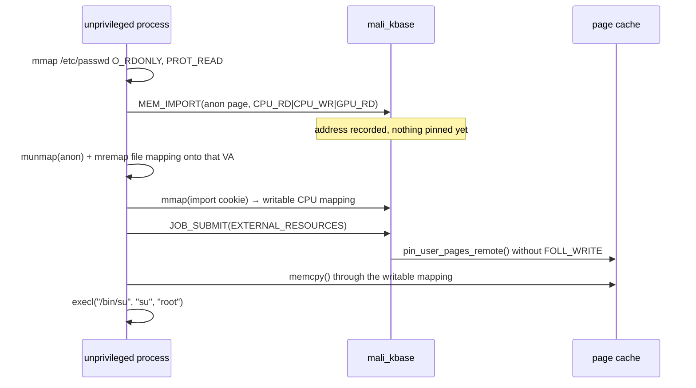

# CVE-2022-22706 - Page-Cache Write

The Arm Mali GPU driver hands userspace a CPU-writable mapping of pages it pinned read-only,
so an unprivileged process gets a writable alias of the page cache backing a file it can
only open `O_RDONLY`.

`exploit.c` blanks root's password field in the `/etc/passwd` page cache and execs
`su root`. The on-disk file is never modified.

> PoC for the driver tree and QEMU target in this repo (`mali_kbase` **r35p0-01eac0**,
> `CONFIG_MALI_NO_MALI=y`, x86_64 GKI 5.15). Run it in the VM.

## The bug

Two decisions disagree about who may write the imported pages.

The CPU mapping's writability comes from `KBASE_REG_CPU_WR`, but the pin asks for write
access based on `KBASE_REG_GPU_WR` alone:

```c
/* mali_kbase_mem.c */
pinned_pages = pin_user_pages_remote(
    mm, address, alloc->imported.user_buf.nr_pages,
    reg->flags & KBASE_REG_GPU_WR ? FOLL_WRITE : 0, pages, NULL, NULL);
```

Import with `CPU_WR` set and `GPU_WR` clear and you get both halves at once: a writable CPU
mapping of the import, and a `get_user_pages` pin taken without `FOLL_WRITE`. Without
`FOLL_WRITE`, `get_user_pages` never breaks COW on a read-only file mapping, it returns the
page-cache page itself. The driver then maps those exact pages back to userspace as writable.

Fixed by [`5381ff7`](https://android.googlesource.com/kernel/google-modules/gpu/+/5381ff7b4106b277ff207396e293ede2bf959f0c%5E%21/)
("GPUCORE-32592 Fix userbuf imports to respect RO memory"), which derives write access from
`KBASE_REG_CPU_WR | KBASE_REG_GPU_WR` instead of `GPU_WR` alone.

## Exploit flow



`MEM_IMPORT` only records an address; the pin happens later, at `JOB_SUBMIT`. That gap is
what lets the anonymous page be swapped for the file mapping in between.

The edit is length-preserving, so nothing after root's line shifts:

```
root:x:0:0:root:/root:/bin/sh      ← before
root::0:0:rootx:/root:/bin/sh      ← after (empty password)
```

busybox `su` returns `CHECKPASS_PW_HAS_EMPTY_PASSWORD` before prompting when the password
field is empty, and only reads `/etc/shadow` when it is exactly `x`.

## Build and run

```sh
gcc -static -o exploit exploit.c
```

Copy it into the VM and run it as an unprivileged user:

```sh
$ ./exploit
```

## Demo


Recorded over SSH into the QEMU target as `user` (uid 1000). `./exploit` patches root's line
in the `/etc/passwd` page cache and execs `su root`, which drops straight to a root shell
without prompting.

Leaving that shell and running `su` again still gives root: the page stays cached, so every
later `open()`/`read()` of `/etc/passwd` sees the patched bytes.

After `echo 1 > /proc/sys/vm/drop_caches` evicts the page and the file is re-read from storage, 
`su` asks for a password again. The bytes on disk were never touched.

## References

* [Arm — Mali GPU driver vulnerabilities](https://developer.arm.com/Arm%20Security%20Center/Mali%20GPU%20Driver%20Vulnerabilities)
* [STAR Labs — Mali-cious Intent: Exploiting GPU Vulnerabilities (CVE-2022-22706 / CVE-2021-39793)](https://starlabs.sg/blog/2025/02-mali-cious-intent-exploiting-gpu-vulnerabilities-cve-2022-22706-/-cve-2021-39793/)
* [Upstream fix — `5381ff7`](https://android.googlesource.com/kernel/google-modules/gpu/+/5381ff7b4106b277ff207396e293ede2bf959f0c%5E%21/)
