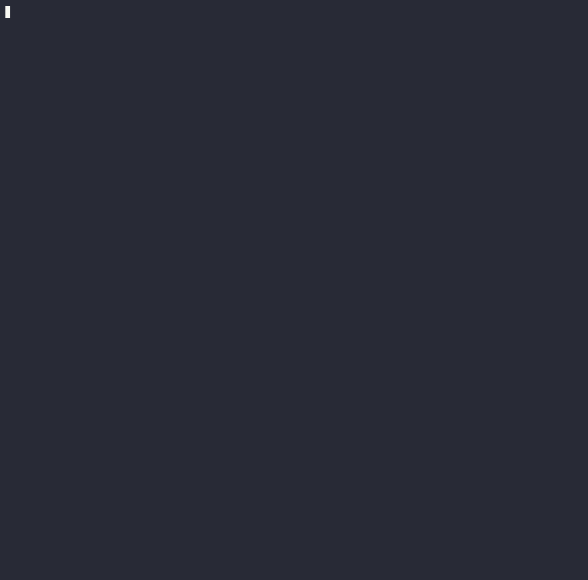

# CVE-2023-20938 — Android binder UAF privilege escalation

A local privilege escalation proof-of-concept for **CVE-2023-20938**, a
use-after-free in the Android binder driver. From an unprivileged shell it
gains **uid 0** and drops **SELinux to permissive**, then spawns a root shell.

Target for this build: **Android Cuttlefish / Goldfish AVD, x86_64, kernel
5.10.107**.

> ⚠️ **Authorized research / educational use only.** Run this only against your
> own test devices and emulators. The bug is fixed in current Android; this PoC
> targets an old, deliberately-vulnerable test build. No warranty.

---

## Demo



Recorded with [asciinema](https://asciinema.org/) and rendered to GIF with
[`agg`](https://github.com/asciinema/agg):

---

## The vulnerability

- **CVE:** CVE-2023-20938
- **Component:** `drivers/android/binder.c`, `binder_transaction_buffer_release()`
- **Class:** use-after-free (kmalloc-128)

`binder_transaction_buffer_release()` trusts an attacker-supplied
`offsets_size`. Sending a transaction whose `offsets_size` is one byte short of
a full entry (`sizeof(offset) - 1 == 7`) makes the release path mis-parse the
trailing `flat_binder_object` and over-decrement a `binder_node`'s refcount,
freeing it while a dangling reference is still live.

---

## How it works

The exploit chains a cross-cache leak into an arbitrary read and a controlled
write, then rewrites credentials. Stage by stage (see `main()` in `poc_cf.c`):

```
 B. Cross-cache leak
      free a wave of binder_nodes (kmalloc-128) -> page returns to the buddy
      allocator -> reclaim the page with eventpoll epitems (eventpoll_epi cache,
      0x80-byte objects). A dangling binder transaction now reads kernel
      pointers out of an epitem, leaking a struct file and its epitem address.

 C. Arbitrary read
      re-trigger the UAF and use a sprayed fake binder_node to turn binder's
      hlist_del unlink into a controlled *(where) = what write. Two writes
      redirect a victim file's f_inode at a fake inode overlaid on the epitem
      and mark it S_PRIVATE. FIGETBSZ on the file then returns
      *(epitem.event.data + 24): a steerable 4-byte read.

 D/E/F. Privilege escalation
      defeat KASLR (leak eventfd_fops via f_op), walk init_task's task list to
      the launcher's cred, zero its uid/gid set and seccomp.mode, then zero
      selinux_state to drop SELinux to permissive.

 G. A pre-forked, eventfd-free launcher execs a root shell.
```

Two unprivileged processes need to share a binder node to drive the UAF;
Through hwservicemanager's `ITokenManager` (`createToken` /`get`-by-token).

---

## Build

```sh
clang -static -Wall -Wextra -o poc_cf poc_cf.c -lpthread
```

`binder.h` must sit next to `poc_cf.c`. The build is static on purpose so the
single binary runs on the target with no toolchain present.

---

## Run

### 1. Boot the vulnerable Cuttlefish guest

From your Cuttlefish host package directory, launch the AVD with the matching
kernel + initramfs:

```sh
HOME=$PWD ./bin/launch_cvd \
  --kernel_path=bzImage \
  --initramfs_path=initramfs.img
```

### 2. Push and run

```sh
adb push poc_cf /data/local/tmp/
adb shell /data/local/tmp/poc_cf
```

A successful run walks through the stages and ends in a root shell:

---

## Reliability

The exploit is **probabilistic**. Every stage retries internally.

So whether you see a clean bail or a guest panic, just **re-run** (the AVD's
`/data` is wiped on reboot, so re-push the binary after a panic).

If the reclaim hit-rate is poor on a slower or busier target, widen the waits
or raise the spray count (the `#define`s near the top of `poc_cf.c`):

| Macro              | Default | Meaning                                         |
| ------------------ | ------- | ----------------------------------------------- |
| `SETTLE_US`        | 5000    | pause after the node is freed, before spraying  |
| `FAKE_SPRAY_COUNT` | 8       | blocked `sendmsg()`s racing to reclaim the slot |
| `FAKE_WAIT_US`     | 10000   | pause after releasing sprays, before unlink     |
| `PRESKIP_US`       | 1000    | pause after the sacrificial first sendmsg       |
| `KW_RETRY_COUNT`   | 8       | attempts per single unlink write                |
| `STAGE_C_TRIES`    | 8       | attempts to bring arbitrary-read online         |

---

## Retargeting another build

The struct offsets and the unrandomized symbol baseline (`*_NOKASLR`) are
**specific to this exact 5.10.107 build** and will not work elsewhere. To port
to a different kernel, update the offset block and the symbol block near the top
of `poc_cf.c` with values from the matching `vmlinux`. I tried it on Pixel 7 after extracting the offsets.

---

## References

- Google's Android Offensive Security Blog [https://androidoffsec.withgoogle.com/posts/attacking-android-binder-analysis-and-exploitation-of-cve-2023-20938/]
