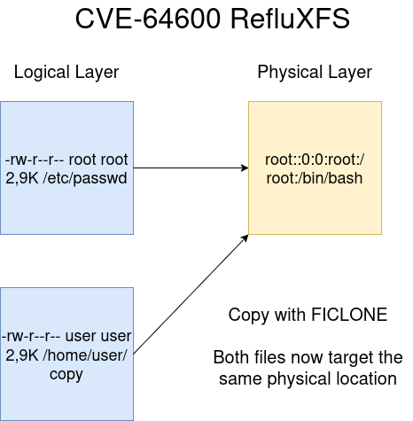
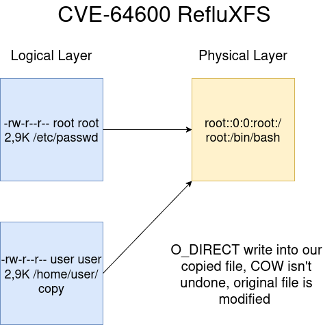

# RefluXFS (CVE-2026-64600) PoC 

This repo contains a PoC of the recently discovered race condition vulnerability affecting COW on XFS reported by the excellent Qualys Security Team. [1] [2]

## PoC info

Handwritten based off of the excellent analysis in the Qualys advisory. Rewrites the first 4KB of the /etc/passwd file with whatever it originally contained,
and replacing the root user line: `root:x:0:0:root:/root:/bin/bash` with `root::0:0:root:/root:/bin/bash`. Notice the diff? Now the root user has no passwd and you can just `su -`. 

Being a janky PoC for my own needs, it has crappy error handling and doesn't do any fancy backups of the original file or the like. Tested on a Rocky Linux 9.7 virtual machine running an XFS /
mount with a kernel from February 2026. It also jankily pads the /etc/passwd write, so if you care about the machine you're running it... make a backup of the file before running. I made the PoC to check my machines, was going to hold it for a while but I saw that another PoC was dropped yesterday so...

You might have to adjust the CLONE_FILE variable in the PoC to point to a path you can write, if /home is in a different partition to /etc/passwd. /var/tmp might help you, you should be to able to
`find / -writable` to guide you for exposure. Compile with `gcc refluxfs.c -o refluxfs -lpthread`.


## Detection and mitigation

The PoC doesn't leave any log or `dmesg`, IMO the best way to catch this would be to setup a SIEM rule to monitor for `ioctl` calls with FICLONE on XFS filesystems.
File Integrity Monitoring tools might also pick this up.

Update the kernel if you can. Alternatively, the Red Hat mitigation using SystemTap works:

```
probe begin {
        printf("refluxfs mitigation loaded\n")
}

probe module("xfs").function("xfs_file_remap_range").call {
        $remap_flags = 0xffff
}

probe module("xfs").function("xfs_file_remap_range").return {
        $return = -95
}

probe end {
        printf("refluxfs mitigation unloaded\n")
}
```

## Prerequisites

1. Default XFS config on a recent (>= 2017) kernel. RHEL uses XFS by default. Check with `$ xfs_info / | grep reflink=1` and `mount -l | grep xfs`.
2. A file worth attacking (target), usually owned by root and world readable (for the copy), as well as a writable path in the same filesystem, where the copy can be dropped. PoC uses /etc/passwd,
could also be a SUID file, or other valuable root-owned config.

A bug in the XFS code means Copy-On-Write can be requested for a file and COW is not undone properly. When writing on our copied file, COW should be undone and two different files should exist on disk. Using threads you can just... write on both files at once because of the race condition.

If you can read the target file, and `ioctl(fd, FICLONE)` it, you have a copy with COW enabled. Must be in the same partition.

<div style="text-align: center;">

 

</div>


Then, you can just... write() into your copy with O_DIRECT and modify the original file. 

<div style="text-align: center;">




</div>

## Default affected distros (again, thank Qualys)


-  RHEL 8, 9, 10; CentOS Stream 8, 9, 10; Rocky and AlmaLinux 8, 9, 10
-  Oracle Linux 8, 9, 10  (RHCK 4.18/5.14/6.12, and UEK R6/R7/8)
-  CloudLinux 8, 9, 10
-  Fedora Server >= 31
-  Amazon Linux 2023
-  Amazon Linux 2 AMIs from December 2022 (2.0.20221210.1) onward


## References

1: https://openwall.com/lists/oss-security/2026/07/22/14

2: https://blog.qualys.com/vulnerabilities-threat-research/2026/07/22/refluxfs-a-linux-kernel-local-privilege-escalation-to-root-in-xfs-cve-2026-64600

There are probably wrong things in my writeup, but I wanted to get started somewhere, especially in these *amazing* couple of months.

> "Better to be a dog in times of tranquility than a human in times of chaos."
> 
> \- Feng Menglong, Stories to awaken the world
