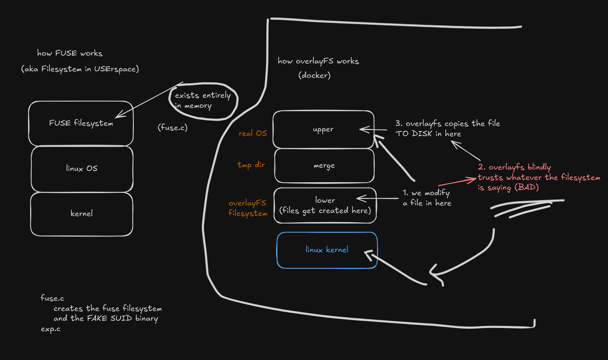

# CVE-2023-0386 - OverlayFS / FUSE

Original CVE source written by xkaneiki:
https://github.com/xkaneiki/CVE-2023-0386/tree/main

Rewritten so the exploit can be run in 1 shell (original exploit requires 2 shells).

```sh
# Compile
make all
# Create mount point for fuse filesystem
mkdir -p /tmp/fusepwn/lower
# Start fuse (which serves a SUID binary)
./fuse /tmp/fusepwn/lower
# Run exploit (which copies fuse's fake SUID binary onto disk with real SUID privs via overlayfs)
./exp
# Run shell
/tmp/fusepwn/upper/bin
```

Cleanup
```sh
# unmount fuse filesystem
fusermount -u /tmp/fusepwn/lower
# remove all 
rm -rf /tmp/fusepwn
# unmount overlayfs (root only. not required)
umount /tmp/fusepwn/merge
```

### Notes
- Use `findmnt` to view mounted filesystems
- The overlayfs mount is only visible by root (not sure why)

### How it Works
`fuse.c` creates a fuse file system mounted at /tmp/fusepwn/lower and serves a fake SUID binary owned by root. This is an in-memory filesystem, so we can lie about the permissions set

`exp.c` then creates an overlayfs mount in /tmp/fusepwn and opens the fake SUID binary (/tmp/fusepwn/lower/bin). When opened, this triggers overlayfs to perform a copy-up which writes the fake SUID binary to disk with real SUID privileges and owned by root.

The vulnerability exists in overlayfs in that it blindly trusts whatever file permissions are being served to it by the lower filesystem. If the lower filesystem is the kernel, this is fine (because it can't be manipulated without root permissions). If the lower filesystem can be manipulated by the user, this isn't fine because we can lie about what files are there (like by using FUSE)

### Patch
https://git.kernel.org/pub/scm/linux/kernel/git/torvalds/linux.git/commit/?id=4f11ada10d0ad3fd53e2bd67806351de63a4f9c3

The patch checks if the UID/GID of the file is valid within the user's namespace. If it's not, it fails the copy up.

i.e. 
- we're bob
- we create a new namespace as root by mapping 1000 (bob's UID) to 0 (root) in `proc/self/uid_map`
- we try to trigger a copy-up on a root-owned file
- overylayfs checks bob's mapping and sees that the user's namespace is actually 1000 (bob) and not 0 (root) like the file is and fails the copy-up

## Helpful Resources
- Helpful blog: https://engineering.facile.it/blog/eng/write-filesystem-fuse/
- Example FUSE implementation: https://man.openbsd.org/fuse_main.3

## Diagram

