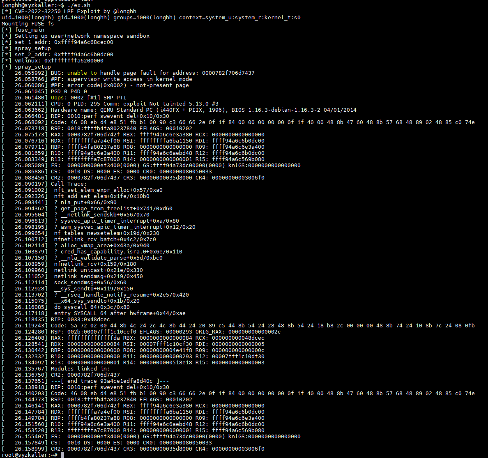

# CVE-2022-32250

This is my exploit for CVE-2022-32250, written entirely based on the research from [NCC Group's blog](https://www.nccgroup.com/us/research-blog/settlers-of-netlink-exploiting-a-limited-uaf-in-nf_tables-cve-2022-32250).

Tested on: Kernel version 5.13\
Success rate: ~70%



## Building

Building requires `libmnl` and `libnftnl`.

```c
make all
```

## Disclaimer
The Proof-of-Concept and the write-up of the vulnerability are for educational and research purposes only. Use at your own risk.